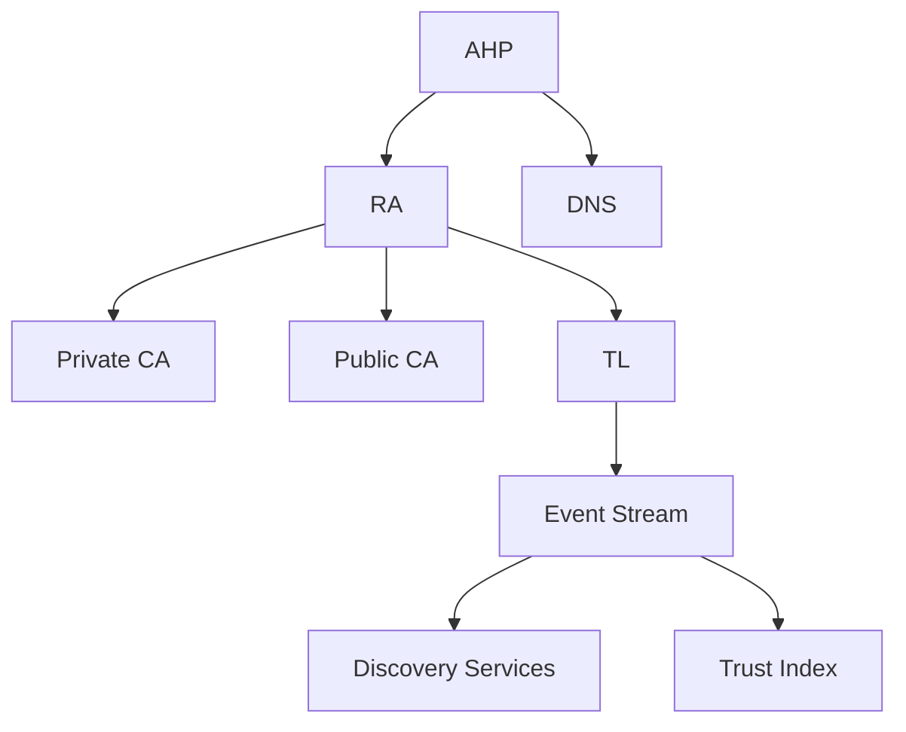
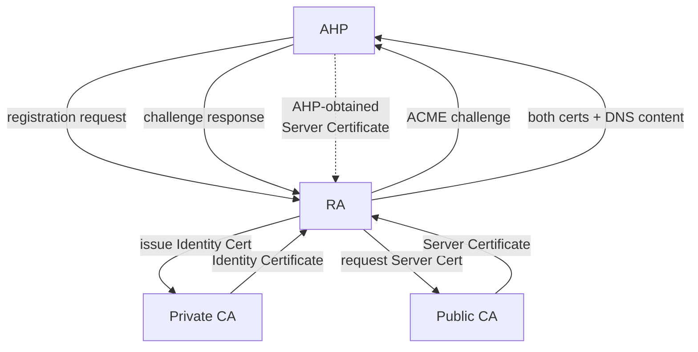
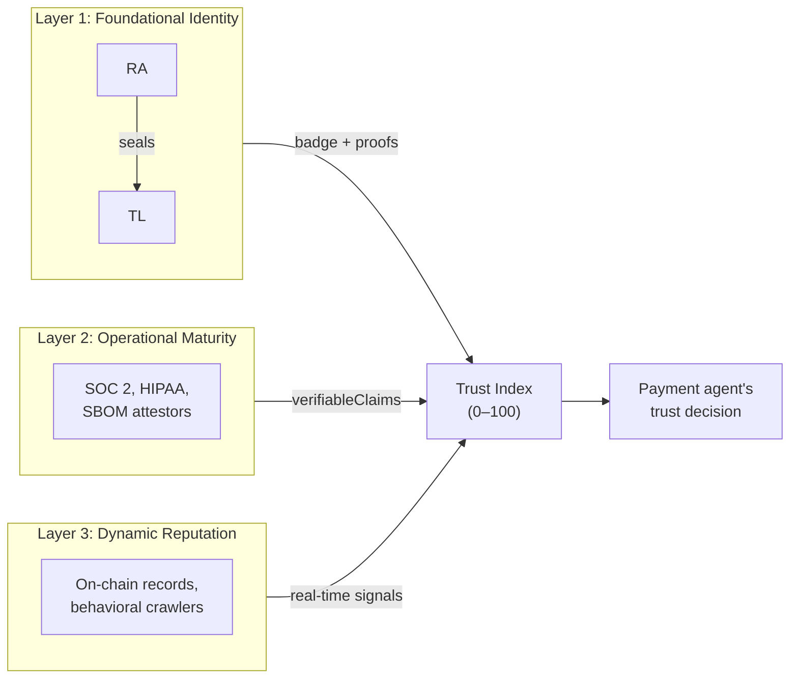
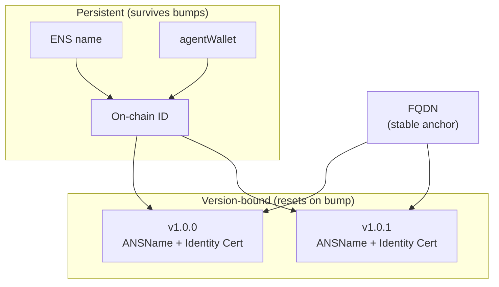
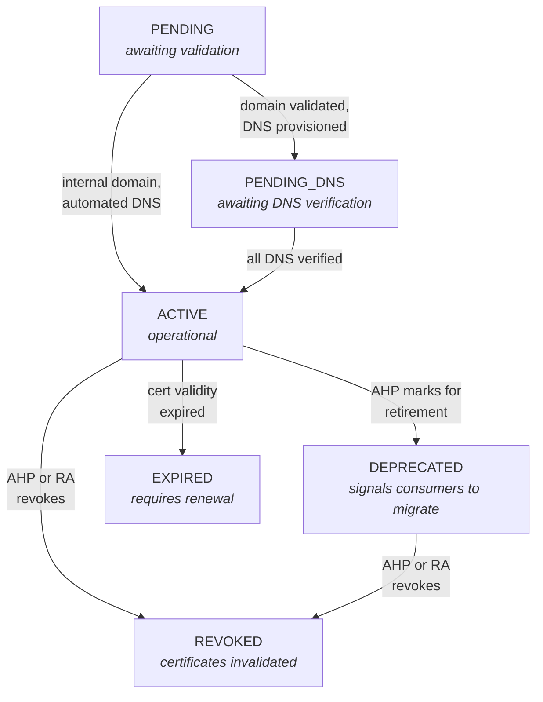

# Agent Name Service: Architecture and Design

*A trust layer for the agentic web*

## 1.0 Introduction and goals

### 1.1 The problem

My company's payment agent receives an instruction to wire $50,000 to a supplier's invoicing agent. The invoicing agent presents a website URL secured by an SSL certificate. The payment agent must decide: does this agent actually belong to the supplier, or has someone stood up a convincing fake? And if the site is legitimate, has the supplier's code changed since my last transaction?

Without reliable answers, things go wrong. An attacker registers a look-alike domain such as `payments-supplier.example.com` and presents a valid certificate for it.
Assuming there's no prior history recorded, the payment agent has no way to tell this impostor from the real supplier, because the certificate may prove only that someone controls the domain, but not that the domain belongs to the right organization.
Separately, what if a legitimate supplier passes a security audit, then quietly updates its model? The certificate stays valid, the endpoint stays up, but the code behind it is no longer what was audited. No one notices until payments fail, and then no one can determine which version was registered when.

ANS prevents both by combining three cryptographic mechanisms. First, the agent's identity is anchored to a domain name whose ownership the Registration Authority (RA) has verified. Second, every change to the agent's software produces a new version number and a new identity certificate, which records which version is registered.
Third, every one of the invoicing agent's lifecycle events is sealed into a Transparency Log, an append-only ledger where entries cannot be altered or removed after the fact. Domain control alone does not detect code swaps. Identity certificates alone do not create a versioned audit trail. The append-only log alone does not prove who issued the certificate. The three together close the gaps at the registration layer: they prove which version was declared and when. Resolving the $50,000 trust question requires additional signals (organizational identity, behavioral reputation, solvency) described in §2.4.

Now suppose the supplier doesn't run its own infrastructure. Instead, a hosting platform operates the invoicing agent on the supplier's behalf, at a domain the platform owns: `supplier-invoicing.platform.example.com`. The RA's domain challenge confirms that the platform controls `platform.example.com`. It does. But the domain tells my payment agent nothing about the supplier hosted on it.
The version-bound certificate and the Transparency Log still work: they prevent one tenant from impersonating another on the same platform, and they record which version was registered when. The missing piece is the link between the domain and the organization. An agent registered on its own domain carries that link.
An agent on a hosting domain does not, and a trust evaluation should reflect the difference.

The RA acts as the notary in this system. A company or platform that hosts agents submits a registration request. The RA verifies domain ownership, issues the identity certificate, specifies precise DNS records so other agents can discover the new identity, and writes the registration event into the log. The RA does not score agents or evaluate their behavior.
A downstream search/rating system consumes the log's sealed records alongside other sources to produce trust evaluations.

### 1.2 Origin

This architecture builds on "Agent Name Service for Secure AI Agent Discovery" by Narajala, Huang, Habler, and Sheriff (OWASP), contributed to the IETF as an internet-draft (draft-narajala-ans).

### 1.2.1 Relationship to other standards

**HCS-14 (Universal Agent ID).** Hiero's HCS-14 standard uses DNS TXT records for agent discovery. Each record type is interpreted through a Profile, which is a named convention that tells a resolver what the record contains. The `.agent` profile uses `_agent.<nativeId>` as the record name.
An ANS Profile for HCS-14 allows any HCS-14 resolver to discover ANS agents through the same interface it uses for agents from other registries.

**HCS-27 (Merkle Tree Checkpoint).** A companion specification that defines a checkpoint format for publishing the TL's root hash (the single value that proves the integrity of the entire log) to a Hiero consensus topic, a shared ledger where the timestamp is independently verifiable. A draft HCS-27 specification and its companion Merkle Tree Profile are in this repository.

**IETF SCITT.** The SCITT working group (Supply Chain Integrity, Transparency and Trust) defines an append-only transparency service that accepts signed statements, registers them in a log, and returns receipts as proof of inclusion.
The ANS Transparency Log follows the SCITT model (RFC 9943), using these receipts to provide clients with mathematical proof that an agent's registration is legitimate and unaltered.

**DNS-AID.** Infoblox's DNS-AID draft (draft-mozleywilliams-dnsop-dnsaid-01, individual submission to IETF dnsop) uses SVCB service binding records (RFC 9460) to let clients find agent endpoints in a single DNS query. DNS-AID tells a client where to connect. ANS tells the client whether to trust the agent at that address.
A client may resolve a DNS-AID record to get the endpoint address, then check an `_ans-badge` record to verify the agent's identity before opening a connection.

**Agent communication and execution protocols.** Google's A2A defines how agents collaborate across services. Anthropic's MCP defines how a model interacts with local tools and data sources. Neither defines how an agent proves its identity to an agent it has never met. ANS provides that layer.

### 1.3 Foundational principles

**Identity is anchored to a domain name.** Every agent maps to a unique, globally resolvable Fully Qualified Domain Name (FQDN). The `ANSName` format `ans://v{version}.{agentHost}` embeds the FQDN directly. The domain is the agent's permanent address. It remains stable across software versions; the version number changes, the domain does not.

Five design decisions follow from this foundation:

1. **Domain control validation.** The RA verifies ownership using the ACME protocol (DNS-01 or HTTP-01 challenges) before attesting to any identity. No domain proof means no registration.

2. **Decentralized discovery.** The TL publishes sealed lifecycle events after the RA seals them. Third-party discovery services subscribe, verify signatures, and build their own indexes. The protocol supports multiple independent discovery providers; no single service controls the lookup.

3. **Version-bound lifecycle.** Every change to an agent's software or capabilities requires a new version number and a new registration. Each version gets its own TL entry, so the audit trail records which version was registered at any point. Relaxing this constraint opens attack surfaces.
A supplier passes a security audit on Tuesday, updates its model on Wednesday, and the certificate stays valid through both. Clients keep trusting it. When the transactions go wrong on Thursday, no one can reconstruct which version was active on Wednesday, because the identity didn't change when the software did.

4. **Dual-certificate model.** Two certificates resolve the conflict between public web trust and software versioning. A Server (SSL) Certificate from a public CA secures the stable FQDN. A Client (Identity) Certificate from a private CA attests to the version-bound `ANSName`. Each has its own lifecycle.

5. **Discoverable schemas.** The ANS Trust Card, when hosted, links each protocol to a canonical URL. Schemas are public, versioned artifacts that clients can fetch and validate against. The Trust Card is built from the Protocol Card and augmented with ANS trust fields. Hosting it is optional at registration; the Trust Index rewards its presence with a higher integrity score.

### 1.4 Terminology

| Term | Definition |
| :--- | :--- |
| **A2A** | Agent-to-Agent protocol for agent collaboration (Linux Foundation AAIF). |
| **ACME** | Automatic Certificate Management Environment (RFC 8555). The protocol the RA uses to verify domain control. |
| **AHP** | Agent Hosting Platform, a service that hosts agent code and manages registration on the owner's behalf. |
| **AIM** | Agent Integrity Monitor. Continuously checks DNS records and certificates against registered state. When an ANS Trust Card is hosted, the AIM also verifies its content hash. |
| **ANS** | Agent Name Service, the directory and trust layer described in this document. |
| **ANS Trust Card** | An optional metadata document the AHP may host after registration. Contains protocol-native metadata augmented with ANS trust fields (`verifiableClaims`, ANSName, trust references). When hosted and when Registration Metadata was submitted, the AIM verifies the content hash against what the RA sealed. Hosting a Trust Card raises the Trust Index integrity score. |
| **CA** | Certificate Authority, an entity that issues digital certificates. |
| **COSE** | CBOR Object Signing and Encryption (RFC 9052). A binary signing envelope for Agent Cards and SCITT receipts. |
| **CSR** | Certificate Signing Request, a message from an applicant to a CA requesting a certificate. |
| **DANE** | DNS-Based Authentication of Named Entities (RFC 6698). Binds a certificate to a DNS record via TLSA. |
| **DID** | Decentralized Identifier (W3C DID 1.0). A URI that resolves to a DID Document containing verification methods. Used for principal binding. |
| **FQDN** | Fully Qualified Domain Name, a complete domain name such as `support.example.com`. |
| **KMS** | Key Management System. Stores and controls access to the private keys that sign certificates and log entries. |
| **MCP** | Model Context Protocol for agent-tool communication (Linux Foundation AAIF). |
| **Protocol Card** | The protocol-native metadata file: an A2A Agent Card (`/.well-known/agent-card.json`), an MCP Server Card (`/.well-known/mcp/server-card.json`), or an OpenAPI document. Created by the developer. The AHP chooses where to host it; the well-known paths shown here are conventions. Both A2A and MCP have competing proposals for their discovery paths, and implementations vary. The `metadataUrl` field in the registration payload lets the AHP declare the actual location. The SDK translates the Protocol Card into Registration Metadata. |
| **RA** | Registration Authority. Validates domain control, issues certificates, provisions DNS records, and seals events into the TL. |
| **Registration Metadata** | The `agentCardContent` field in the registration payload. The agent's capabilities, endpoints, and protocols in the RA's format. The RA hashes it and seals the hash into the TL. |
| **TL** | Transparency Log, an append-only, cryptographically verifiable ledger of all agent lifecycle events. |

### 1.5 Goals

AI agents buy supplies, book travel, and sign contracts without a human in the loop. The ones handling real money need proof of who stands behind them. No system provides that proof using the infrastructure the internet already runs on: DNS, X.509 certificates, DNSSEC, and the operational practices that keep them working under abuse and at scale.
The registry automates the mechanics: verifying domain ownership, issuing certificates, specifying DNS records, and writing events into the log. The identity always anchors to a domain name.

The protocol is designed for an open, federated market. Any organization can operate an RA, a TL, a Trust Index, or a Discovery Service. Multiple RAs can coexist, each issuing certificates and sealing events into its own TL. Multiple Trust Index providers can crawl the same logs and produce competing evaluations. The protocol does not require agents to register with a specific RA or be scored by a specific Trust Index. An RA that is also a DNS provider, a certificate authority, or a blockchain operator gains operational efficiency from that vertical integration, but the protocol does not grant it privileged access. Every component communicates through public interfaces that any conforming implementation can use.

### 1.6 Deployment topologies

The same RA, TL, and certificate infrastructure can run at different scopes depending on the trust boundary an organization needs.

**Public ANS.** The RA, TL, and event feeds are internet-facing. Any verifier that has installed the Private CA root can verify any agent's identity and audit its history. The Private CA root is distributed via the Trust Provisioner. The CA's practices are externally auditable.

**Internal ANS.** An organization runs its own RA and TL behind its corporate network, the same way a company runs internal DNS and uses RFC 1918 address space. Agents registered internally are visible only to participants on that network. The Private CA root is distributed through the organization's device management. The CA's practices are governed by internal policy. CA/B Forum Baseline Requirements do not apply to private CAs.

**Enterprise ANS as a service.** A hosted internal ANS instance, operated on behalf of an enterprise in their own cloud account. The enterprise controls access, data residency, and retention policy. The Private CA root is scoped to the enterprise's trust store.

**Extranet ANS.** A semi-private deployment shared among a defined set of partner organizations. Participants trust the shared RA and TL, but the infrastructure is not open to the public internet. The Private CA root is distributed to all participating organizations via the Trust Provisioner or a shared trust bundle.

Each topology runs the same protocol. The difference is who can see the TL, who can query the event feeds, and who controls the Private CA. For a given registration, the same entity may operate both the RA and the TL that seals it. If that entity is compromised, it could forge events with no independent check, because the KMS key that signs checkpoints is under the same operator's control. HCS-27 consensus checkpoints (§1.2.1) are the primary mitigation: the TL's root hash is anchored to an independently verifiable ledger that neither the RA nor the TL controls. An observer who checks the consensus topic detects any rewriting. Federation adds a second layer: an agent can register with an RA operated by one entity and have events sealed by a TL operated by another.

An agent's domain determines the strength of its identity signal. An agent on its own domain carries a cryptographic chain that traces to the controlling organization. An agent on a hosting platform's domain traces to the platform. Both are valid registrations.

### 1.7 Entity scope

The term "agent" appears throughout this document because autonomous AI agents are the primary registrant. The architecture is not limited to agents.
Any software entity that needs a verifiable, domain-anchored identity can register: a web crawler with declared behavioral policies, a corporate API that requires versioning and a certificate lifecycle, a dedicated commerce client whose operator controls the domain and wants counterparties to verify the connection.
The registration payload, certificate model, and TL semantics are identical regardless of entity type.

### 1.8 Registration progression

The RA acts as a notary. It witnesses domain control, issues certificates, provisions DNS records, and seals the event into the TL. It does not require the registrant to present every possible trust artifact. The minimum registration is intentionally low: a domain, a version, at least one endpoint, and an identity CSR.

Registration at the floor produces a sealed TL event, discoverable DNS records, and a dual certificate pair. That is enough for Bronze verification and a basic Trust Index score. The Trust Index then creates the economic incentive to improve: higher scores mean better placement in discovery feeds and stronger trust signals to counterparties. Each step above the floor costs the AHP time and money. The protocol supports every step but mandates only the first.

| Artifact | Required | Trust Index effect |
| :--- | :--- | :--- |
| Domain + version + endpoints + identity CSR | Yes | Baseline registration. Bronze-eligible. |
| OV or EV Server Certificate | No | Raises identity score from Basic to Verified or Premium. |
| ANS Trust Card hosted at FQDN | No | Raises integrity score. Enables content hash verification when Registration Metadata is submitted. |
| Registration Metadata (`agentCardContent`) | No | Sealed hash enables AIM integrity verification of the Trust Card. |
| `verifiableClaims` in Trust Card | No | Feeds Layer 2 signals: SOC 2, SBOM, compliance certifications. |
| Principal binding (LEI, DID, biometric) | No | Raises identity score. Required for Premium grade. |
| SCITT receipt stapled to Trust Card | No | Enables offline Gold verification. Highest integrity signal. |

## 2.0 Component model



*Figure 1. System boundaries. All trust artifacts flow through two chokepoints: the RA, where identity enters the system, and the TL, where sealed evidence leaves it. The AHP never writes to the log. Discovery services never query the RA.*

### 2.1 The Registration Authority system

**2.1.1 RA.** Receives a registration request from an AHP. Validates that the AHP controls the domain via ACME. Requests an Identity Certificate from the Private CA and obtains a Server Certificate from the Public CA (or accepts one the AHP brings).
Generates the DNS records that make the agent discoverable, and ultimately seals the entire registration into the TL so the event becomes part of the permanent record.

**2.1.2 KMS.** Signs every TL checkpoint. If this key is compromised, every sealed record in the log becomes untrustworthy.

**2.1.3 Provider Registry.** Decouples an entity's legal name from its identifier. When "AcmeCorp" becomes "MegaCorp," one record updates instead of re-registering thousands of agents.

**2.1.4 AIM.** Compares the live internet against what the RA sealed. When something doesn't match, it publishes a finding. It cannot revoke certificates or command state changes.

**2.1.5 RA API.** The AHP registers an agent, submits CSRs for both certificate types, and triggers ACME and DNS verification. It can query registration status at any point, including partial registrations not yet sealed into the TL. It resolves an ANSName to its current registration and revokes a version at the AHP's request.
Agent discovery flows from the Event Stream through independent indexing services, not through the RA.

### 2.2 The Agent Hosting Platform system

**2.2.1 AHP.** Hosts the agent's code and serves the live endpoints at the agent's FQDN. During registration, the AHP responds to ACME challenges so the RA can verify domain control, then receives both certificates and installs them in its keystore. The AHP may also host an ANS Trust Card; the Trust Index rewards its presence.
The AHP provisions DNS records using content the RA generates. When the agent's code changes, the AHP initiates a new version registration.

**2.2.2 Interfaces hosted by the AHP:**
* **Agent Functional Endpoint.** The live service exposing the agent's capabilities.
* **ANS Trust Card (optional).** A metadata document describing the agent's capabilities, endpoints, supported protocols, and ANS trust fields. Agents without a Trust Card are fully registered; the Trust Index scores their integrity lower.

### 2.3 Infrastructure and dependencies

**2.3.1 Transparency Log**

The TL receives signed events from the RA, validates each signature, and seals the events into a cryptographic append-only structure. That structure produces two kinds of proof: inclusion proofs (proving a specific event exists in the log) and consistency proofs (proving the log has only grown, never shrunk or rewritten).
Without inclusion proofs, a client cannot verify that its agent's registration is in the log. Without consistency proofs, an auditor cannot detect if the TL operator deleted or modified historical entries. The KMS signs each checkpoint. A conforming TL MUST operate as a SCITT Transparency Service (RFC 9943), issuing binary COSE receipts as proof of inclusion.

Each event receives a sequence number that increases with every entry and never repeats. Events become visible only after the KMS signs a checkpoint, so a client querying the log always sees a consistent, finalized view. Each event carries a schema version, so that field renames in future schemas do not break existing consumers.

**2.3.1.1 Public verification interface:**

A conforming TL MUST expose a REST API for external verifiers. Without a public API, verification depends on trusting the RA's assertions rather than independently checking the cryptographic evidence. The required API surface:

| Endpoint | Purpose |
| :--- | :--- |
| `GET /v1/agents/{agentId}` | Sealed event, TL signature, and inclusion proof for one agent (HTML or JSON) |
| `GET /v1/agents/{agentId}/audit` | Paginated history of all lifecycle events for one agent, each with its own proof |
| `GET /v1/log/checkpoint` | Latest signed checkpoint: log size, root hash, and KMS signature |
| `GET /v1/log/checkpoint/history` | Checkpoint history with pagination, for consistency proof verification |
| `GET /v1/log/schema/{version}` | JSON Schema definition for a given event schema version |
| `GET /root-keys` | KMS verification keys, including historical keys for older proofs |

Implementations MAY expose additional endpoints specific to their proof format.

**2.3.1.2 Key distribution:**

The TL MUST distribute verification keys via the `/root-keys` endpoint so that any verifier can check root signatures without contacting the RA. Historical keys SHOULD be retained; without them, proofs signed before a key rotation become unverifiable.

**2.3.1.3 Verification independence:**

Verification MUST NOT require access to producer public keys, authentication for read-only operations, or knowledge of RA implementation details. If it did, trust would collapse to "trust the RA" rather than "trust the math."

**2.3.2 Event Stream**

The Event Stream makes sealed events queryable. Every payload carries the RA's signature, verifiable against keys the RA registered at the TL. Consumers verify authenticity without contacting the TL.

| Endpoint | Purpose |
| :--- | :--- |
| `GET /v1/events` | Sealed lifecycle events, filtered by provider or time range, paginated by cursor |

**2.3.3 Producer authentication**

The TL MUST verify that each event came from an authorized RA instance before sealing it. Each RA instance registers a public key with the TL and signs every submitted event; the TL validates the signature before accepting the event.

**2.3.4 DNS provider**

The external service that hosts the agent's DNS zone. The RA generates DNS record content; the AHP provisions it at the DNS provider.

**2.3.5 Certificate Authorities (CAs)**

Two CAs, two trust roots, two revocation paths:

* **Public CA.** Revocation propagates through public OCSP/CRL.

* **Private CA.** Issues Identity Certificates on the RA's behalf. The RA requests issuance; the Private CA signs. The Private CA may be operated by the RA operator or by a separate organization that provides private CA services. Revocation stays within the ANS ecosystem. The Private CA is on the critical path for every registration: if the CA is unavailable, no new agents can activate.

The Identity Certificate requires a URI SAN that no Public CA can issue. Only a Private CA, operating under its own issuance policy and certificate practice statement, can. The Private CA's root is not in public trust stores; the Trust Provisioner distributes it (ADR 009).

**Validity period trajectory.** The CA/B Forum is reducing Server Certificate maximum validity from 200 days to 47 days between 2026 and 2029 (Ballot SC-081). The Identity Certificate's validity period is not subject to BR constraints.

**OV/EV certificate path.** ACME automates domain validation but cannot verify the organization behind the domain. AHPs that need OV or EV Server Certificates obtain them from the Public CA through that CA's own process. The AHP brings the issued certificate to the RA at registration.



*Figure 2. Certificate flows. The solid path is the default: the RA requests the Server Certificate. The dotted path is bring-your-own: the AHP obtains one independently.*

### 2.4 The trust framework: three layers

After the RA has sealed the invoicing agent's identity into the transparency log, my payment agent can verify that identity. But should it trust the invoicing agent to handle $50,000? The RA doesn't answer that. Three layers of trust data together provide the answer, each from a different service in the open agentic internet.

**Layer 1: Foundational identity.** This layer is the scope of this document.

**Layer 2: Operational maturity (third-party attestors).** The invoicing agent's SOC 2 report, its HIPAA compliance certificate, its software bill of materials all arrive as references in the ANS Trust Card's `verifiableClaims` array, when the AHP hosts a Trust Card. Agents without a Trust Card can still receive Layer 2 signals through the Trust Manifest's external signal blocks. Attestors update on their own cycle: annually for an audit, quarterly for a compliance scan.

**Layer 3: Behavioral reputation (real-time scoring).** These are transaction records. For instance, the invoicing agent completed 14,000 micropayment transactions last quarter with a 99.7% settlement rate, recorded on-chain. It has no unresolved dispute flags. While these signals may go back months and years, they update in seconds.



*Figure 3. Three independent sources converge. No single source controls the evaluation. The payment agent decides from the combined score.*

**How the layers compose.** A companion Trust Index specification (TRUST_INDEX_SPEC.md) defines how a Trust Index provider consumes data from all three layers and produces a Trust Vector: five independent scores (integrity, identity, solvency, behavior, safety) delivered as a signed Verifiable Credential. The Trust Vector maps to recommended profiles (READ_ONLY, TRANSACTIONAL, FIDUCIARY, UNTRUSTED) that clients use for authorization decisions. ANS alone tells my payment agent who registered the invoicing agent and when. The Trust Index tells my payment agent whether to wire the $50,000.

The Trust Index scores each agent based on its registration artifacts, which creates a feedback loop. Agents that register with the minimum (domain, version, endpoints) score low. Agents that host an ANS Trust Card, obtain OV certificates, add `verifiableClaims`, and submit Registration Metadata score higher. Discovery Services rank higher-scoring agents more prominently. The scoring incentivizes registration improvements without the RA mandating them.

### 2.5 The ANS SDK

The version-bound lifecycle requires a new registration on every code change. Without tooling, that means a developer who ships a one-line fix must also generate a key pair, build a CSR, submit it to the RA, wait for domain validation, install the new certificate, and update DNS. The SDK collapses that sequence into a single command.
It translates Protocol Cards into Registration Metadata, manages the certificate lifecycle, and bootstraps the agent's trust store so it can verify Identity Certificates from any compliant RA.

## 3.0 Data model and integrity

### 3.1 The ANSName

`ans://v{version}.{agentHost}`

Example: `ans://v1.0.0.sentiment-analyzer.example.com`

| Component | Constraints | Example |
| :--- | :--- | :--- |
| **protocol** | Fixed. Always `ans`. | `ans` |
| **version** | Semantic version, numeric only: `major.minor.patch`. No pre-release or build metadata suffixes. Prefixed with `v`. | `v1.0.0` |
| **agentHost** | FQDN per RFC 1035 and RFC 1123. Each label is at most 63 octets, uses LDH characters (letters, digits, hyphens), and does not begin or end with a hyphen. The complete FQDN MUST NOT exceed 237 octets (derivation below). | `sentiment-analyzer.example.com` |

**The 237-octet host limit.** The RA derives DNS record names by prepending labels to the `agentHost`. The longest is `_acme-challenge.{agentHost}`, used during ACME domain validation. `_acme-challenge` is 15 octets; with the label separator, the prefix consumes 16 octets of the 253-octet domain name limit (RFC 1035 §2.3.4). 253 minus 16 leaves 237.

**The 400-octet ANSName limit.** The complete ANSName MUST NOT exceed 400 octets. The `ans://v` prefix is 7 octets. A semver string with three 5-digit segments and two dots is at most 17 octets. Added to the 237-octet host, the structured maximum is 261 octets. The 400-octet cap provides headroom for safe transport across HTTP headers, TLS fields, and database columns.

**Design decision.** The original IETF draft (draft-narajala-ans) embedded provider name, protocol, and capability fields in the identifier. This design removes them. The identifier carries two facts: which version is registered, and which domain is accountable.

**Registration metadata.** Two fields accompany the ANSName at registration but are not part of the identifier:

| Field | Max Length | Required | Unique |
| :--- | :--- | :--- | :--- |
| **agentDisplayName** | 64 chars | Yes | No |
| **agentDescription** | 150 chars | No | No |

The display name is the human-readable label shown in discovery UIs. It supports spaces, capitalization, and special characters. The FQDN is the unique identifier; display names need not be unique.

### 3.2 Identifiers

#### 3.2.1 Registration identifiers

| Identifier | Format | Assigned by | Mutable | Scope | Purpose |
| :--- | :--- | :--- | :--- | :--- | :--- |
| **ANSName** | `ans://v{ver}.{host}` | Derived from registration fields | No | Global | Which version is registered on which domain |
| **FQDN** | RFC 1035 domain name | Submitted by AHP | No | Global | The domain name, stable across all versions |
| **Agent ID** | UUID v4 string | RA, at registration | No | Issuing RA | The registration record's unique key; used in API paths (`/agents/{agentId}`) |
| **ProviderID** | RA-defined | RA, from authentication system | No | Issuing RA | Who controls the domain |
| **Supersedes ID** | Registration ID reference | RA, when a new version registers | No | Issuing RA | The previous version's registration record |

**ProviderID constraints.** The RA assigns the ProviderID; the AHP does not submit it. It names the entity that controls the domain, not the entity that authored the software. The identifier MUST be stable: the same entity always receives the same ProviderID from a given RA, regardless of credential. The identifier MUST be scoped to the issuing RA.
In a federated ecosystem, consumers scope the ProviderID by the RA Identifier to avoid collisions.

The ProviderID does not span RAs. The FQDN does. An agent moves between RAs by updating DNS records, not by changing its name. For cross-RA correlation, the registration payload accepts an optional `lei` field (Legal Entity Identifier, ISO 17442). When absent, correlation falls back to the domain and OV/EV certificate subject.

**Hosted-platform delegation.** When a platform registers an agent on behalf of a tenant, the ProviderID and `lei` field identify the platform and the tenant respectively. These are identity assertions, not delegation proofs. The tenant can close this gap by issuing a W3C Verifiable Credential (`ANS_DELEGATION` claim type) authorizing the platform to register on its behalf. The tenant signs the VC with its DID key; the platform includes the VC in the ANS Trust Card's `verifiableClaims` array. The Trust Index verifies the tenant's signature, confirms the delegation matches the registration's ProviderID and FQDN, and scores the identity dimension accordingly. The claim type and verification steps are defined in the Trust Index specification (§4.2).

#### 3.2.2 Transparency Log identifiers

| Identifier | Format | Purpose |
| :--- | :--- | :--- |
| **Log Entry ID** | Implementation-defined | Unique reference to each event in the TL |
| **Sequence Number** | Monotonically increasing integer | Enforces the append-only property; never reused |
| **Leaf Index** | Integer | Position in the log's cryptographic structure; used to generate inclusion proofs |
| **Tree Version** | Integer | Increments on KMS key rotation; tells verifiers which key signed a given proof |

#### 3.2.3 Event identifiers

| Identifier | Field | Purpose |
| :--- | :--- | :--- |
| **RA Instance ID** | `raId` | Tags each sealed event with the runtime instance that processed it; isolates events from a compromised instance |
| **Producer Key ID** | `keyId` | Identifies the key that signed individual events |
| **RA Identifier** | `registrarId` | Stable, public identifier for each RA in a federated ecosystem. The field name `registrarId` is historical; it identifies a Registration Authority, not a domain name registrar. |

The checkpoint signature is signed by the KMS key. Its field name is implementation-defined.

#### 3.2.4 Reputation continuity

The FQDN and Server Certificate together identify the agent's TLS endpoint across version bumps. When AcmeCorp registers `support.example.com` at version 1.0.0, then bumps to 1.1.0, the domain and the Server Certificate stay the same. The ANSName resets. A Trust Index that accumulates reputation against the FQDN sees the full transaction history across both versions. The `supersedes` field in each TL event links the version chain.

This continuity holds as long as the same operator controls the domain. Three mechanisms detect a change in control:

- **ACME re-validation.** The RA re-runs domain control validation at each renewal and version bump. When the original operator no longer controls DNS, the ACME challenge fails and the RA revokes the registration.
- **RDAP monitoring.** The AIM monitors the registrant entity in the registrar's RDAP response. A change in the registrant entity handle or a fresh `last changed` timestamp signals a transfer. The level of detail visible in RDAP varies by registrar and by the observer's authorization level (RFC 9083).
- **Provider mismatch.** The RA assigns a ProviderID from its authentication system at registration (§3.2.1). When a new operator registers a version for an FQDN that already has an ACTIVE registration under a different ProviderID, the RA detects the conflict and MUST revoke the prior registration.

Upon detection of a control change via any of these mechanisms, the RA MUST revoke the previous registration by sealing an `AGENT_REVOKED` event into the TL. Between a domain transfer and detection, stale reputation remains attached to the FQDN. Trust Indexes determine staleness from TL event timestamps: the most recent `AGENT_REGISTERED`, `AGENT_RENEWED`, or `AGENT_REVOKED` event for an FQDN records when the RA last validated domain control. The Trust Index specification (§2.5) defines the discount and revocation rules.

The FQDN is a proxy for persistent identity, not the real thing. When AcmeCorp sells `support.example.com` to MegaCorp, the FQDN persists but the operator changed. Reputation accumulated under AcmeCorp should not transfer to MegaCorp. A principal binding closes this gap. An LEI identifies the organization regardless of which domain it operates. An on-chain ID identifies the principal regardless of which RA registered it. When the `lei` field is present, a Trust Index can aggregate behavioral signals across all registrations sharing that LEI. AcmeCorp's remaining 40,000 agents still carry its reputation. MegaCorp's new registrations on the transferred domains start fresh under MegaCorp's LEI. The Trust Index specification (§2.5) defines the staleness and revocation rules that govern this separation.


*Figure 4. The FQDN is the permanent anchor. Version-bound identifiers (ANSName, Identity Certificate) reset on every bump. Persistent identifiers (on-chain ID, ENS name, agentWallet) survive across versions.*

Each layer's trust root is independent: a compromised Public CA cannot forge an Identity Certificate, and a compromised Private CA cannot fake an on-chain registration.

### 3.3 Certificate integrity

| Certificate | Issued by | SAN type | SAN value | Purpose |
| :--- | :--- | :--- | :--- | :--- |
| **Server** | Public CA | `dNSName` | The agent's FQDN | Standard TLS for the stable domain |
| **Identity** | Private CA (RA-operated) | `uniformResourceIdentifier` | The full ANSName (`ans://v{ver}.{host}`) | Binds the certificate to a specific software version |

The Identity Certificate requires a URI SAN. The `ans://` scheme is syntactically valid per RFC 3986 §3.1 and permitted in URI SANs per RFC 5280 §4.2.1.6. CA/B Forum Baseline Requirements prohibit `uniformResourceIdentifier` SANs in publicly trusted server certificates (BR §7.1.2.7.12). A Public CA cannot issue this certificate. Only a Private CA, operating under its own issuance policy, can.

### 3.4 Agent state lifecycle

The RA tracks registration state in its database. Only transitions to `ACTIVE`, `DEPRECATED`, `REVOKED`, `RENEWED`, and `EXPIRED` produce TL events. Transitions before activation (`PENDING` → `PENDING_DNS`) are RA-internal.



*Figure 5. Agent state lifecycle. External domains pass through PENDING_DNS; internal domains skip directly to ACTIVE. REVOKED and EXPIRED are terminal. PENDING and PENDING_DNS can also be cancelled, removing partial artifacts without a TL event.*

Revocation is idempotent. Cancellation before activation produces no TL event because the log-sealing step has not occurred.

### 3.5 Cryptographic data integrity standards

| Requirement | Standard | Rule |
| :--- | :--- | :--- |
| Canonicalization | JCS (RFC 8785) | All JSON MUST be canonicalized before signing or hashing. Without deterministic serialization, two implementations hashing the same logical object produce different results. |
| Signature format | JWS Detached (RFC 7515 Appendix F) | Payload is not embedded. Signatures are stored in separate fields from the data they sign. |
| Co-located signatures | JWS Detached | When a signature resides in the same JSON object as its data, the signature fields MUST be excluded from the signed payload. The exclusion scope MUST be explicit. |
| Algorithm | ES256 (ECDSA P-256/SHA-256) | Default. Implementations MUST support algorithm agility. |
| Signature wire format | JWS Compact | `<protected_header>..signature` (two dots; empty middle section is the detached payload) |

**Protected headers.** Every signature MUST include:

| Header | Value |
| :--- | :--- |
| `alg` | Signing algorithm |
| `kid` | Key identifier |
| `typ` | Type indicator (e.g., `JWT`) |
| `timestamp` | Unix timestamp of signature creation |
| `raid` | RA instance identifier |

## 4.0 Trust, security, and attestation

### 4.1 Layered trust

| Layer | Mechanism | What it proves |
| :--- | :--- | :--- |
| **Identity** | Version-bound ANSName | Which version is registered on which domain |
| **Cryptographic** | KMS-signed checkpoint | The log has not been tampered with |
| **Operational** | `raId` per event | Which RA instance performed the validation |

#### 4.1.1 Verification steps and trust tiers

A client verifies an agent through independent checks, each using a different trust channel.

| Step | Check | Trust channel | What it proves |
| :--- | :--- | :--- | :--- |
| 1 | PKI certificate validation | CA system | Standard TLS. Cannot detect a compromised CA. |
| 2 | DANE record validation | DNS (DNSSEC) | The Server Certificate fingerprint matches the TLSA record at `_443._tcp.{agentHost}`. A compromised CA alone cannot forge this record. |
| 3 | TL verification | TL (KMS-signed log) | The inclusion proof confirms the registration was sealed into the log. A tampered or deleted entry breaks the proof. |

**TLSA parameters.** The RA specifies `TLSA 3 0 1 [sha256_hash]`: DANE-EE (usage 3), full Server Certificate (selector 0), SHA-256 (matching type 1). Selector 0 produces the same hash as the badge fingerprint in the TL, so a single SHA-256 computation of the Server Certificate serves both DANE and badge verification.

**DNSSEC prerequisite.** DANE requires DNSSEC. Per RFC 6698 §4, a TLSA RRset whose validation state is not "secure" MUST be treated as bogus. If an agent's zone is not DNSSEC-signed, Silver and Gold tiers are unreachable. The RA SHOULD verify DNSSEC status before provisioning TLSA records.

**TL verification strategies.** Trust On First Use (TOFU) caches the fingerprint locally on first contact. TL-Backed Verification queries the TL directly and works in ephemeral environments (containers, serverless). Gold tier MAY use either. New implementations SHOULD use TL-Backed Verification.

**Tiers.**

| Tier | Steps | Shorthand |
| :--- | :--- | :--- |
| **Bronze** | 1 | PKI only |
| **Silver** | 1–2 | PKI + DANE |
| **Gold** | 1–3 | PKI + DANE + TL |

Future verification steps strengthen Gold but do not create new tiers. The Trust Index captures the difference as a numeric score.

A tier describes what the *client* verified, not a property the RA assigned. Two clients connecting to the same agent may reach different tiers depending on what checks they run.

### 4.2 Attestation and verification

#### 4.2.1 DNS trust anchor

The RA specifies one `_ans-badge` TXT record per ACTIVE version, pointing to that version's badge in the TL. The AHP provisions it.

**Record syntax:** `_ans-badge.{agentHost} IN TXT "v=ans-badge1; version=v1.0.0; url=https://{tl_host}/v1/agents/{agentId}"`

| Field | Required | Values |
| :--- | :--- | :--- |
| `v` | Yes | Always `ans-badge1` |
| `version` | Yes | Semver prefixed with `v`. Identifies which ACTIVE version this badge represents. |
| `url` | Yes | Badge URL at the RA's TL (`{tl_host}` is the TL hostname) |
| `ra` | No | RA Identifier of the issuing Registration Authority. Reserved for federated deployments. |

When multiple versions are ACTIVE, each has its own `_ans-badge` record. A verifier that knows the version (from the Identity Certificate's URI SAN) selects the matching record. A verifier that does not know the version selects the highest version or compares fingerprints against each badge.

#### 4.2.2 Cryptographic verification path

| Step | Check |
| :--- | :--- |
| 1 | Verify the `_ans-badge` TXT record via DNSSEC |
| 2 | Validate the JWS signature on the attestation badge using the RA's public key |
| 3 | Verify that the event exists in the TL via an inclusion proof |
| 4 | Validate the Signed Tree Head using the KMS key identifier |
| 5 | Confirm the agent's current state matches the latest log entry |

### 4.3 Key management

| Principle | Rule |
| :--- | :--- |
| Agent keys | The RA never generates, handles, or accesses an agent's private keys. The AHP owns its key lifecycle. |
| RA credentials | Separate credentials per external service integration, rotated on schedule. |

### 4.4 Agent discovery model

Discovery is decoupled from the RA. A Discovery Service subscribes to the event feed, verifies each payload's signature, and indexes the metadata by FQDN. The `_ans` record's `url` field points the crawler to the agent's metadata endpoint. The SDK requests the Trust Card first (`application/cose`). If the endpoint returns it, the SDK has a signed COSE_Sign1 document with protocol-native metadata, ANS trust fields, and a stapled SCITT receipt. If the endpoint returns JSON instead (because the AHP has not upgraded that agent registration), the SDK has the Protocol Card and falls back to sidecar receipt verification via the `_ans-badge` record. If the endpoint is unreachable, the Discovery Service falls back to the TL event it already consumed from the event feed, which carries the registration metadata, endpoints, and certificate fingerprints.

**DNS record set.** The RA generates record content for child labels under the agent's FQDN. The AHP or domain owner provisions the records using the content the RA specifies. All child-label records coexist with a CNAME (when present) at the FQDN itself, because child labels are separate DNS nodes.

| Record | Label | Type | Purpose | Per-version |
| :--- | :--- | :--- | :--- | :--- |
| Discovery | `_ans.{agentHost}` | TXT | Which protocol the agent speaks and where to find the metadata | Yes |
| Badge | `_ans-badge.{agentHost}` | TXT | TL badge URL for verification | Yes |
| DANE | `_443._tcp.{agentHost}` | TLSA | Server Certificate fingerprint (selector 0) | No (shared across versions) |
| HTTPS | `{agentHost}` | HTTPS | ALPN hints, ECH parameters | No (blocked by CNAME; requires flattening) |
| Identity DANE | `_ans-identity._tls.{agentHost}` | TLSA | Identity Certificate fingerprint (ADR 010). Managed by the AHP, not the RA. | No |

When the last ACTIVE version for an FQDN is revoked, the AHP removes all ANS records it provisioned for that FQDN. The RA's revocation response lists the records to delete.

#### 4.4.1 The `_ans` DNS record

The `_ans` TXT record is a connection hint published in DNS. It tells a client which protocol the agent supports and where to find the metadata.

**Record syntax:** `_ans.{agentHost} IN TXT "v=ans1; version=v1.0.0; p=a2a; url=https://agent.example.com/.well-known/agent-card.json"`

| Field | Required | Values |
| :--- | :--- | :--- |
| `v` | Yes | Always `ans1` |
| `version` | Yes | Semver prefixed with `v`. Implementations strip the `v` before comparison. |
| `p` | No | `a2a`, `mcp`, `http`. When omitted, the record applies to any protocol. |
| `url` | Unless `mode=direct` | URL to the agent's metadata endpoint. The SDK requests `application/cose` first (returns the ANS Trust Card with stapled receipt) and falls back to `application/json` (returns the Protocol Card). Fallback path: `/.well-known/agent-card.json`. |
| `mode` | Unless `url` present | `card` (default): fetch the file at `url`. `direct`: connect to the FQDN. |

**Configurations:**

| Configuration | `mode` | `url` | `p` | TL hash |
| :--- | :--- | :--- | :--- | :--- |
| Static card | `card` | metadata URL at agent's FQDN | optional | SHA-256 of fetched content |
| Dynamic/direct | `direct` | omitted | required | null |
| SaaS delegate | `card` | cross-domain URL | optional | SHA-256 of fetched content; `delegate: true` in TL event |
| Multi-protocol | per-record | per-record | one per record | per-record |

**FQDN anchoring.** Every `url` host MUST exactly match the agent's FQDN. Exception: SaaS delegates register with `delegate: true`; the RA validates domain control of both FQDNs. The TL event MUST include the `delegate` boolean.

**Version coexistence.** Each ACTIVE version gets its own record. Multiple records per version are permitted when the agent speaks more than one protocol. The RA removes a revoked version's records without disturbing others.

**Examples:**

```text
; Static card
_ans IN TXT "v=ans1; version=v1.0.0; url=https://agent.example.com/.well-known/agent-card.json"

; Dynamic / direct (no static file)
_ans IN TXT "v=ans1; version=v1.0.0; p=mcp; mode=direct"

; SaaS delegate (cross-domain metadata, delegate: true in TL event)
_ans IN TXT "v=ans1; version=v2.1.0; url=https://agents.platform.example.com/metadata/agent-0014x"

; Multi-protocol (one record per protocol)
_ans IN TXT "v=ans1; version=v1.0.0; p=a2a; mode=direct"
_ans IN TXT "v=ans1; version=v1.0.0; p=mcp; url=https://api.example.com/.well-known/mcp/server-card.json"
```

**Resolution logic:**

1. Query all `_ans` TXT records for the FQDN.
2. Filter by `p={target_protocol}`. If no match, select records with no `p` field.
3. Select the highest `version` (semver ordering), or exact match if the client needs a specific version.
4. `mode=direct`: connect to the FQDN. `url` present: fetch. Neither: fall back to `/.well-known/agent-card.json`.

#### 4.4.2 Coexistence with SVCB-based discovery (DNS-AID)

A domain owner can publish DNS-AID SVCB records (`[agent-id]._[protocol]._agents.{domain}`) alongside `_ans` TXT records. The two record families occupy different DNS names and do not collide. An ANS-aware client reads `_ans`. A DNS-AID client reads the SVCB records under `_agents`. Both reach the same endpoint.

The RA MAY provision DNS-AID SVCB records during activation (§5.1.2 step b). The `_agents` subtree sits under the registrable domain (`_agents.example.com`), not under the agent's FQDN, so the RA needs parent-zone credentials it may not hold. For hosted agents, the customer may have authorized the RA to write records under the agent's FQDN but not under the customer's parent zone.
DNS-AID provisioning stays opt-in until a delegation model for parent-zone writes exists.

When both record families exist for the same agent, the endpoint in the `_ans` record's `url` field and the SVCB target SHOULD point to the same service. If the SVCB record carries `cap-sha256`, its value SHOULD equal the `capabilities_hash` that the RA sealed into the TL for the same version. Both are SHA-256 hashes of the Trust Card content.
A mismatch is an integrity finding, not a registration failure. This cross-check is not yet active; it requires `capabilities_hash` to be populated in TL entries.

**TLSA selector difference.** ANS uses TLSA selector 0 (full Server Certificate hash) because the same hash doubles as the badge fingerprint in the TL. DNS-AID examples use selector 1 (public key hash). Both selectors are valid under RFC 6698. When a zone carries both, two TLSA records with different selectors coexist at the same owner name.
A DANE-capable client checks all records and succeeds if any match the presented Server Certificate.

### 4.5 Coexistence with other trust models

An agent at a stable FQDN supports multiple authentication protocols simultaneously. Token-based clients connect over standard TLS. ANS-aware agents connect via mTLS, presenting the Identity Certificate. Both arrive at the same address. ADR 009 details how a Trust Provisioner bridges private trust domains across RAs.

#### 4.5.1 Mutual TLS between ANS-registered agents

1. Caller sends ClientHello.
2. Server returns Server Certificate + CertificateRequest.
3. Caller presents its Identity Certificate.
4. Server verifies the caller's Identity Certificate against the ANS Private CA.
5. mTLS tunnel established. The caller knows the server's FQDN; the server knows the caller's ANSName.
6. Caller verifies the server's versioned identity via `_ans-badge` TXT record or TL query.

Steps 1–5 are standard mTLS. Step 6 is ANS-specific: the caller confirms the server's Server Certificate fingerprint matches the badge the RA sealed at registration. This two-step process (TLS for channel security, badge/TL for identity) avoids requiring the server to present different certificates to different clients.

**Step 6 under TL unavailability.** When the agent's ANS Trust Card carries a stapled SCITT receipt, the caller verifies locally with no TL call. When the Trust Card is absent or uses the sidecar path, the caller fetches the receipt from the `_ans-badge` URL, which requires the TL's receipt endpoint to be reachable. If the TL is unreachable, the caller falls back to Silver verification (PKI + DANE) and records the downgrade.

**Adaptive authorization.** An agent MAY accept multiple authentication methods simultaneously (API key, OAuth, mTLS). The Trust Index specification defines authentication strength levels and step-up requirements. The RA does not evaluate authentication strength.

**Delegated authorization.** When an agent acts on behalf of a human, the agent proves its own identity via mTLS. The human's authorization travels separately as a delegation token (RFC 8693). The agent's FQDN is the recommended actor identifier, because delegations survive version bumps. The RA does not issue or validate delegation tokens.

### 4.6 Channel vs. message-level security

TLS secures transient, point-to-point API calls. Digital signatures secure durable artifacts that third parties or asynchronous consumers verify independently.

| Payload | Signature | Verification |
| :--- | :--- | :--- |
| TL checkpoint | KMS key | Public, via `/root-keys` |
| RA attestation badge | RA key | Public, via RA's published key |
| Event producer signature | Producer key | Internal only; preserves chain of custody |
| Revocation requests | AHP key | Non-repudiation |

### 4.7 Audit trails

| Log | Scope | Contents |
| :--- | :--- | :--- |
| Private (RA) | Internal | Debugging and forensic analysis |
| Public (TL) | Immutable, cryptographically verifiable | Finalized state changes: `AGENT_REGISTERED`, `AGENT_REVOKED`, `AGENT_RENEWED` |

### 4.8 Producer key management

Each RA instance MUST register at least one active public key with the TL before submitting events. Keys specify the signing algorithm and an expiration date.

Rotation uses an overlap window: new keys are registered with future `validFrom` dates; both old and new remain active during the transition. Producer private keys never leave the RA instance. Historical signatures remain valid after key expiration but not after revocation.

### 4.9 Ecosystem security considerations

**Query privacy.** Out of scope for the RA. Discovery Services SHOULD implement privacy-preserving techniques (Private Information Retrieval, Anonymized Query Relays).

**Connection privacy.** The TLS handshake reveals the agent's hostname to network observers. Encrypted Client Hello (ECH, RFC 9849) encrypts it. When an AHP provides an ECH configuration during registration, the RA publishes it in the HTTPS record.

### 4.10 Ecosystem integrity and remediation

The AIM is external to the RA. A malicious monitor could disable valid agents by flooding the RA with false failure reports. Four principles guard against this:

| Principle | Rule |
| :--- | :--- |
| **Monitors report, the RA acts** | External monitors publish findings. They cannot command state changes. The RA compares each finding against what the TL records before acting. |
| **Reports are public and signed** | Monitors publish findings to cryptographically signed feeds, building a verifiable reputation. |
| **Quorum before action** | The RA MUST NOT act on a single report from one monitor. Corroboration from multiple independent monitors is required. |
| **Evidence must be verifiable** | Every finding MUST include cryptographic proof of the discrepancy. The RA re-verifies independently. |

The RA's remediation scope is infrastructure integrity: do the live DNS records and Server Certificate match what the RA sealed? When an ANS Trust Card is hosted and its content was hashed at registration, the AIM also verifies the card's integrity. The RA does not evaluate an agent's behavior or quality. The Trust Index evaluates behavior.

**Suppression before revocation.** The AIM records integrity findings in its own data store. A conforming RA MUST poll or subscribe to these findings. When a finding meets the quorum requirement (corroboration from multiple monitors), the RA independently re-verifies the reported mismatch against the TL's sealed records. If confirmed, the RA publishes a suppression event to the TL. Discovery services that consume the event feed remove the agent from their indexes. Suppression is reversible. Revocation is permanent. The AHP retains time to investigate and correct the discrepancy.

**Domain lifecycle monitoring.** The AIM SHOULD monitor WHOIS/RDAP status and NS record changes for registered agents' domains. Status transitions to `pendingDelete`, `redemptionPeriod`, or `serverHold` indicate the domain is at risk. NS record changes indicate a potential provider migration. Both produce findings for the RA.

## 5.0 Operational flow

The RA maintains a mutable database where registrations progress through states. The TL is append-only: once the RA seals an event, it cannot be altered. These are two different systems with different guarantees.

Before sealing, a registration is a draft in the RA's database. The AHP can cancel it. The RA can update internal state. No TL event exists yet.

After sealing, the identity-bound fields are immutable. There is no API to modify an ACTIVE registration's ANSName, FQDN, version, endpoints, or Registration Metadata in place. Every change requires a new version and a new TL event. The one exception is ECH key rotation, which does not affect identity.

**Change-boundary scope.** The protocol enforces version discipline at the declared identity boundary: the ANSName, the Trust Card content, and the certificate. An AHP SHOULD re-register when any of the following change: executable code, model weights, prompt templates, retrieval corpus version, safety policy configuration, tool permissions, or protocol schema. The protocol cannot enforce this requirement; changes that do not alter the declared artifacts are invisible to it. The AIM detects Trust Card drift after activation; it cannot detect runtime changes that leave the Trust Card unchanged. The Trust Index's code volatility signal creates economic incentives for version discipline: agents that re-register frequently with small changes score as maintained; agents with long gaps followed by undeclared behavioral shifts score as unstable when detected by peer reports or behavioral monitoring.

### 5.1 Initial registration flow

Registration has two stages: the RA accepts the request and reserves the ANSName in `PENDING`, then activates the agent once all validations pass.

1. AHP submits registration request.
2. RA validates domain control (ACME).
3. RA obtains Server + Identity Certificates.
4. RA seals event into TL.
5. RA returns certificates + DNS record content to AHP.
6. AHP provisions DNS.

#### 5.1.1 Stage 1: Pending registration

The AHP submits a registration request. The payload:

| Group | Field | Required | Description |
| :--- | :--- | :--- | :--- |
| **Identity** | `agentHost` | Yes | FQDN |
| | `version` | Yes | Semantic version (e.g., `1.0.0`) |
| | `agentDisplayName` | Yes | Human-readable name |
| | `agentDescription` | No | Brief capability description |
| **Endpoints** | `protocol` | Yes | `A2A`, `MCP`, or `HTTP-API` (minimum 1 endpoint) |
| | `agentUrl` | Yes | The endpoint URL |
| | `metadataUrl` | No | Protocol metadata (e.g., `/.well-known/mcp/server-card.json`) |
| | `documentationUrl` | No | Developer documentation for this endpoint |
| | `functions` | No | Function declarations: `id`, `name`, optional `tags` |
| | `transports` | No | `STREAMABLE-HTTP`, `SSE`, `JSON-RPC`, `GRPC`, `REST`, `HTTP` |
| **Certificates** | `identityCsrPEM` | Yes | CSR for Identity Certificate |
| | `serverCsrPEM` | No | CSR for RA-issued Server Certificate |
| | `serverCertificatePEM` | No | BYOC Server Certificate (alternative to CSR) |
| **Registration Metadata** | `agentCardContent` | No | Full Registration Metadata JSON (translated from the Protocol Card by the SDK, or submitted directly) |
| **On-chain** | `onChainId` | No | Persistent ledger identifier. The AIM verifies post-activation. |
| | `ensName` | No | ENS name with bidirectional binding. The AIM verifies post-activation. |
| **Organization** | `lei` | No | Legal Entity Identifier (ISO 17442) |
| **Privacy** | `echConfigList` | No | Base64-encoded ECHConfigList (RFC 9849) |

When `agentCardContent` is provided, the RA hashes the Registration Metadata and seals the hash into the TL at activation, enabling content integrity verification. When omitted, a conforming AIM computes the baseline hash from the live ANS Trust Card on first successful fetch, if one is hosted. Agents registered without `agentCardContent` and without a hosted Trust Card receive DNS and certificate verification only.

If valid, the RA constructs the ANSName and sets the registration to `PENDING`.

#### 5.1.2 Stage 2: Activation

**Validations** (all must pass before activation):

| Validation | Method |
| :--- | :--- |
| Domain control | ACME DNS-01 (RFC 8555 §8.4) or HTTP-01 (RFC 8555 §8.3, port 80 only) |
| Organization identity | Separate OV-level process when applicable |
| Schema integrity | Fetch each `metadataUrl`, hash, compare against expected value |
| DNSSEC presence | Query for DNSKEY at the agent's zone. Advisory: warn if absent; do not block. The RA records the result as a `dnssecStatus` field in the TL event payload, with one of three values: `fully_validated`, `not_signed`, or `signed_broken`. Verifiers and Trust Indexes read this field to know the DNSSEC state at registration time without re-querying DNS. |

**Activation sequence** (irreversible once step d completes):

| Step | Action |
| :--- | :--- |
| a. Certificate issuance | RA obtains Identity Certificate. Server Certificate: from Public CA (if CSR) or validated BYOC. |
| b. DNS record generation | RA generates record set content per §4.4. AHP provisions the records. |
| c. Event payload | RA hashes Registration Metadata (if submitted) and assembles the event payload. |
| d. Log sealing | RA submits signed event to TL. Point of no return. |
| e. Artifact delivery | RA delivers certificates to AHP. |
| f. Notification | TL publishes sealed event to message bus. |

### 5.2 Lifecycle operations

| Operation | Trigger | AHP submits | RA processes | RA submits to TL | DNS effect |
| :--- | :--- | :--- | :--- | :--- | :--- |
| **Version bump** | Code or config change | New version + fresh Identity CSR | Re-validates, issues new Identity Certificate | `AGENT_REGISTERED` | New per-version records added (`_ans`, `_ans-badge`); shared records unchanged (`_443._tcp`). The AHP updates `_ans-identity._tls` for the new Identity Certificate. |
| **Renewal** | Identity Certificate approaching expiration, code unchanged | New CSR, same ANSName | Re-validates, issues fresh Identity Certificate | `AGENT_RENEWED` | None |
| **Revocation** | Agent shutdown or version retirement | RFC 5280 reason code | Revokes Identity Certificate at Private CA | `AGENT_REVOKED` | Per-version records removed immediately; shared records removed when last ACTIVE version is gone |

**Version coexistence.** During a version bump, both old and new versions are ACTIVE. The Server Certificate stays active (tied to the FQDN, not the version). A patch bump may coexist for hours; a major version change may coexist for months. The RA does not impose a retirement timeline. If the new registration fails validation, the old version remains ACTIVE.

**DNS cleanup.** For external domains, the revocation response includes the records to remove; the AHP executes the cleanup.

### 5.3 DNS management roles

| Actor | Initial Registration Tasks | Ongoing Lifecycle Tasks | Deregistration Tasks |
| :--- | :--- | :--- | :--- |
| **AHP** | Owns domain, obtains DNS write credential, manages A/AAAA records. | Autonomous DNS updates, monitors renewals, submits config changes. | Submits deregistration request, revokes RA access. |
| **RA** | Generates ACME challenge, verifies record, generates permanent record content. | Re-runs ACME challenge at each renewal and version bump; updates record content. | Specifies records for deletion when last ACTIVE version is deregistered. |
| **DNS provider** | Hosts authorization endpoint, processes AHP's API requests to provision ANS records. | Processes AHP's modification requests (upon RA instruction). | Processes deletion requests from the AHP. |

A CNAME at the agent's FQDN blocks HTTPS and SVCB records at the same label (RFC 1034 §3.6.2) but does not affect child-label records (`_ans`, `_ans-badge`, `_443._tcp`). When the RA detects a CNAME, it skips the HTTPS record. CNAME flattening by the DNS provider avoids this restriction entirely.

**Parallel release tracks.** A `releaseChannel` field in the ANS Trust Card (e.g., `stable`, `beta`) labels which track a version belongs to. Each version has a unique ANSName; each channel's lifecycle is independent.

**Rollbacks.** The AHP deploys the old stable code as a new version (`v1.0.2`), registers it, and revokes the buggy version. If the previous version is still ACTIVE, traffic can shift back immediately while the new registration completes.

### 5.4 Ongoing integrity verification

An AIM MUST distinguish between "Unreachable" (transient network failure, retry later) and "Mismatch" (the content has changed, remediation needed). Conflating the two would let a network glitch trigger suppression for a legitimate agent.

The AIM verifies each ACTIVE registration independently:

| Check | What the AIM does | Pass condition | Required |
| :--- | :--- | :--- | :--- |
| **DNS pointer** | Authoritative query for `_ans` and `_ans-badge` with DNSSEC validation | Records exist and validate | Yes |
| **Server Certificate** | TLS handshake to the FQDN, extract certificate fingerprint | Fingerprint matches what the RA sealed | Yes |
| **ANS Trust Card integrity** | Fetch Trust Card from the `card` URL in the `_ans` record, hash the content | Hash matches the `capabilities_hash` sealed at registration | Only when Trust Card is hosted and Registration Metadata was submitted |
| **Schema integrity** | Fetch each `schema.url` in the Trust Card, hash the content | Hash matches the `schema.hash` in the Trust Card | Only when Trust Card is hosted |

Most registered agents do not host a Trust Card. For those agents, the AIM verifies DNS records and Server Certificate only. The Trust Index scores agents without a verifiable Trust Card lower on the integrity dimension, creating an incentive for AHPs to host one.

When Registration Metadata was submitted, the RA sealed its hash at activation. When omitted, a conforming AIM computes the baseline hash from the live ANS Trust Card on first successful fetch, if one is hosted. Trust Cards behind authentication cannot be fetched by the AIM; the Trust Index scores integrity lower when no hash is available.

**ECH key rotation.** AHPs rotate ECH keys via `PATCH /v1/agents/{agentId}/ech` without creating a TL entry. ECH is a transport-layer optimization, not an identity change.

## 6.0 Architectural decisions

| ADR | What breaks without it | Rule |
| :--- | :--- | :--- |
| **006: Identity Certificate BYOC** | A rogue CA issues an Identity Certificate for `ans://v1.0.0.payments.example.com`. The TL seals it. A verifier sees a registration the RA never validated. | Identity Certificates: BYOC is PROHIBITED. Server Certificates: BYOC is permitted. The RA verifies domain control via ACME regardless. |
| **009: Trust Provisioner** | The Private CA's root is not in universal trust stores. The mTLS handshake fails for non-ANS-aware agents. | The Trust Provisioner installs Private CA roots into the agent's trust store. Single-RA phase: one root. Federated phase: trust bundle from the Federation Registry. |
| **010: TLSA separation of duties** | A compromised RA issues a fraudulent Server Certificate and publishes a matching TLSA record. DANE's defense-in-depth is defeated. | The RA's DNS permissions MUST exclude TLSA write access. The Agent Owner or AHP writes the TLSA record. |
| **012: Cryptographic consent** | My payment agent wires $50,000. The supplier claims the wire was authorized. The operator denies it. Neither side can prove what happened. | The agent MUST sign the transaction payload with its Identity Certificate's private key (JWS Detached). The signature ties a specific version to a specific transaction. |

*ADRs 001–005, 007–008, 011, 013 are absorbed into §§1–5. ADRs 003, 014, 019–022 are relocated to RA_IMPLEMENTATION.md. ADRs 015–018 cover SCITT and HCS integration (separate documents).*

## 7.0 Non-functional requirements

Requirements that add quantitative thresholds beyond what §§1–5 specify. Behavioral requirements (JCS canonicalization, append-only semantics, `raId` per event, URI SAN binding, producer signature validation, key retention) are stated in their home sections and not repeated here.

| ID | Component | Threshold |
| :--- | :--- | :--- |
| NFR-A-01 | RA | 99.9% uptime |
| NFR-A-02 | AIM | 99.9% uptime |
| NFR-P-01a | RA | Activation processing < 120s median, measured from the RA receiving a validated ACME challenge response to the TL sealing the event and returning the certificates. Excludes time waiting for the AHP to provision the ACME challenge record and time waiting for the AHP to provision ANS DNS records after activation. |
| NFR-P-01b | AHP + DNS | ANS DNS record propagation after activation. The RA generates the record content; the AHP provisions it. Propagation time depends on the AHP's DNS provider and is outside the RA's control. |
| NFR-P-02 | TL | Sealing < 500ms median |
| NFR-P-03 | Private CA | Revocation reflected in OCSP/CRL < 5 min |
| NFR-P-04 | AIM | DNS change detection < 24h. Certificate revocation per NFR-P-03 is the primary security backstop for compromised agents. AIM detection is an integrity alerting SLA, not the first line of defense. |
| NFR-P-05 | TL | Batch processing < 5s |
| NFR-P-06 | TL | Append: O(log n) |
| NFR-P-07 | TL | Inclusion proof generation < 100ms |
| NFR-P-08 | TL | Sealed event queryable within one batch cycle |
| NFR-S-01 | RA | 1,000 registrations/hour |
| NFR-S-06 | AIM | Full verification cycle within NFR-P-04 window |
| NFR-S-07 | TL | Billions of events, sub-second append |
| NFR-S-08 | TL | Each batch reconstructible from its metadata |
| NFR-S-09 | TL | Historical states preserved for consistency proofs |
| NFR-C-01 | RA | The RA performs domain control validation (DCV) via ACME. The RA verifies that presented Server Certificates (DV, OV, or EV) were issued by a trusted Public CA. OV and EV vetting is performed by the Public CA, not the RA. |
| NFR-C-02 | TL | Standardized inclusion and consistency proof interfaces |

### 7.1 Failure modes

| Scenario | Consequence | RA response |
| :--- | :--- | :--- |
| AHP unavailable for extended period | Identity Certificate expires. mTLS fails. Public endpoint inaccessible. | RA detects expired status. Cannot auto-renew (AHP controls its private keys). |
| Domain name expires | Endpoint unreachable. ACME challenge at next renewal or version bump fails. | RA treats the DCV failure as a security event and MUST revoke associated registrations. AIM RDAP monitoring (§3.2.4) may detect the expiry earlier via `pendingDelete` or `redemptionPeriod` status. |

## Appendix A: Data structure examples

All examples follow one agent, "Acme Support Agent" (`support.example.com`, version 1.5.0), through the registration lifecycle. CSRs and signatures are truncated.

### A.1 Registration request
The AHP submits this payload to the RA's `/register` endpoint.

```json
{
  "agentDisplayName": "Acme Support Agent",
  "agentDescription": "Customer support agent.",
  "version": "1.5.0",
  "agentHost": "support.example.com",
  "endpoints": [
    {
      "protocol": "A2A",
      "agentUrl": "wss://support.example.com/a2a",
      "metadataUrl": "https://support.example.com/.well-known/agent-card.json",
      "documentationUrl": "https://dev.example.com/docs/a2a",
      "transports": ["STREAMABLE-HTTP", "SSE"],
      "functions": [
        {
          "id": "lookupOrder",
          "name": "Lookup Order",
          "tags": ["order", "support"]
        }
      ]
    },
    {
      "protocol": "MCP",
      "agentUrl": "https://support.example.com/mcp",
      "metadataUrl": "https://support.example.com/.well-known/mcp/server-card.json",
      "documentationUrl": "https://dev.example.com/docs/mcp",
      "transports": ["STREAMABLE-HTTP"],
      "functions": [
        {
          "id": "getTicketStatus",
          "name": "Get Ticket Status",
          "tags": ["ticket", "support"]
        }
      ]
    }
  ],
  "identityCsrPEM": "-----BEGIN CERTIFICATE REQUEST-----\nMIICvjCCAaYCAQAweTELMAkGA1UEBhMCVVMxEzARBgNVBAgMCkNhbGlmb3JuaWEx\n...(truncated for brevity)...\n-----END CERTIFICATE REQUEST-----",
  "serverCsrPEM": "-----BEGIN CERTIFICATE REQUEST-----\nMIICvDCCAaQCAQAweDELMAkGA1UEBhMCVVMxEzARBgNVBAgMCkNhbGlmb3JuaWEx\n...(truncated for brevity)...\n-----END CERTIFICATE REQUEST-----",
  "lei": "549300EXAMPLE00LEI17",
  "agentCardContent": {
    "agentDisplayName": "Acme Support Agent",
    "agentDescription": "Customer support agent.",
    "version": "1.5.0",
    "agentHost": "support.example.com",
    "releaseChannel": "stable",
    "endpoints": ["...same as A.2..."],
    "securitySchemes": {"...same as A.2..."},
    "verifiableClaims": ["...same as A.2, if any..."]
  },
  "echConfigList": "AEn+DQBFKwAgACBh3V7JEKAS...(truncated for brevity)...AAAA"
}
```

The RA constructs the ANSName from these fields: `ans://v1.5.0.support.example.com`.

`agentCardContent` is the Registration Metadata. When provided, the RA hashes it at activation and seals the hash into the TL, so the AIM can later verify the live ANS Trust Card against what was registered. When omitted and when the AHP hosts a Trust Card, a conforming AIM computes the baseline hash from the live card on first successful fetch.

### A.2 ANS Trust Card
Hosted by the AHP at the URL advertised in the `_ans` DNS record when the AHP chooses to publish one. Built from the Protocol Card, augmented with ANS trust fields (`verifiableClaims`, `ansName`, `securitySchemes`). This artifact is optional. Agents registered without a Trust Card are fully operational; the Trust Index scores their integrity lower.

```json
{
  "ansName": "ans://v1.5.0.support.example.com",
  "agentDisplayName": "Acme Support Agent",
  "agentDescription": "Customer support agent.",
  "version": "1.5.0",
  "agentHost": "support.example.com",
  "releaseChannel": "stable",
  "endpoints": [
    {
      "protocol": "A2A",
      "agentUrl": "wss://support.example.com/a2a",
      "metadataUrl": "https://support.example.com/.well-known/agent-card.json",
      "documentationUrl": "https://dev.example.com/docs/a2a",
      "transports": ["STREAMABLE-HTTP", "SSE"],
      "functions": [
        {
          "id": "lookupOrder",
          "name": "Lookup Order",
          "tags": ["order", "support"]
        }
      ]
    },
    {
      "protocol": "MCP",
      "agentUrl": "https://support.example.com/mcp",
      "metadataUrl": "https://support.example.com/.well-known/mcp/server-card.json",
      "documentationUrl": "https://dev.example.com/docs/mcp",
      "transports": ["STREAMABLE-HTTP"],
      "functions": [
        {
          "id": "getTicketStatus",
          "name": "Get Ticket Status",
          "tags": ["ticket", "support"]
        }
      ]
    }
  ],
  "securitySchemes": {
    "agentAuth": {
      "type": "mutual_tls",
      "description": "mTLS using the agent's Identity Certificate for high-assurance ANS-to-ANS communication."
    }
  },
  "verifiableClaims": [
    {
      "type": "SOC2_TYPE2",
      "issuer": "did:web:auditor.example.com",
      "hash": "SHA256:9f3a2b...",
      "url": "https://auditor.example.com/reports/example-2026.json",
      "issuedAt": "2026-01-15T00:00:00Z",
      "expiresAt": "2027-01-15T00:00:00Z"
    },
    {
      "type": "SBOM_CYCLONEDX",
      "issuer": "self",
      "hash": "SHA256:4e7d1c...",
      "url": "https://support.example.com/.well-known/sbom.json",
      "issuedAt": "2026-02-01T00:00:00Z"
    }
  ]
}
```

### A.3 Pub/Sub event payload (registration)

The TL seals the RA's event and publishes it to subscribers. Each published message carries the TL's signature, so subscribers verify authenticity without contacting the TL.

**Pub/Sub message envelope:**

```json
{
  "logId": "550e8400-e29b-41d4-a716-446655440000",
  "schemaVersion": "V1",
  "payload": { ... }
}
```

**TL event request (also the `producer.event` in A.4):**

```json
{
  "ansId": "550e8400-e29b-41d4-a716-446655440000",
  "ansName": "ans://v1.5.0.support.example.com",
  "eventType": "AGENT_REGISTERED",
  "agent": {
    "host": "support.example.com",
    "name": "Acme Support Agent",
    "version": "v1.5.0",
    "providerId": "PID-8294",
    "lei": "549300EXAMPLE00LEI17"
  },
  "attestations": {
    "identityCert": {
      "fingerprint": "SHA256:22b8a8045734ad3bd8e24c52db8d9aa4dc12907337f790ee70499999021f0eb9",
      "type": "X509-OV-CLIENT"
    },
    "serverCert": {
      "fingerprint": "SHA256:d2b71bc02f119a61611b77eadc44c23670917ac4f435fe4e1095d4e5209087ea",
      "type": "X509-DV-SERVER"
    },
    "dnsRecordsProvisioned": {
      "_ans": "v=ans1; version=v1.5.0; url=https://support.example.com/.well-known/agent-card.json",
      "_ans-badge": "v=ans-badge1; version=v1.5.0; url=https://{tl_host}/v1/agents/550e8400-e29b-41d4-a716-446655440000"
    },
    "domainValidation": "ACME-DNS-01",
    "dnssecStatus": "fully_validated"
  },
  "expiresAt": "2026-10-05T18:00:00.000000Z",
  "issuedAt": "2025-10-05T18:00:00.000000Z",
  "raId": "id-A",
  "timestamp": "2025-10-05T18:00:00.000000Z"
}
```

The `agent.version` carries the `v` prefix (`v1.5.0`) because the TL stores the ANSName-formatted version. The registration request (A.1) accepts `1.5.0` without the prefix; the RA adds it.

### A.4 Transparency Log badge response

Badge consumers query `GET /v1/agents/{agentId}`. The response contains the sealed event, the TL's signature over it, and an inclusion proof.

```json
{
  "schemaVersion": "V1",
  "status": "ACTIVE",
  "payload": {
    "logId": "550e8400-e29b-41d4-a716-446655440000",
    "producer": {
      "event": {
        "ansId": "550e8400-e29b-41d4-a716-446655440000",
        "ansName": "ans://v1.5.0.support.example.com",
        "eventType": "AGENT_REGISTERED",
        "agent": {
          "host": "support.example.com",
          "name": "Acme Support Agent",
          "version": "v1.5.0",
          "providerId": "PID-8294",
          "lei": "549300EXAMPLE00LEI17"
        },
        "attestations": {
          "identityCert": {
            "fingerprint": "SHA256:22b8a8045734ad3bd8e24c52db8d9aa4dc12907337f790ee70499999021f0eb9",
            "type": "X509-OV-CLIENT"
          },
          "serverCert": {
            "fingerprint": "SHA256:d2b71bc02f119a61611b77eadc44c23670917ac4f435fe4e1095d4e5209087ea",
            "type": "X509-DV-SERVER"
          },
          "dnsRecordsProvisioned": {
            "_ans": "v=ans1; version=v1.5.0; url=https://support.example.com/.well-known/agent-card.json",
            "_ans-badge": "v=ans-badge1; version=v1.5.0; url=https://{tl_host}/v1/agents/550e8400-e29b-41d4-a716-446655440000"
          },
          "domainValidation": "ACME-DNS-01",
    "dnssecStatus": "fully_validated"
        },
        "expiresAt": "2026-10-05T18:00:00.000000Z",
        "issuedAt": "2025-10-05T18:00:00.000000Z",
        "raId": "id-A",
        "timestamp": "2025-10-05T18:00:00.000000Z"
      },
      "keyId": "id-B",
      "signature": "eyJhbGciOiJFUzI1NiJ9..."
    }
  },
  "signature": "eyJhbGciOiJFUzI1NiIsImtpZCI6InRsLXJvb3Qta2V5LTIwMjUifQ...",
  "inclusionProof": {
    "leafHash": "abc123def456...",
    "leafIndex": 1234567,
    "treeSize": 9876543,
    "treeVersion": 1,
    "path": ["def456789abc...", "012345abcdef...", "..."],
    "rootHash": "current1234abcdef...",
    "rootSignature": "eyJhbGciOiJFUzI1NiJ9..."
  }
}
```

| Section | Contents |
| :--- | :--- |
| `status` | `ACTIVE`, `DEPRECATED`, `WARNING`, `EXPIRED`, or `REVOKED`. Computed at query time, not stored in the sealed event. |
| `payload` | The sealed event inside a producer envelope. `producer.event` has the same structure as A.3. `producer.keyId` identifies which of the RA instance's rotating keys signed this event. `producer.signature` is the RA's JWS, retained for RA/TL forensic purposes. External verifiers do not need the producer public key. |
| `signature` | The TL's JWS over the entire `payload`. External verifiers validate this signature and the `inclusionProof` using the TL's public key. |
| `inclusionProof` | Proves the event exists at a specific position in the log. Given `leafHash`, `leafIndex`, and `path`, a verifier recomputes the root and checks it against `rootHash`. `rootSignature` is the TL's JWS over that root. `treeVersion` increments on key rotation so verifiers select the correct historical key. |

The `path` array contains log₂(`treeSize`) hashes: about 30 for a billion events (under 1 KB).

The field names in the `inclusionProof` section above use JSON for readability. A conforming TL returns a binary COSE receipt (§2.3.1); the verification semantics are the same.

### A.5 AIM failure report
Published by an AIM worker when it detects a mismatch between live DNS and the registered state. The RA's remediation process consumes these reports. The AIM uses its own schema (snake_case), independent of the RA/TL event format.

```json
{
  "event_type": "integrity_failure_detected",
  "event_timestamp": "2025-10-06T11:00:00Z",
  "worker_id": "id-C",
  "agent_host": "support.example.com",
  "ans_name": "ans://v1.5.0.support.example.com",
  "check": {
    "record_type": "_ans",
    "failure_type": "MISMATCH",
    "expected_value": "v=ans1; version=v1.5.0; url=https://support.example.com/.well-known/agent-card.json",
    "actual_value": "v=ans1; version=v1.5.0; url=https://malicious-site.com/evil-card.json"
  }
}
```

### A.6 Revocation request
Submitted by the AHP to `POST /agents/{agentId}/revoke`.

```json
{
  "reason": "CESSATION_OF_OPERATION",
  "comments": "Service is being retired."
}
```

The `agentId` path parameter identifies the agent. `reason` is required; `comments` is optional (max 200 chars).

### A.7 Pub/Sub event payload (revocation)
Same structure as A.3, with two additions: `revocationReasonCode` and `revokedAt`. The revocation request (A.6) uses the shorter field name `reason`; the sealed event uses `revocationReasonCode` so the immutable record is unambiguous.

```json
{
  "ansId": "550e8400-e29b-41d4-a716-446655440000",
  "ansName": "ans://v1.5.0.support.example.com",
  "eventType": "AGENT_REVOKED",
  "agent": {
    "host": "support.example.com",
    "name": "Acme Support Agent",
    "version": "v1.5.0",
    "providerId": "PID-8294",
    "lei": "549300EXAMPLE00LEI17"
  },
  "attestations": {
    "identityCert": {
      "fingerprint": "SHA256:22b8a8045734ad3bd8e24c52db8d9aa4dc12907337f790ee70499999021f0eb9",
      "type": "X509-OV-CLIENT"
    },
    "serverCert": {
      "fingerprint": "SHA256:d2b71bc02f119a61611b77eadc44c23670917ac4f435fe4e1095d4e5209087ea",
      "type": "X509-DV-SERVER"
    },
    "dnsRecordsProvisioned": {
      "_ans": "v=ans1; version=v1.5.0; url=https://support.example.com/.well-known/agent-card.json",
      "_ans-badge": "v=ans-badge1; version=v1.5.0; url=https://{tl_host}/v1/agents/550e8400-e29b-41d4-a716-446655440000"
    },
    "domainValidation": "ACME-DNS-01",
    "dnssecStatus": "fully_validated"
  },
  "expiresAt": "2026-10-05T18:00:00.000000Z",
  "revocationReasonCode": "CESSATION_OF_OPERATION",
  "revokedAt": "2025-11-20T14:00:00.000000Z",
  "issuedAt": "2025-10-05T18:00:00.000000Z",
  "raId": "id-A",
  "timestamp": "2025-11-20T14:00:00.000000Z"
}
```

`eventType` is `AGENT_REVOKED`. `timestamp` reflects the revocation time, not the original registration.

### A.8 DNS records
The complete DNS zone for a registered agent. The AHP manages the location records (A/AAAA). The RA generates the content for the discovery, badge, and DANE records; the AHP provisions them. The Identity DANE record at `_ans-identity._tls` is managed exclusively by the AHP.

```DNS Zone file
$ORIGIN support.example.com.
$TTL 3600

; --- Core Location Records (Managed by AHP) ---
@           IN  A      203.0.113.50
@           IN  AAAA   2001:db8::50

; --- (RA generates the content below; AHP provisions the records) ---
; Service binding: HTTP/2 support and Encrypted Client Hello (when AHP provides ECH config)
; Blocked by CNAME at @ when the FQDN is behind a hosting platform.
; When no CNAME is present, the AHP provisions this record.
@           IN  HTTPS  1 . alpn=h2 ech=AEn+DQBFKwAgACBh3V7JEKAS...

; Binds the TLS certificate to the DNS name via DNSSEC
_443._tcp   IN  TLSA   3 0 1 <sha256_fingerprint_of_server_certificate>

; Connection hints for client agents
; This agent supports A2A (with a hosted card) and MCP (direct connection)
_ans        IN  TXT    "v=ans1; version=v1.5.0; p=a2a; url=https://support.example.com/.well-known/agent-card.json"
_ans        IN  TXT    "v=ans1; version=v1.5.0; p=mcp; mode=direct"

; Points to the badge endpoint at the TL (one record per ACTIVE version)
_ans-badge   IN  TXT    "v=ans-badge1; version=v1.5.0; url=https://{tl_host}/v1/agents/550e8400-e29b-41d4-a716-446655440000"

; --- High-assurance addition (Requires DNSSEC) ---
; For full verification (§4.1.1, step 2+), agents add one more record.
; CRITICAL: Per ADR 010, this record MUST be managed exclusively by the agent
; owner (or their AHP), not the RA. It is the owner's final, independent
; attestation. Even a compromised RA cannot forge an agent's identity,
; because it cannot create a matching DNS record.
_ans-identity._tls IN TLSA 3 0 1 <sha256_fingerprint_of_identity_certificate>
```

### A.9 Producer key registration

Each RA instance registers its signing key with the TL before submitting events.

| Field | Description |
| :--- | :--- |
| `keyId` | Unique key identifier |
| `publicKey` | PEM-encoded public key |
| `algorithm` | Signing algorithm (e.g., ES256) |
| `raId` | RA instance identifier |
| `validFrom` | Start of validity period |
| `expiresAt` | End of validity period |

The TL returns the `keyId`, status, and a fingerprint of the registered key.

### A.10 Revocation response
The RA returns the DNS records the AHP must delete.

```json
{
  "agentId": "550e8400-e29b-41d4-a716-446655440000",
  "ansName": "ans://v1.5.0.support.example.com",
  "status": "REVOKED",
  "reason": "CESSATION_OF_OPERATION",
  "revokedAt": "2025-11-20T14:00:00Z",
  "dnsRecordsToRemove": [
    {
      "name": "support.example.com",
      "type": "HTTPS",
      "value": "1 . alpn=h2 ech=AEn+DQBFKwAgACBh3V7JEKAS...",
      "purpose": "DISCOVERY"
    },
    {
      "name": "_443._tcp.support.example.com",
      "type": "TLSA",
      "value": "3 0 1 <sha256_fingerprint_of_server_certificate>",
      "purpose": "CERTIFICATE_BINDING"
    },
    {
      "name": "_ans.support.example.com",
      "type": "TXT",
      "value": "v=ans1; version=v1.5.0; url=https://support.example.com/.well-known/agent-card.json",
      "purpose": "TRUST"
    },
    {
      "name": "_ans-badge.support.example.com",
      "type": "TXT",
      "value": "v=ans-badge1; version=v1.5.0; url=https://{tl_host}/v1/agents/550e8400-e29b-41d4-a716-446655440000",
      "purpose": "BADGE"
    }
  ]
}
```

The AHP deletes the records using the list in the response.
