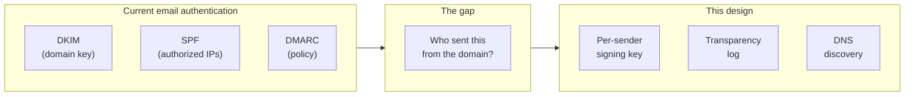
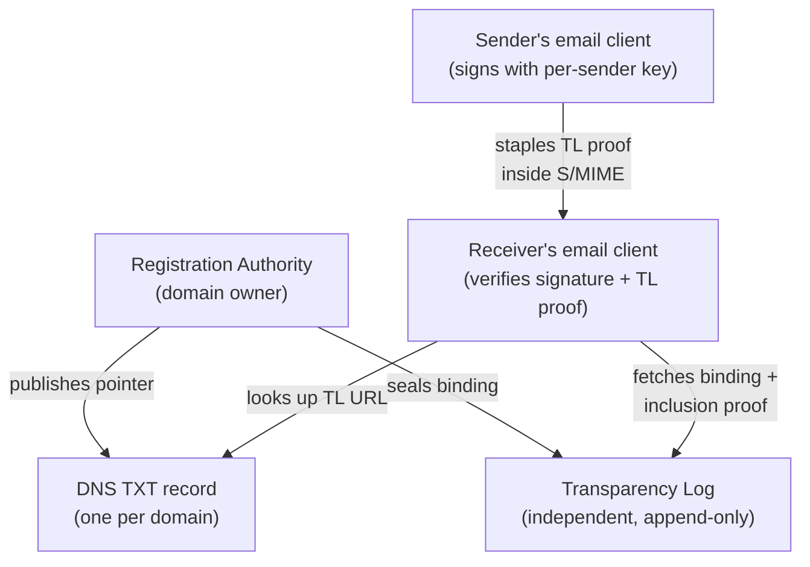
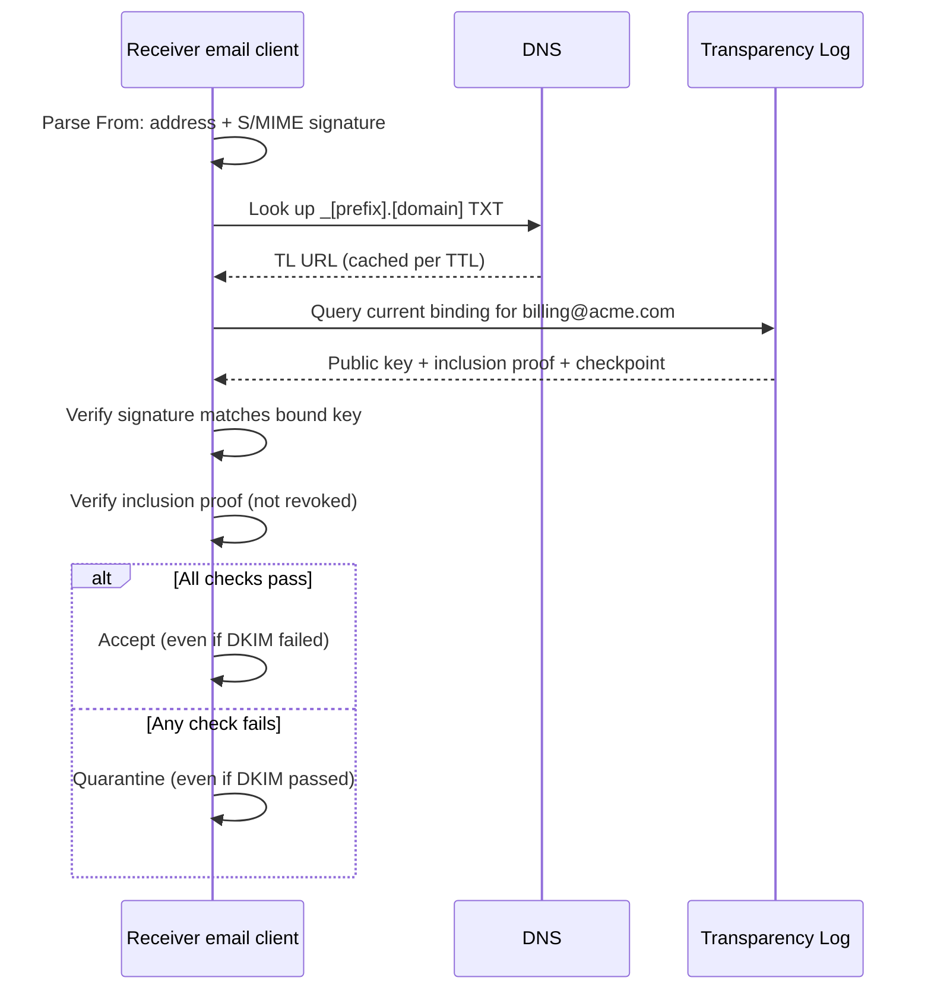
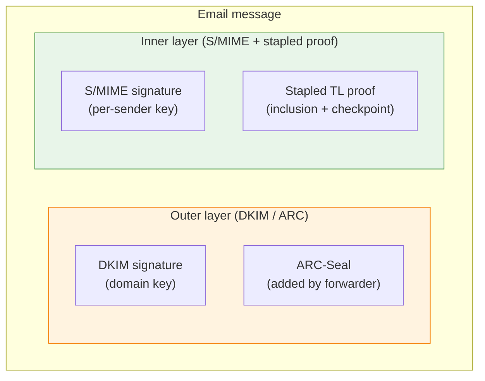

# Email sender trust: design sketch

Status: exploratory (2026-04-08). Draft 0.6.
Not an ANS feature. Inspired by the Agent Name Service (ANS), which anchors
AI agent identity to domain names using the same three components described here.

## The problem

Your CFO's email account is compromised. The attacker sends wire transfer
instructions to the accounts payable team. DKIM, the protocol that digitally
signs outgoing email so a receiver can verify it wasn't forged in transit,
passes. SPF and DMARC, the two protocols designed to catch domain forgery,
pass. Every authentication check succeeds because all three operate at the
domain level. The attacker is sending from the real domain.

The typical attack exploits an existing relationship. The attacker
compromises a vendor's billing address, replies to a real invoice thread,
and changes the bank account number. The recipient sees a familiar sender,
a familiar subject line, and a valid signature on every message in the
conversation. The only difference is the routing number.

The same failure occurs when an attacker registers `acme-billing.com` and
configures all three protocols correctly. The signatures pass. The domain
is fake.

S/MIME (the standard for signing individual email messages) and PGP can bind
a signature to a specific sender, but both require the receiver to already
trust the sender's Certificate Authority or to have exchanged keys manually.
Neither publishes key bindings to a transparency log, an independent,
append-only record that receivers could check without trusting the sender's
organization. When a key is compromised, the damage is discovered afterward.

These attacks share a trait: the email travels from a known sender to a
specific recipient. Wire instructions, payment notifications, executive
requests. This design targets that class of email. The per-sender proof
survives intact through intermediaries that don't modify the body. When a
security gateway does modify the body (URL rewriting, banner injection),
the gateway verifies the proof first, then applies its changes.

What if the receiver could check the sender's signing key against an
independent log, without trusting the sender's CA or exchanging keys in
advance? That requires three things working together: per-sender keys, a
transparency log, and DNS-based discovery.



*DKIM, SPF, and DMARC prove the email came from the domain. They cannot
prove which sender on that domain sent it. Per-sender keys, sealed into a
transparency log and discoverable via DNS, close the gap.*

## How it works

ANS proved this combination for AI agents. The same four components apply
to email senders.



*The RA and the log are operated independently. A compromised RA cannot
rewrite the log; a compromised log cannot fabricate RA signatures. The
receiver needs no prior trust relationship with either.*

### Per-sender signing key

Each protected sender gets a dedicated key pair (Ed25519 or ECDSA P-256).
The private key stays in a hardware security module (HSM), secure enclave, or
managed service account on the sender's infrastructure. It never leaves that
boundary.

The identifier is the plain email address: `billing@acme.com`. The
transparency log indexes by sender address. When the key rotates, a new
event is sealed with a fresh key ID. No version numbers are needed because
email senders, unlike software agents, don't change code between rotations.

### Transparency log

An append-only log based on SCITT (RFC 9943, a standard for supply-chain
integrity that defines tamper-evident logs with cryptographic proofs). Every
key registration, rotation, and revocation is a sealed event accompanied by
an inclusion proof, a compact receipt that proves the event exists in the log
without downloading the entire log.

The receiver verifies the inclusion proof without trusting the registrar. If
the registrar is compromised, the log's signed checkpoints (periodic snapshots
of the log state, signed by the log operator) expose unauthorized entries.

The log can be public (internet-scale, like Certificate Transparency logs for
TLS), private (enterprise internal), or hybrid (private with selective
publication to a public log).

### DNS discovery

One TXT record per domain:

```dns
_[prefix].[domain].  IN  TXT  "v=[VER]1; log=https://tl.example.com; ttl=300"
```

The record prefix and version tag are placeholders pending a project name.
The fields:

| Field | Required | Purpose |
| ----- | -------- | ------- |
| `v` | Yes | Format version |
| `log` | Yes | Transparency log URL for sender key lookups |
| `ra` | No | RA identifier (for federated deployments) |
| `ttl` | No | Recommended receiver cache duration in seconds (default 300) |

Receivers that don't support this system ignore the record.

A separate record (not piggybacked on `_dmarc`) avoids coupling failures:
a DMARC lookup failure should not prevent the log lookup.

### Registration Authority

The domain owner controls sender registration. An enterprise can run its own
RA (the same model used for internal ANS deployments) or delegate to a
third-party RA.

The RA registers sender bindings and seals them to the log. When the CEO's
account is compromised, the IT security team revokes the CEO's key through
the RA without needing the CEO's cooperation.

The log must be independent of the RA. A compromised RA cannot suppress
or alter events the log has already sealed.

## Who gets registered

Not every sender in a 50,000-employee enterprise needs an individual key.

**Tier 1 (high-value senders).** Per-address registration. The CFO, the billing
system, the automated payment notifications, customer support addresses. These
are the senders whose compromise causes wire transfers, credential theft, or
regulatory exposure. Each gets a dedicated signing key, sealed to the log,
revocable by the domain's RA.

**Tier 2 (general staff).** No per-address log entry. General staff relies on
DKIM for domain-level authentication. An optional domain-level "catch-all"
binding in the log could cover all non-Tier-1 senders, but the primary defense
remains DKIM/SPF/DMARC.

The dividing line is financial exposure. An employee sharing a meeting link
does not need the same key management as the CFO authorizing a wire transfer.

## Sending an email

The sender signs the email with S/MIME using their per-sender private key.
The proof travels inside the S/MIME signed attributes, a section of the CMS
(Cryptographic Message Syntax) envelope that carries additional authenticated
data alongside the signature. The sender staples two items:

- The transparency log inclusion proof for the current key binding.
- A signed checkpoint proving freshness.

No new email headers. The proof rides inside the CMS envelope through any
mail transfer agent (MTA), the servers that relay messages between sender and
receiver. An MTA that strips unknown headers cannot strip signed attributes
inside a CMS structure.

S/MIME already defines email signing, and the CMS structure is extensible
via signed attributes. A new signature format would require changes to every
mail transfer agent in the path. Layering on S/MIME requires only email
client changes and a new OID (Object Identifier, the numeric tag that
identifies this attribute type within the CMS structure).

## Receiving an email



*The receiver's three lookups: DNS for the log URL, the log for the key
binding, then local signature verification. No prior trust relationship
with the sender's RA or CA is required.*

If no DNS record exists for the sender's domain, the receiver treats the
email as legacy.

## Revocation

| Property | Behavior |
| -------- | -------- |
| Authority | The domain owner's RA can revoke any sender under its domain. The IT security team revokes through the RA without needing the key holder's participation. |
| Propagation | Within the DNS cache TTL (default 300 seconds). Tier 1 domains SHOULD use a 60-second TTL. Tier 1 senders MUST staple fresh proofs, giving receivers zero-cache verification without waiting for TTL expiry. |
| Push notification | The log can support webhook or subscription notification for Tier 1 senders who opt into immediate propagation. |
| Forensics | Historical bindings remain queryable with proofs. A revoked key's log history shows when it was registered, who owned it, and when it was revoked. |

The RA controls revocation, not the key holder.

## Lifecycle events

Every lifecycle event is sealed to the log:

| Event | Meaning |
| ----- | ------- |
| REGISTER | New sender binding: address + public key + owner |
| ROTATE | New key for an existing sender. Old key implicitly superseded. |
| REVOKE | RA revokes a sender's key. Immediate. |
| RENEW | Owner re-attests (periodic re-verification of key holder) |

## Data formats

### Sender binding (TL entry)

The log seals this structure for each event, indexed by sender address:

```json
{
  "eventType": "REGISTER",
  "sender": "billing@acme.com",
  "keyId": "ed25519:9f4a...3e2d",
  "publicKey": "MCowBQYDK2VwAyEA...",
  "owner": "Finance Ops Team <finance-ops@acme.com>",
  "constraints": {
    "allowedIps": ["198.51.100.0/24"],
    "configHash": "sha256:7d8e...f1a2"
  },
  "previousKeyId": null,
  "timestamp": "2026-04-08T14:22:15Z",
  "scittLeafHash": "sha256:7d8e...f1a2"
}
```

The log returns this structure plus a fresh inclusion proof on query.

### Stapled proof (CMS signed attribute)

The proof is a CMS signed attribute with a placeholder OID
(1.3.6.1.4.1.55555.1.1, to be IANA-registered):

```asn1
-- Inside signedAttrs of the SignerInfo
{
    type  1.3.6.1.4.1.55555.1.1,        -- placeholder OID
    values {
        SEQUENCE {
            sender         IA5String,     -- "billing@acme.com"
            key-id         OCTET STRING,  -- 32-byte key fingerprint
            binding-hash   OCTET STRING,  -- SHA-256 of binding JSON
            scitt-receipt  SEQUENCE {
                log-id         OCTET STRING,
                tree-size      INTEGER,
                leaf-index     INTEGER,
                inclusion-path SEQUENCE OF OCTET STRING,
                signed-checkpoint SEQUENCE {
                    timestamp  GeneralizedTime,
                    signature  OCTET STRING
                }
            }
        }
    }
}
```

JSON representation (for readability):

```json
{
  "sender": "billing@acme.com",
  "keyId": "ed25519:9f4a...3e2d",
  "bindingHash": "sha256:7d8e...f1a2",
  "scittReceipt": {
    "logId": "sha256:550e8400-e29b-41d4-a716-446655440000",
    "treeSize": 142387,
    "leafIndex": 8734,
    "inclusionPath": [
      "sha256:01a2...b3c4",
      "sha256:05d6...e7f8"
    ],
    "signedCheckpoint": {
      "timestamp": "2026-04-08T14:22:15Z",
      "signature": "MEUCIQD..."
    }
  }
}
```

The JSON is DER-encoded (a compact binary serialization that CMS uses
internally) inside the CMS attribute. Receivers extract and verify it
against the log.

## Body modification and gateway verification



*Intermediaries that only re-sign (orange layer) leave the inner S/MIME
proof (green layer) intact. Intermediaries that rewrite the body break
both layers. The gateway-first verification path handles the second case.*

The stapled proof lives inside S/MIME signed attributes, which are protected
by the original sender's signature. Forwarding services that re-sign with
ARC (RFC 8617, the Authenticated Received Chain that preserves authentication
results across mail forwarding hops) add an ARC-Seal over the outer DKIM
chain but do not alter the inner CMS structure.

When an email passes through a forwarder that only re-signs the DKIM layer,
the inner S/MIME signature and stapled proof survive intact. The receiver
verifies the original proof first, before evaluating any ARC seals.

**The body modification problem.** Many intermediaries do more than re-sign.
Security gateways rewrite URLs for click tracking, inject banners, and
append disclaimers. Mailing lists add footers. Corporate relays re-encode
attachments. Any change to the message body breaks the S/MIME signature,
and the stapled proof breaks with it. ARC preserves DKIM authentication
across these hops but cannot preserve an inner S/MIME signature over
modified content.

This is not a rare edge case. Security gateways sit in the inbound path of
most enterprise email. A normal message from an external sender to a
corporate recipient passes through the recipient's gateway, which rewrites
the body before delivery. The DKIM body hash changes. The S/MIME signature
breaks. The stapled proof is lost.

S/MIME has had this problem since 1995. It is a primary reason S/MIME never
reached mainstream adoption. This design inherits the limitation because it
chose S/MIME as the carrier. The trade-off was deliberate: CMS stapling
avoids requiring changes to every mail transfer agent in the path, which is
the only realistic route to incremental adoption. But "no MTA changes
required" and "survives content modification by intermediaries" are mutually
exclusive.

**Gateway-first verification.** The practical deployment path is to verify
the proof at the ingress gateway before any body modification occurs. The
gateway parses the S/MIME signature and stapled proof, checks the sender's
key binding against the transparency log, records the result, then applies
its URL rewriting, banners, and disclaimers to the now-verified message.
The inner signature breaks, but the verification already happened.

Gateways are consumers of the transparency log, not operators. The
independence between RA, log, and receiver is the same architectural
boundary that makes Certificate Transparency work: the verifier does not
control the log, and the log does not control the registrar. A gateway
that also acted as the RA or log operator would centralize trust in the
receiver, which is the opposite of what this design provides.

**Scope boundary.** Per-sender verification protects email that either
arrives unmodified (direct sender-to-receiver) or passes through a gateway
that verifies before rewriting. The CFO's wire transfer instructions, the
billing system's payment notifications, the support address responding to a
customer. These hit the gateway first. Tier 1 senders should use secure
portal links for high-value content rather than email bodies that
intermediaries will modify after verification.

For email that routinely passes through content-modifying relays without
pre-verification (mailing lists, forwarding rules), domain-level DKIM
remains the authentication layer.

## Relationship to existing standards

| Standard | Relationship |
| -------- | ------------ |
| DKIM/SPF/DMARC | Runs in parallel. This design adds per-sender verification on top. |
| S/MIME | Layers on top. Reuses the CMS signature format with a new signed attribute OID. |
| Certificate Transparency | Same concept applied to email sender keys instead of TLS certificates. |
| SCITT (RFC 9943) | The log implementation. Reuses append-only log, inclusion proofs, and signed checkpoints. |
| ARC (RFC 8617) | Inner CMS proof preserved through forwarding. ARC governs the outer DKIM chain only. |
| BIMI / VMC / CMC | Complementary. BIMI binds a brand logo to a domain via DNS; a Verified Mark Certificate (VMC) or Common Mark Certificate (CMC) is an X.509 cert that verifies the logo belongs to the domain owner. This design verifies the *sender*. BIMI verifies the *brand*. Both signals can travel in the transparency log binding. |

## BIMI integration

BIMI (Brand Indicators for Message Identification) already solves a related
problem for email: proving which brand owns the sending domain. A domain with
a VMC has passed trademark verification. A domain with a CMC has proven at
least one year of logo use. Self-asserted BIMI publishes a logo via DNS
without certificate verification.

The per-sender key binding proves that `billing@acme.com` is an authorized
sender. The VMC proves that `acme.com` is a verified brand. A single
transparency log entry can carry both.

The sender binding structure can carry BIMI status as an optional field:

| Field | Purpose |
| ----- | ------- |
| `bimi` | `vmc`, `cmc`, `self-asserted`, or absent |
| `vmcUrl` | URL to the VMC or CMC certificate (when present) |
| `logoHash` | SHA-256 of the verified logo SVG |

A receiver or discovery service that indexes the log can then distinguish
three levels of brand trust without performing its own DNS lookups and
certificate downloads for every sender:

| BIMI status | Brand verification | Visual treatment |
| ----------- | ----------------- | ---------------- |
| VMC | Registered trademark verified by CA | Verified badge |
| CMC | Logo use verified by CA | Verified badge (lower tier) |
| Self-asserted | DNS record only, no CA verification | Logo displayed, no badge |
| Absent | No BIMI record | Generic icon |

Brands that have already invested in VMC for email reuse that proof here.
One log query returns both the sender's key binding and the brand's
verification status.

## Security properties

| Property | What it means |
| -------- | ------------- |
| No CA monopoly | The receiver trusts the log and DNSSEC (DNS Security Extensions, which cryptographically sign DNS records), not a specific CA. Any RA can register senders. |
| RA compromise is detectable | Unauthorized registrations appear in the log's signed checkpoints. The log cannot suppress events the RA sealed. |
| Key compromise is bounded | Revocation propagates within the cache TTL. Historical proofs identify exactly which emails were sent with the compromised key before revocation. |
| Backward compatible | Non-supporting receivers see ordinary S/MIME email. Mail transfer agents pass the signed attribute through untouched. |

## Failure modes

| Mode | Likelihood | Mitigation |
| ---- | ---------- | ---------- |
| Email clients don't parse custom CMS signed attributes | High today | Deploy at the security gateway first (mail filtering appliances already inspect S/MIME). Push client updates to major vendors after gateway adoption proves the value. |
| Forwarding services strip CMS attributes | Medium | Same services already break S/MIME today. No worse than the status quo. Tier 1 senders should avoid forwarding for wire instructions and use portal links instead. |
| Key rotation burden for Tier 1 senders | Medium | Automated RA console with HSM integration. Same operational model as certificate lifecycle management for TLS. |
| 5-minute revocation window exploited | Medium | MUST-staple for Tier 1 closes the window. Push notifications via webhook give near-instant propagation for opted-in receivers. |
| Security gateway rewrites body, breaking S/MIME proof | High in enterprises | Verify at the ingress gateway before body modification. Gateway records the result, then applies its rewrites. |

## Privacy

The `owner` field in the transparency log binding can contain names and
email addresses. For public logs:

- The owner field MUST be redacted to a role identifier ("Finance Ops Team")
  or omitted entirely. The minimum binding is sender address + public key +
  key ID.
- When an enterprise needs owner tracking in a public log, use a pseudonym:
  SHA-256 of the owner's email address. Only the RA can re-identify it.
- The log supports redaction events (SCITT allows replacing a leaf with a
  redacted version). Retention should align with the domain's regulatory
  requirements; automated deletion after the retention period.

Enterprises using private logs keep full owner data internal. Federation
to a public log strips personally identifiable information automatically.
The DNS record contains no personal data.

## Spam-control integration

This design becomes a signal in existing spam filters the same way DMARC
became one. Mail security gateways already parse S/MIME signatures and
DMARC results for intent scoring. They can add a rule: a passing per-sender
proof alongside a passing DKIM signature boosts legitimacy; a failing proof
(even with DKIM passing) triggers quarantine.

Attackers cannot forge the log proof. A spoofed domain or compromised
account produces a valid DKIM signature but no valid per-sender proof.
Legitimate Tier 1 mail passes both checks, so the additional signal does
not add false positives.

## Adoption

S/MIME never crossed the adoption threshold because key exchange was manual
and CA trust was painful. Here, the log replaces the CA, but receivers still
need a reason to check it.

Three standards crossed the same threshold:

- **DKIM (2007).** Big senders adopted first. Gmail and Yahoo published
  DKIM signatures; receivers added checks. Enforcement followed volume.
- **Certificate Transparency (2013-2018).** Google seeded the public logs,
  then Chrome required CT for all new certificates. Adoption was
  operator-driven, not user-driven.
- **DMARC (2012-2024).** Twelve years from publication to broad enforcement.
  Gmail and Yahoo required DMARC alignment in 2024 for bulk senders. Policy
  pressure from large receivers drove adoption.

Enterprise pilots with private logs come first. Large cloud email providers
who control the majority of outbound enterprise mail adopt next. Receiver-side
enforcement for domains that publish the DNS record follows. Financial
institutions will likely require it for wire transfer instructions before
any general mandate.

## Trust scoring

The ANS Trust Index Spec defines a scoring engine that crawls transparency
logs, assembles a manifest of signals, and returns a signed trust evaluation.
It scores agents across five dimensions: integrity, identity, solvency,
behavior, and safety.

Three of those dimensions apply to email senders without modification.
Integrity covers key age, rotation history, and receipt freshness. Identity
covers BIMI status, DMARC policy, and certificate type (the Trust Index
Spec already defines these as inherited trust anchors in §5.6). Behavior
covers revocation history and complaint patterns. Solvency and safety do
not apply.

The transparency log format is the same (SCITT). The evaluation API is the
same. The Trust Manifest schema is extensible. An implementation that scores
ANS agents can score email senders from the same infrastructure by adding
email-specific signal blocks to the manifest.

## Open questions

1. **Project name.** Working name TBD. The DNS record prefix, format version
   tag, and OID descriptions depend on it.
2. **S/MIME signed attribute OID.** Placeholder OID 1.3.6.1.4.1.55555.1.1
   used in this sketch. Needs IANA registration under the final project name.
3. **TL query protocol.** REST API (mirrors ANS TL) is the current
   recommendation. A standardized query format would enable interoperability
   across log implementations but adds specification work.
4. **Enterprise internal deployment.** Private RA + private log for
   employee-to-employee mail. Federation to a public log for external senders.
   The boundary and trust model for federation need specification.
5. **Bulk registration API.** Enterprises registering hundreds of Tier 1
   senders need a batch registration endpoint. Single-sender registration
   doesn't scale for initial rollout.
6. **Key storage requirements.** HSM or secure enclave for Tier 1 senders.
   Whether this is a MUST or a SHOULD affects deployment cost and adoption
   speed.
7. **Log governance.** Who operates public logs, and who establishes root
   trust? Certificate Transparency faced the same question and took years
   to resolve through browser vendor policy. The email ecosystem has no
   equivalent enforcement lever today.
