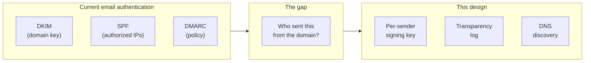
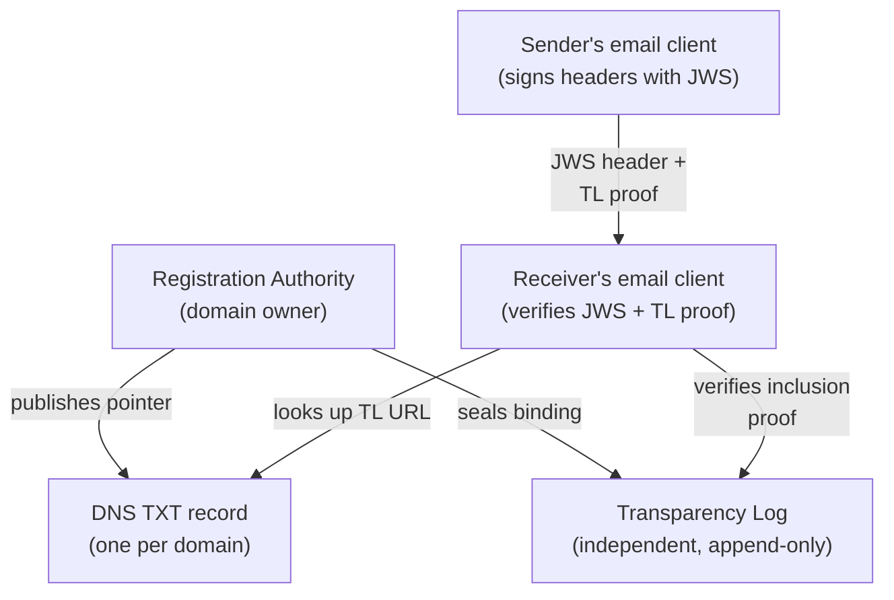
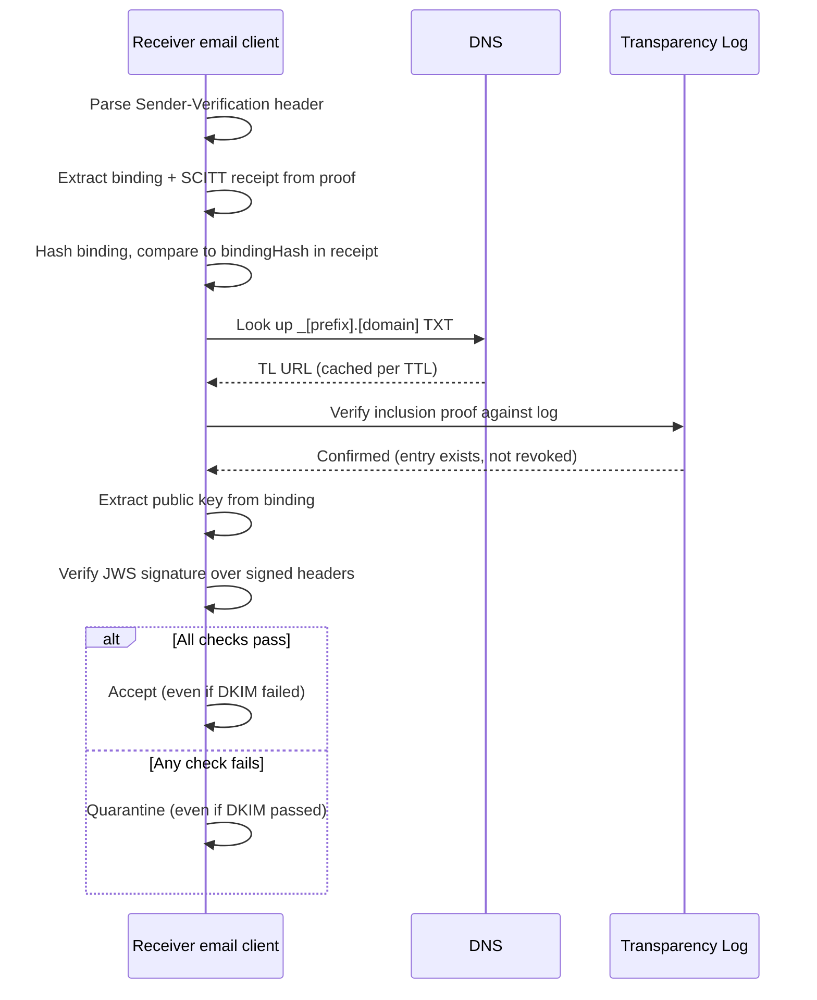
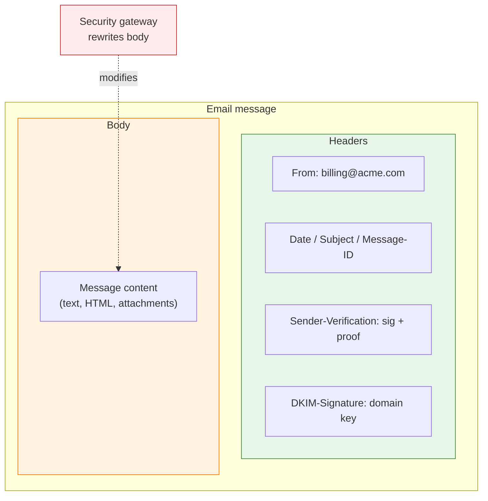

# Sender verification specification

Version 1.0 (2026-04-09).
Not an ANS feature. Applies principles from the Agent Name Service (ANS),
which anchors AI agent identity to domain names.

## The problem

Your CFO's email account is compromised. The attacker sends wire transfer
instructions to the accounts payable team. DKIM, the protocol that digitally
signs outgoing email so a receiver can verify it wasn't forged in transit,
passes. SPF and DMARC, the two protocols designed to catch domain forgery,
pass. Every authentication check succeeds because all three operate at the
domain level. The attacker is sending from the real domain.

The typical attack exploits an existing relationship. The attacker
compromises a vendor's billing address, replies to a real invoice thread,
and changes the bank account number. The recipient sees a familiar sender,
a familiar subject line, and a valid signature on every message in the
conversation. The only difference is the routing number.

An attacker who registers `acme-billing.com` and configures all three
protocols correctly passes every check. The domain is fake.

S/MIME (the standard for signing individual email messages) and PGP can bind
a signature to a specific sender, but both require the receiver to already
trust the sender's Certificate Authority or to have exchanged keys manually.
Neither publishes key bindings to a transparency log, an independent,
append-only record that receivers could check without trusting the sender's
organization.

What if the receiver could check the sender's signing key against an
independent log, without trusting the sender's CA or exchanging keys in
advance?



*DKIM, SPF, and DMARC prove the email came from the domain. They cannot
prove which sender on that domain sent it.*

## How it works



*A compromised RA cannot rewrite the log. A compromised log cannot fabricate
RA signatures. The receiver needs no prior trust relationship with either.*

### Per-sender signing key

Each protected sender gets a dedicated key pair (Ed25519 or ECDSA P-256).
An organization whose CFO already has a PGP key pair can register that
existing key instead of generating a new one. The private key stays in a
hardware security module (HSM), secure enclave, or managed service account
on the sender's infrastructure. It never leaves that boundary.

The identifier is the plain email address: `billing@acme.com`. In public
logs, the address is stored as a salted hash to prevent enumeration. When
the key rotates, a new event is sealed with a fresh key ID.

### Transparency log

An append-only log based on SCITT (RFC 9943, a standard for supply-chain
integrity that defines tamper-evident logs with cryptographic proofs). Every
key registration, rotation, and revocation is a sealed event accompanied by
an inclusion proof, a compact receipt that proves the event exists in the
log without downloading the entire log.

The receiver verifies the inclusion proof without trusting the registrar. If
the registrar is compromised, the log's signed checkpoints (periodic
snapshots of the log state, signed by the log operator) expose unauthorized
entries.

The log can be public (internet-scale, like Certificate Transparency logs
for TLS), private (enterprise internal), or hybrid (private with selective
publication to a public log).

### DNS discovery

One TXT record per domain:

```dns
_[prefix].[domain].  IN  TXT  "v=[VER]1; log=https://tl.example.com; ttl=300"
```

The record prefix and version tag are placeholders pending a project name.

| Field | Required | Purpose |
| ----- | -------- | ------- |
| `v` | Yes | Format version |
| `log` | Yes | Transparency log URL for sender key lookups |
| `ra` | No | RA identifier (for federated deployments) |
| `ttl` | No | Recommended receiver cache duration in seconds (default 300) |
| `salt` | No | Hex-encoded salt for sender address hashing in public logs |
| `strict` | No | When `1`, receivers MUST quarantine email from Tier 1 senders that arrives without a Sender-Verification header |

Receivers that don't support this system ignore the record.

A separate record (not piggybacked on `_dmarc`) avoids coupling failures:
a DMARC lookup failure should not prevent the log lookup.

### Registration Authority

The domain owner controls sender registration. An enterprise can run its
own RA or delegate to a third party.

The RA registers sender bindings and seals them to the log. When the CEO's
account is compromised, the IT security team revokes the CEO's key through
the RA without needing the CEO's cooperation.

The log must be independent of the RA. A compromised RA cannot suppress
or alter events the log has already sealed.

## Who gets registered

Not every sender in a 50,000-employee enterprise needs an individual key.

**Tier 1 (high-value senders).** Per-address registration. The CFO, the
billing system, the automated payment notifications, customer support
addresses. These are the senders whose compromise causes wire transfers,
credential theft, or regulatory exposure. Each gets a dedicated signing
key, sealed to the log, revocable by the domain's RA.

**Tier 2 (general staff).** No per-address log entry. General staff relies
on DKIM for domain-level authentication. An optional domain-level
"catch-all" binding in the log could cover all non-Tier-1 senders, but the
primary defense remains DKIM/SPF/DMARC.

The dividing line is financial exposure. An employee sharing a meeting link
does not need the same key management as the CFO authorizing a wire transfer.

## Sending an email

The sender signs the email's headers with a JWS detached signature
(RFC 7515, Appendix F). The signature and the transparency log inclusion
proof travel together in a new email header. An ECDSA P-256 signature is
approximately 86 characters. ARC (RFC 8617, the Authenticated Received
Chain) already uses header-only signing in email, so the pattern has
precedent.

The signed header set:

| Header | Required | What it prevents |
| ------ | -------- | ---------------- |
| From | Yes | Sender impersonation |
| Date | Yes | Replay of old messages |
| Message-ID | Yes | Replay of old messages |
| To | Yes | Replay to unintended recipients |
| Cc | Yes | Replay to unintended recipients |
| Reply-To | Yes | Response redirection by an intermediary |
| In-Reply-To | Yes | Thread hijacking (forging a reply into an existing conversation) |
| References | Yes | Thread hijacking (forging a reply into an existing conversation) |
| Subject | Recommended | Mailing lists that add a prefix invalidate only this field |

When a header in the signed set is absent from the original message
(for example, In-Reply-To on a message that is not a reply), signing
the absence prevents an intermediary from adding it later.

Header signing does not prove the body arrived intact. Tier 1 senders
SHOULD include a body hash (`bh=`). When present, the receiver can detect
body modification. When absent or non-matching, the sender identity is
still verified but the body is not.

Example header (simplified):

```text
Sender-Verification: v=SV1;
  a=ES256;
  s=billing@acme.com;
  h=from:date:subject:message-id:to:cc:reply-to:in-reply-to:references;
  bh=sha256:7d8e...f1a2;
  sig=MEUCIQD...;
  proof=eyJ0cmVlU2l6ZSI6MTQyMzg3...
```

| Field | Purpose |
| ----- | ------- |
| `v` | Format version |
| `a` | Signing algorithm |
| `s` | Sender address in plaintext (matches From header). The receiver hashes this with the published salt for log lookup. |
| `h` | Signed header fields |
| `bh` | Body hash for integrity verification. RECOMMENDED for Tier 1 senders. |
| `sig` | JWS detached signature over the listed headers |
| `proof` | Base64-encoded binding + SCITT receipt (see Data formats) |

Mail transfer agents relay headers they don't recognize, so no MTA changes
are required. Verification happens at the receiver's email client or
security gateway.

## Receiving an email



*The binding travels with the email. The log confirms it was registered.
No key-fetch round trip to the RA. No prior CA trust required.*

If no DNS record exists for the sender's domain, the receiver treats the
email as legacy.

A domain that publishes the DNS record can also declare which senders are
Tier 1 in the transparency log. When an email arrives from a listed sender
without a Sender-Verification header, the absence is a scoring signal. The
domain told the world to expect a proof from that sender, and the proof is
missing. A Trust Index that consumes the log can lower the sender's score
on that basis, the same way it lowers an agent's integrity score when a
Trust Card is missing. The receiver's gateway acts on the score.

## Headers and intermediaries



*The JWS signature covers the headers (green). A security gateway that
rewrites the body (orange) does not touch the headers. The sender
verification survives.*

The signature covers email headers, not the message body. Security gateways
that rewrite URLs, inject banners, or append disclaimers change the body but
leave the signed headers intact.

The sender verification passes regardless of body modification.

When a message carries a body hash (`bh=`), the gateway knows the sender
claimed body integrity. The gateway can handle this in two ways:

- **Preserve the body.** Skip URL rewriting and banner injection for
  this message. Verify the sender proof and body hash, then deliver
  intact. Mail flow rules already do this today for S/MIME-signed
  messages.
- **Verify then modify.** Check the body hash, record whether it
  matched, then apply normal rewrites. The body hash breaks, but the
  gateway has already recorded the integrity result.

Mailing lists sometimes modify the Subject header by adding a prefix. A
modified Subject invalidates that one field, not the verification.

Intermediaries that strip unknown headers would remove the
Sender-Verification header entirely. This is the same risk DKIM-Signature
faces, and it is rare in practice: mail servers relay headers they don't
recognize.

## Revocation

| Property | Behavior |
| -------- | -------- |
| Authority | The domain owner's RA can revoke any sender under its domain. The IT security team revokes through the RA without needing the key holder's participation. |
| Propagation | Within the DNS cache TTL (default 300 seconds). Tier 1 domains SHOULD use a 60-second TTL. Tier 1 senders MUST include fresh proofs, giving receivers zero-cache verification without waiting for TTL expiry. |
| Push notification | The log can support webhook or subscription notification for Tier 1 senders who opt into immediate propagation. |
| Forensics | Historical bindings remain queryable with proofs. A revoked key's log history shows when it was registered, who owned it, and when it was revoked. |

The RA controls revocation, not the key holder.

## Lifecycle events

Every lifecycle event is sealed to the log:

| Event | Meaning |
| ----- | ------- |
| REGISTER | New sender binding: address + public key + owner |
| ROTATE | New key for an existing sender. Old key implicitly superseded. |
| REVOKE | RA revokes a sender's key. Immediate. |
| RENEW | Owner re-attests (periodic re-verification of key holder) |

## Data formats

The log and the binding are separate structures. The log seals hashes and
identifiers only. The full binding travels with the email in the stapled
proof, carrying the public key and owner metadata. This follows the ANS
pattern: the Transparency Log seals a hash of the registration metadata,
not the metadata itself.

The log stores less per entry, and no personal data enters the public
record by construction. The receiver verifies entirely from the message
header and the log, with no round trip to the RA for key material.

### TL entry (what the log seals)

Hashes and identifiers only. No keys, no owner names, no constraints.

```json
{
  "eventType": "REGISTER",
  "senderHash": "sha256:a1b2c3d4...e5f6",
  "keyId": "es256:9f4a...3e2d",
  "bindingHash": "sha256:7d8e...f1a2",
  "previousKeyId": null,
  "timestamp": "2026-04-08T14:22:15Z"
}
```

The `bindingHash` is the SHA-256 of the full binding JSON. The log proves
that a binding was registered and when. It does not store what the binding
contains.

### Full binding (what the sender staples)

The sender includes the full binding alongside the SCITT receipt in the
Sender-Verification header. The receiver hashes the binding and compares
the result against the `bindingHash` in the TL entry. If they match, the
binding is authentic.

```json
{
  "senderHash": "sha256:a1b2c3d4...e5f6",
  "keyId": "es256:9f4a...3e2d",
  "publicKey": "MFkwEwYHKoZIzj0CAQYIKoZIzj0DAQcDQgAE...",
  "owner": "Finance Ops Team",
  "did": null,
  "constraints": {
    "allowedIps": ["198.51.100.0/24"],
    "configHash": "sha256:7d8e...f1a2"
  }
}
```

The `did` field is optional. A did:web identifier maps directly from the
email address: `cfo@acme.com` becomes `did:web:acme.com:users:cfo`. The
email address remains the primary lookup key.

### Sender-Verification header proof

The proof field carries both structures, Base64-encoded:

```json
{
  "binding": {
    "senderHash": "sha256:a1b2c3d4...e5f6",
    "keyId": "es256:9f4a...3e2d",
    "publicKey": "MFkwEwYHKoZIzj0CAQYIKoZIzj0DAQcDQgAE...",
    "owner": "Finance Ops Team",
    "did": null,
    "constraints": {
      "allowedIps": ["198.51.100.0/24"],
      "configHash": "sha256:7d8e...f1a2"
    }
  },
  "scittReceipt": {
    "logId": "sha256:550e8400-e29b-41d4-a716-446655440000",
    "treeSize": 142387,
    "leafIndex": 8734,
    "inclusionPath": [
      "sha256:01a2...b3c4",
      "sha256:05d6...e7f8"
    ],
    "signedCheckpoint": {
      "timestamp": "2026-04-08T14:22:15Z",
      "signature": "MEUCIQD..."
    }
  }
}
```

The Base64-encoded proof is approximately 1 KB, comparable to a
DKIM-Signature or ARC-Seal header.

## Relationship to existing standards

| Standard | Relationship |
| -------- | ------------ |
| DKIM/SPF/DMARC | Runs in parallel. This design adds per-sender verification on top. |
| JWS (RFC 7515) | The signature format. Detached signature over email headers. |
| ARC (RFC 8617) | Precedent for header-only signing in email. |
| Certificate Transparency | Same concept applied to email sender keys instead of TLS certificates. |
| SCITT (RFC 9943) | The log implementation. Reuses append-only log, inclusion proofs, and signed checkpoints. |
| DID (W3C) | Optional identity format in the sender binding. Not required for verification. |
| BIMI / VMC / CMC | Complementary. BIMI verifies the brand. This design verifies the sender. Both signals can travel in the log binding. |

## Why not per-sender DKIM selectors?

Per-sender DKIM selectors achieve per-sender signing with existing
infrastructure. DKIM stores its keys in DNS, which the domain owner
controls. If the domain is compromised, the attacker can add a new DKIM
selector, sign fraudulent messages with it, and remove the old selector
record. No audit trail of the change survives in DNS.

This design stores key events in a transparency log that the domain owner
cannot rewrite. Every registration, rotation, and revocation is a
permanent entry. A compromised domain can revoke a key but cannot erase
the fact that it existed or that messages were signed with it before
revocation.

DKIM verification succeeds when the domain is compromised. It should not.

## BIMI integration

BIMI (Brand Indicators for Message Identification) proves which brand owns
the sending domain. A domain with a VMC (Verified Mark Certificate) has
passed trademark verification. A domain with a CMC (Common Mark Certificate)
has proven at least one year of logo use. Self-asserted BIMI publishes a
logo via DNS without certificate verification.

The per-sender key binding proves that `billing@acme.com` is an authorized
sender. The VMC proves that `acme.com` is a verified brand. A single
transparency log entry can carry both.

The sender binding structure can carry BIMI status as an optional field:

| Field | Purpose |
| ----- | ------- |
| `bimi` | `vmc`, `cmc`, `self-asserted`, or absent |
| `vmcUrl` | URL to the VMC or CMC certificate (when present) |
| `logoHash` | SHA-256 of the verified logo SVG |

| BIMI status | Brand verification | Visual treatment |
| ----------- | ----------------- | ---------------- |
| VMC | Registered trademark verified by CA | Verified badge |
| CMC | Logo use verified by CA | Verified badge (lower tier) |
| Self-asserted | DNS record only, no CA verification | Logo displayed, no badge |
| Absent | No BIMI record | Generic icon |

Brands that have already invested in VMC for email reuse that proof here.

## Security properties

| Property | What it means |
| -------- | ------------- |
| No CA monopoly | The receiver trusts the log and DNSSEC (DNS Security Extensions, which cryptographically sign DNS records), not a specific CA. Any RA can register senders. |
| RA compromise is detectable | Unauthorized registrations appear in the log's signed checkpoints. The log cannot suppress events the RA sealed. |
| Key compromise is bounded | Revocation propagates within the cache TTL. Historical proofs identify exactly which emails were sent with the compromised key before revocation. |
| Survives body modification | The JWS signature covers headers, not the body. Security gateways that rewrite URLs or inject banners do not invalidate the sender verification. |
| Replay and thread-hijack resistant | To, Cc, Reply-To, In-Reply-To, References, Date, and Message-ID are in the mandatory signed set. Replaying to a different recipient, injecting a Reply-To, or forging a reply into an existing thread invalidates the signature. |
| Backward compatible | Non-supporting receivers see an unrecognized header and ignore it. |

## Failure modes

| Mode | Likelihood | Mitigation |
| ---- | ---------- | ---------- |
| Intermediary strips the Sender-Verification header | Low | Same risk as stripping DKIM-Signature. Mail servers relay headers they don't recognize. |
| Mailing list modifies Subject header | Medium | Subject is recommended, not mandatory. A modified Subject invalidates that field only. |
| Replay to unintended recipient | Low | To and Cc are in the mandatory signed set. Replaying to a different recipient invalidates the signature. |
| Reply-To injection by intermediary | Low | Reply-To is in the mandatory signed set. Adding or modifying Reply-To after signing invalidates the signature. |
| Thread hijacking via forged In-Reply-To | Low | In-Reply-To and References are in the mandatory signed set. Forging a reply into an existing conversation invalidates the signature. |
| Header stripped on strict-mode domain | Medium | When the DNS record includes `strict=1`, the receiver quarantines email from Tier 1 senders that arrives without the header. |
| Key rotation burden for Tier 1 senders | Medium | Automated RA console with HSM integration. Same operational model as certificate lifecycle management for TLS. |
| 5-minute revocation window exploited | Medium | Fresh proofs required for Tier 1. Push notifications via webhook give near-instant propagation for opted-in receivers. |

## Privacy

A public transparency log that indexes by plaintext sender address exposes
every Tier 1 sender at a domain. An attacker who queries the log can
enumerate the CFO, the billing system, and every other registered address.
That is a target list.

Public logs MUST index by salted hash instead of plaintext address. The
domain publishes a salt value (rotatable) in the DNS record or the log
metadata. The receiver computes `SHA-256(salt || "billing@acme.com")` from
the From header and looks up the hash in the log. The log never contains
the plaintext address.

| Property | Behavior |
| -------- | -------- |
| Lookup | Receiver computes hash from From header + published salt, queries the log by hash |
| Enumeration | An attacker with the salt can hash guessed addresses but cannot enumerate registered senders from the log alone |
| Salt rotation | The domain publishes a new salt and re-registers all Tier 1 bindings under the new hashes. Old hashes become unlinkable. |
| Private logs | Enterprises using private logs may store plaintext addresses internally. Federation to a public log replaces them with hashes. |

The `owner` field in the binding carries additional risk. For public logs,
the owner field MUST be redacted to a role identifier ("Finance Ops Team")
or omitted. When an enterprise needs owner tracking in a public log, a
pseudonym (SHA-256 of the owner's email, re-identifiable only by the RA)
is sufficient.

The log supports redaction events (SCITT allows replacing a leaf with a
redacted version). Retention should align with the domain's regulatory
requirements.

The DNS record contains no personal data.

Three additional privacy techniques apply as future extensions:

- **Org-level authorization.** The log could register key authorizations at
  the organization level ("acme.com authorizes key fingerprint abc123 for
  email signing") without binding keys to specific senders. The key-to-sender
  mapping would live in the organization's own infrastructure, where it can
  control access and rate-limit queries. The log reveals how many sender
  keys an organization has, not who they belong to. This adds an HTTPS
  round trip to the sender's endpoint for the key-to-sender resolution.
- **Query privacy.** A receiver that queries the log for a specific sender
  hash reveals who it is communicating with. Private Information Retrieval
  (PIR) would let the receiver query without the log operator learning
  which hash was checked. The ANS architecture spec (§4.9) recommends
  this for agent discovery.
- **Zero-knowledge freshness.** A sender could prove that its key binding
  was registered within a recent time window without revealing which log
  entry or which sender hash. The ANS Trust Index Spec uses zero-knowledge
  proofs for solvency (§4.3). The same pattern applies to registration
  freshness.

## Spam-control integration

Mail security gateways already parse DKIM signatures and DMARC results for
intent scoring. They can add a rule: a passing per-sender proof alongside a
passing DKIM signature boosts legitimacy; a failing proof (even with DKIM
passing) triggers quarantine.

Attackers cannot forge the log proof. A spoofed domain or compromised
account produces a valid DKIM signature but no valid per-sender proof.
Legitimate Tier 1 mail passes both checks, so the additional signal does
not add false positives.

## Adoption

Previous attempts at per-sender email signing (S/MIME, PGP) failed because
key exchange was manual and CA trust was painful. Here, a transparency log
replaces the CA, and DNS discovery replaces the key exchange.

S/MIME signed the message body, which broke when security gateways rewrote
URLs or injected banners. S/MIME's encryption also prevents gateways from
scanning message content, forcing enterprises to write mail flow rules that
bypass S/MIME emails entirely. Header-only signing survives body
modifications, leaves the message body readable for gateway inspection,
and requires neither MTA changes nor S/MIME client support.

Three standards crossed a similar adoption threshold:

- **DKIM (2007).** Big senders adopted first. Gmail and Yahoo published
  DKIM signatures; receivers added checks. Enforcement followed volume.
- **Certificate Transparency (2013-2018).** Google seeded the public logs,
  then Chrome required CT for all new certificates. Adoption was
  operator-driven, not user-driven.
- **DMARC (2012-2024).** Twelve years from publication to broad enforcement.
  Gmail and Yahoo required DMARC alignment in 2024 for bulk senders. Policy
  pressure from large receivers drove adoption.

Enterprise pilots with private logs come first. Large cloud email providers
who control the majority of outbound enterprise mail adopt next.
Receiver-side enforcement for domains that publish the DNS record follows.

Financial institutions will likely require it for wire transfer instructions
before any general mandate.

## Trust scoring

The ANS Trust Index Spec defines a scoring engine that crawls transparency
logs, assembles a manifest of signals, and returns a signed trust
evaluation. It scores agents across five dimensions: integrity, identity,
solvency, behavior, and safety.

Three of those dimensions apply to email senders. Integrity covers key age,
rotation history, and receipt freshness. Identity covers BIMI status, DMARC
policy, and certificate type (the Trust Index Spec defines these as
inherited trust anchors in §5.6). Behavior covers revocation history and
complaint patterns. Solvency and safety do not apply.

The log format, evaluation API, and manifest schema are shared. An
implementation that scores ANS agents can score email senders by adding
email-specific signal blocks to the manifest.

## Open questions

1. **Project name.** Working name TBD. The DNS record prefix, format version
   tag, and header name depend on it.
2. **JWS header name.** `Sender-Verification` is a placeholder. The final
   name needs IANA registration.
3. **TL query protocol.** REST API (mirrors ANS TL) is the current
   recommendation. A standardized query format would enable interoperability
   across log implementations but adds specification work.
4. **Enterprise internal deployment.** Private RA + private log for
   employee-to-employee mail. Federation to a public log for external
   senders. The boundary and trust model for federation need specification.
5. **Bulk registration API.** Enterprises registering hundreds of Tier 1
   senders need a batch registration endpoint. Single-sender registration
   doesn't scale for initial rollout.
6. **Key storage requirements.** HSM or secure enclave for Tier 1 senders.
   Whether this is a MUST or a SHOULD affects deployment cost and adoption
   speed.
7. **Log governance.** Who operates public logs, and who establishes root
   trust? Certificate Transparency faced the same question and took years
   to resolve through browser vendor policy. The email ecosystem has no
   equivalent enforcement lever today.
8. **DID integration.** The `did` field in the sender binding is optional.
   A did:web identifier maps directly from the email address:
   `cfo@acme.com` becomes `did:web:acme.com:users:cfo`. A receiver could
   derive the DID from the From header, attempt resolution, and degrade
   gracefully if no DID document exists. The email address remains the
   primary identifier and lookup key.
