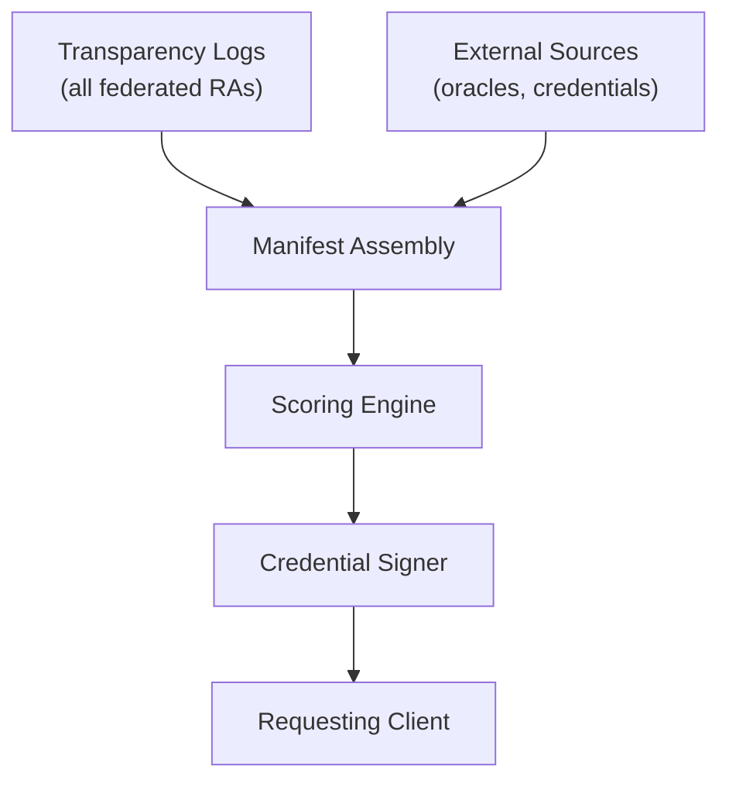
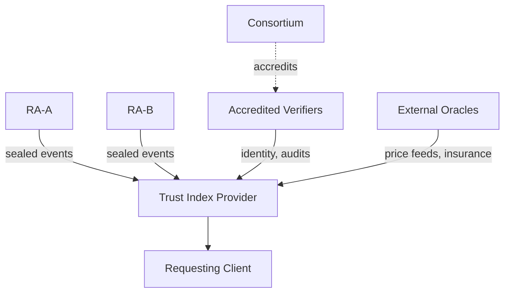
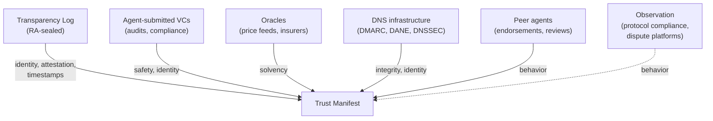
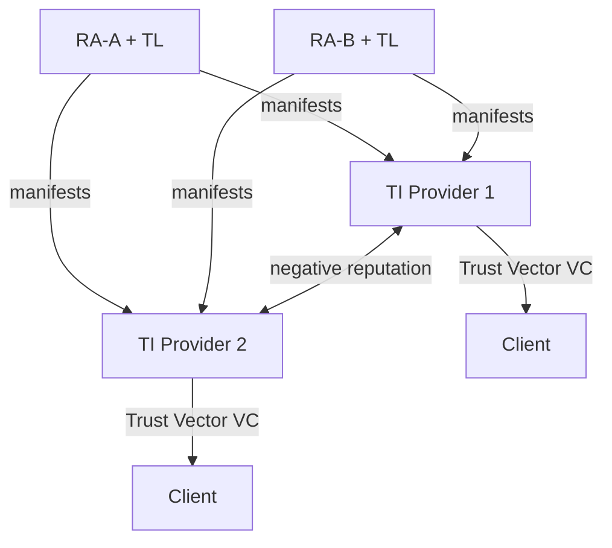
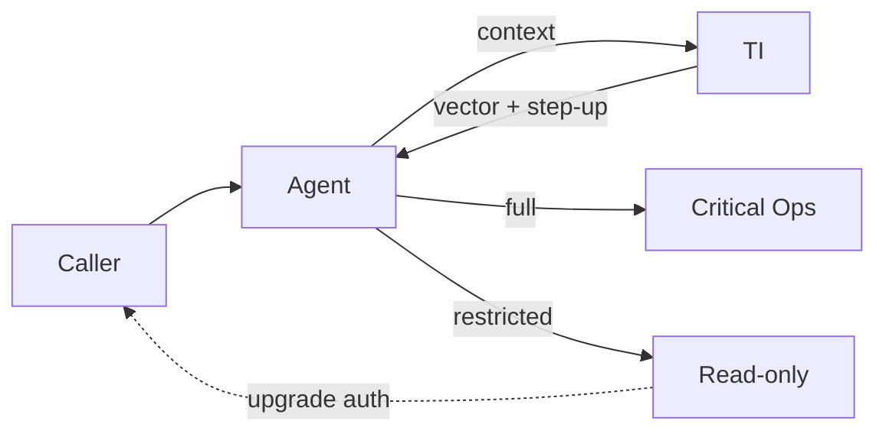

# Trust Index Open Specification

Version 1.1.0 | 2026-03-20

*Spec version 1.1.0 defines Trust Manifest schema version 1.0.0.
Non-breaking spec revisions do not bump the schema version.*

---

## 1. Introduction

### 1.1 Purpose and scope

My payment agent can verify that the invoicing agent's identity is sealed in a Transparency Log, that its domain ownership was validated, and that its Server Certificate fingerprint matches the TLSA record. But should it trust the invoicing agent to handle $50,000? The Registration Authority doesn't answer that. A Trust Index does.

A Trust Index crawls Transparency Logs published by federated Registration Authorities, combines the sealed data with external signals, and computes a trust evaluation. The evaluation answers one question: given what is publicly verifiable about this agent, what category of tasks should a client delegate to it?

Each RA carries its own registrar identifier and signing keys, so a TI that crawls multiple RAs can assess the RAs themselves. An RA with a history of lax validation or delayed revocations drags down the score of every agent it registered. Federation defines how Trust Manifests, Verifiable Credentials, and negative reputation signals move across RA boundaries.

This specification does not define signal weights, scoring algorithms, or deployment architectures. A conforming Trust Index provider computes Trust Vectors from the signals defined here and returns evaluations in the format defined here.
Two providers given the same Trust Manifest MAY return different Trust Vectors because they weight signals differently, just as two credit bureaus score the same borrower differently from the same financial records. The dimensions and their semantics are fixed; the math inside each dimension is not.



*Figure 1. Two inputs converge: TL-sealed data and external signals. The output is a signed credential that any third party can verify without contacting the TI.*

### 1.2 Terminology

Terms defined in the ANS architecture document (DESIGN.md) are used here with the same meaning: RA, TL, AIM, AHP, ANSName, FQDN, KMS, Identity Certificate, Server Certificate, Protocol Card, Registration Metadata, ANS Agent Card. This table defines terms specific to the Trust Index.

| Term | Definition |
| ------ | ----------- |
| **Identity Grade** | A classification (Basic, Verified, Premium) describing how thoroughly the agent's operator was vetted. See Section 5. |
| **Principal Binding** | A link between an agent and the real-world entity that controls it, expressed as a DID, Legal Entity Identifier, or biometric hash. |
| **Trust Index (TI)** | A service that crawls Transparency Logs, evaluates agent metadata, and publishes Trust Vectors. |
| **Trust Manifest** | A JSON document conforming to the schema in Appendix A. Core fields come from TL-sealed data; signal blocks aggregate inputs from the TL, agent-submitted VCs, oracles, and peer endorsements. |
| **Trust Vector** | A five-integer tuple (integrity, identity, solvency, behavior, safety), each value 0–100, representing an agent's trustworthiness along five independent dimensions. |
| **Verification Tier** | A classification (Bronze, Silver, Gold) describing what checks a verifier performed when evaluating an agent. A property of the verification act, not of the agent. See Section 6. |

### 1.3 Conformance levels

The key words "MUST", "MUST NOT", "REQUIRED", "SHALL", "SHALL NOT", "SHOULD", "SHOULD NOT", "RECOMMENDED", "MAY", and "OPTIONAL" in this document are to be interpreted as described in RFC 2119.

A **conforming Trust Index provider** MUST:

1. Accept Trust Manifests conforming to the schema in Appendix A
2. Return Trust Evaluations as W3C Verifiable Credentials whose `credentialSubject` conforms to the schema in Appendix B
3. Compute Trust Vectors with five dimensions as defined in Section 2.2
4. Support the four recommended profiles defined in Section 2.3
5. Verify credentials in the formats defined in Section 4
6. Expose a Trust Evaluation API as defined in Section 7

A conforming provider MAY use any scoring algorithm, signal weights, or caching strategy, provided the output conforms to this specification.

### 1.4 Relationship to ANS architecture

The ANS architecture (DESIGN.md) provides the sealed events, certificates, and DNS records that the Trust Index scores:

| ANS concept | DESIGN.md | How the TI uses it |
| :--- | :--- | :--- |
| **Three-layer trust framework** | §2.4 | Layer 1 (RA-sealed identity) feeds the integrity and identity dimensions. Layer 2 (third-party attestations in the ANS Agent Card's `verifiableClaims` array) feeds solvency, safety, and portions of behavior. Layer 3 (real-time behavioral signals) feeds behavior and updates all dimensions over time. |
| **Verification tiers** | §4.1.1 | Bronze, Silver, Gold describe what the *client* verified, not what the agent possesses. See Section 6. |
| **Log-sealing boundary** | §5.0, §5.1.2 step d | The integrity dimension depends on the TL's immutability guarantee. The KMS signs each checkpoint. Trust Manifest integrity signals are meaningful only because this property holds. |
| **Version coexistence** | §5.2 | Multiple ACTIVE versions of the same agent can coexist. Each version has its own ANSName, Identity Certificate, and TL entry. A conforming TI MUST score each ACTIVE version independently. |
| **Dual-certificate model** | §3.3, ADR 006 | The identity dimension treats Identity Certificates (Private CA, version-bound) differently from Server Certificates (Public CA, FQDN-bound). See Section 4.1. |



*Figure 2. The TI crawls sealed events from multiple federated RAs and combines them with external inputs. The consortium accredits verifiers. The TI signs the result as a credential that any third party can verify without contacting the TI.*

### 1.5 Evolutionary design

The stable contract between providers is small and fixed: a standard input schema (Trust Manifest), a standard output shape (five-dimensional Trust Vector delivered as a signed Verifiable Credential), and the requirement that all dimensions be present and independently scored. This contract is what makes evaluations comparable across providers and portable across RAs.

Everything outside that contract evolves. Signal types change as new attestation standards and oracle feeds emerge. Credential formats change as new proof systems are deployed. The relative importance of dimensions shifts as agent-to-agent commerce creates new patterns.

The specification accommodates this through explicit extension points:

- **Signal schema versioning**: new signal types enter as additions to a versioned schema, with a deprecation lifecycle that gives providers time to adopt.
- **Trust Vector dimensions**: the governance body may add dimensions in future schema versions without breaking existing consumers.
- **Identity grades** and **recommended profiles**: new grades and profiles can be defined without altering existing ones.
- **Credential format registry**: new proof types plug into the verification pipeline alongside existing ones.
- **Crypto suite forward declaration**: the Trust Manifest carries algorithm identifiers and NIST security levels so that quantum-resistant proof systems can be scored appropriately as they become available.

Where this specification prescribes a specific value (a schema field name, a dimension name, a conformance requirement), that value is part of the stable contract. Where it recommends a value or describes it as informational, that value is a starting point that providers and the governance body should expect to revise as the market matures.

Three areas will require attention as the ecosystem grows beyond a single RA and TI provider:

1. **Auditable evidence for FIDUCIARY profiles.** Regulated institutions require justification. Future FIDUCIARY-profile evaluations will need structured evidence references linking each dimension score to verifiable sources (TL entries, VC identifiers, oracle timestamps).
2. **Oracle diversity.** Solvency and insurance signals from a single oracle are a single point of failure. Future schema versions should define minimum diversity requirements for high-stakes profiles.
3. **Reputation tamper-evidence.** Negative reputation entries are shared as signed assertions. A tamper-evident log of reputation decisions would strengthen auditability, paralleling how the ANS TL provides tamper-evidence for registration decisions.

Features from companion proposals that are not yet part of the core ANS architecture are marked with status labels:

| Marker | Meaning | Source |
| -------- | --------- | -------- |
| `[PROPOSED]` | Designed, not yet implemented | IETF SCITT migration, including COSE receipts and Status Tokens |
| `[PENDING]` | Blocked on a dependency outside this specification | Cross-channel hash consistency, SVCB `cap-sha256` comparison |
| `[DRAFT:HCS-27]` | Specification drafted, pending external publication | HCS-27 Merkle Tree Checkpoint standard |
| `[DRAFT:HCS-14]` | External specification published as draft | HCS-14 Universal Agent ID standard |

---

## 2. Trust Model

### 2.1 Five signal categories

The specification defines five signal categories, ordered from cryptographic facts to behavioral observations. A conforming TI MUST evaluate all dimensions defined in its declared schema version and MUST NOT collapse them into fewer dimensions.

**Integrity: Is this agent mechanically sound?**

| Signal | What the TI checks |
| :--- | :--- |
| Agent age | Days since registration without revocation |
| Code volatility | Frequency and pattern of code changes. Monthly signed releases indicate maintenance; hourly changes indicate instability. |
| Attestation freshness | Recency of TEE hardware attestation, verified against hardware vendors' public keys |
| SBOM publication | Whether the agent discloses its software dependencies |
| SCITT receipt status `[PROPOSED]` | Whether the registration carries a COSE receipt from the TL, and whether it is stapled to the ANS Agent Card or fetched from a sidecar endpoint |
| Discovery record coverage | Additional discovery channels beyond the `_ans` TXT record: DNS-AID SVCB, HCS-14 `_agent`, protocol-native well-known endpoints. Capped so discovery records alone cannot dominate this dimension. |
| Cross-channel hash consistency `[PENDING]` | Agreement among the TL's sealed `capabilities_hash`, the DNS-AID `cap-sha256` parameter, and the live ANS Agent Card hash. Activates when `capabilities_hash` is populated in TL entries. |

**Identity: Who stands behind this agent?**

| Signal | What the TI checks |
| :--- | :--- |
| Certificate type | DV, OV, or EV Server Certificate |
| Principal binding | Verifiable link to the controlling entity via `did:web`, vLEI, or biometric hash |
| Inherited trust anchors | Pre-existing verification from other channels: strict DMARC enforcement, Verified Mark Certificate |
| Logo verification | Whether the agent's logo is backed by a VMC or CMC |

**Solvency: Can this agent pay for damages?**

| Signal | What the TI checks |
| :--- | :--- |
| Wallet proof | Zero-knowledge proof that the agent controls funds above a threshold, without revealing the balance |
| Payment network history | Transaction volume, settlement rate, and chargeback ratio. Reflects willingness to pay, not just ability. |
| Insurance | Active liability policy from a recognized insurer |
| Escrow history | Track record of successful fund releases and disputes |

**Behavior: How does this agent treat others?**

| Signal | What the TI checks |
| :--- | :--- |
| Dispute rate | Fraction of transactions ending in complaints |
| Protocol adherence | Rate limit compliance, MCP/A2A specification conformance |
| Peer endorsements | Signed attestations from other registered agents |
| User ratings | Aggregated scores from verified interactions, weighted by reviewer identity grade |
| Interop compliance | Handshake success rates, async response rates, credential grant honoring |
| On-chain feedback | Behavioral ratings on a blockchain registry such as ERC-8004. Transaction fees make fabrication expensive. |
| License adherence | Whether the agent operates within machine-readable license terms. A recorded violation is a negative signal. |

**Safety: Will this agent leak data or cause harm?**

| Signal | What the TI checks |
| :--- | :--- |
| Guardrail certification | Adversarial testing results from a recognized auditor |
| Data egress policy | Declared data flow restrictions, verifiable through TEE attestation |
| Model provenance | Which LLM powers the agent, verified through a software signing transparency log |
| Enclave attestation | TEE hardware details: provider, hardware version, SVN. Known-vulnerable generations are penalized. |
| Compliance certifications | Third-party audit results: SOC 2 Type II, HIPAA, ISO 27001 |

### 2.2 Trust Vector

The Trust Vector has this JSON representation:

```json
{
  "trustVector": {
    "integrity": 82,
    "identity": 95,
    "solvency": 12,
    "behavior": 78,
    "safety": 91
  }
}
```

Each dimension is scored independently. A high score in one dimension does not compensate for a low score in another. An agent scoring 95 on identity and 0 on solvency has strong accountability but no financial backing; a stock trading agent should reject it, while a news reader might accept it.

| Dimension | Travel Agent | Trading Bot |
| ----------- | ------------- | ------------- |
| Integrity | 72 | 65 |
| Identity | 90 | 55 |
| Solvency | 15 | 85 |
| Behavior | 78 | 60 |
| Safety | 88 | 45 |
| **Composite** | **69** | **62** |
| **Profile** | `READ_ONLY` | `TRANSACTIONAL` |

Two agents score within seven composite points but qualify for different profiles. A composite score hides the distinction. The Trust Vector exposes it.

In schema version 1.0, the Trust Vector contains the five dimensions defined above. The consortium governance body MAY add dimensions in future schema versions. A conforming TI MUST support the dimensions defined in its declared schema version and MUST NOT drop or rename any.
Additional signal categories (such as sustainability) MAY be returned as supplementary fields outside the `trustVector` object.

### 2.3 Recommended profiles

The Trust Evaluation API response includes a `recommendedProfile` field classifying agents into operating categories:

| Profile | Conditions | Suitable for |
| --------- | ------------ | -------------- |
| `READ_ONLY` | Low solvency or identity | Information queries, read-only data access |
| `TRANSACTIONAL` | Moderate scores across all dimensions | Small purchases, reversible transactions |
| `FIDUCIARY` | High identity and solvency | Financial delegation, legal contracts |
| `UNTRUSTED` | Any dimension below a critical threshold | No delegation; the client SHOULD NOT proceed |

A conforming TI MUST support these four profiles. A TI MAY define additional profiles and MUST document their assignment criteria.

When interaction context is provided, the TI SHOULD adjust the recommended profile based on authentication strength. The `FIDUCIARY` profile SHOULD require transport-layer authentication (mTLS or equivalent).

A client receiving an `UNTRUSTED` profile SHOULD treat it as a discovery-suppression signal, not a certificate-revocation trigger. The distinction matters: suppression hides the agent from search results and recommendations; revocation breaks the agent's TLS connections and requires RA action. Only the RA controls certificate revocation.

### 2.4 Composite score (deprecated)

For backward compatibility, the evaluation response MAY include a `compositeScore` field: a single integer 0-100 computed as a weighted sum of the dimensions. This field is DEPRECATED. Clients SHOULD use the Trust Vector and recommended profile for decisions.

An agent scoring 70 overall might score 0 on solvency and 100 on safety. The composite hides this.

### 2.5 Signal decay

Behavioral signals lose relevance over time. A five-star review from twelve months ago carries less weight than one from last week.

A conforming TI MUST apply temporal decay to behavioral signals. Older observations carry less weight than recent ones. The decay function is an implementation choice; Appendix D provides one model (exponential decay) with recommended rates per signal type.

Two properties are required regardless of the decay function chosen. First, disputes and other negative signals MUST decay more slowly than positive signals like usage metrics. Bad behavior should be remembered longer than good. Second, the decay function MUST be monotonically decreasing: a signal's weight never increases with age.

For cached oracle signals, a TI SHOULD apply a freshness penalty when the source is unreachable. The penalty MUST reduce the signal's contribution toward zero as the cache ages. A TI MUST document its freshness penalty function.

### 2.6 Environment adjustments

The agent's score also depends on the infrastructure around it.

| Factor | Dimension | Effect | Level |
| :--- | :--- | :--- | :--- |
| **TLD reputation** | Identity | `.bank` requires the registrant to be a verified financial institution (positive). High-abuse TLDs penalize. | SHOULD |
| **DNSSEC** | Integrity | A valid chain from root to the agent's domain. A broken or absent chain penalizes, with a larger penalty for Premium identity grade. | SHOULD |
| **Certificate scope** | Integrity | Single-FQDN certificate limits blast radius to one hostname. Wildcard means a compromise affects every subdomain. Penalize wildcards. | SHOULD |
| **HTTPS record** | Integrity | Enables ECH, hiding the subdomain from network observers. Cloud deployments often cannot publish HTTPS records due to CNAME restrictions. Penalize absence where the deployment permits. | MAY |
| **SVCB discovery** | Integrity | DNS-AID SVCB record (RFC 9460) bundles protocol, port, and capability hash. `[PENDING]` When `cap-sha256` is present, compare against the TL's sealed `capabilities_hash`. Reward presence. | MAY |
| **Registrar reputation** | Identity | The registrar's public track record of abuse-rate compliance | MAY |

---

## 3. Trust Manifest

### 3.1 Canonical JSON Schema

The Trust Manifest's core fields come from the TL: agent identity, attestation level, and timestamps. Its signal blocks draw from multiple sources: TL entries, agent-submitted VCs, oracle feeds, and peer endorsements.

A conforming TI MUST require that the REQUIRED fields (`manifestVersion`, `agentIdentity`, `attestationLevel`, `timestamps`) are TL-attested. A TI MUST distinguish between TL-attested signals and unattested inputs when computing integrity scores.



*Figure 4. Six provenance channels feed the Trust Manifest. Only the TL channel is cryptographically attested. The dashed line marks behavioral observation as an open integration point: this specification does not define the observation source.*

The normative schema is in Appendix A. Where any inline description conflicts with Appendix A, the appendix governs.

### 3.2 Required and optional fields

The top-level Trust Manifest object requires four sections:

| Field | Required | Description |
| ------- | ---------- | ------------- |
| `manifestVersion` | MUST | Schema version string (e.g., "1.0.0") |
| `agentIdentity` | MUST | Agent identification and principal binding |
| `attestationLevel` | MUST | Verification tier and certificate type |
| `timestamps` | MUST | Registration, verification, and expiry timestamps |
| `integritySignals` | SHOULD | Integrity dimension signals |
| `identitySignals` | SHOULD | Identity dimension signals |
| `solvencySignals` | SHOULD | Solvency dimension signals |
| `behaviorSignals` | SHOULD | Behavior dimension signals |
| `safetySignals` | SHOULD | Safety dimension signals |

Within `agentIdentity`, the only REQUIRED field is `ansName`. The `principalBinding` object SHOULD be present for Verified-grade agents and MUST be present for Premium (see Section 5.3). The `agentHost` and `registrarId` fields SHOULD be present but are not required because they can be derived from the ANSName and TL context.

A TI receiving a Trust Manifest with missing SHOULD fields MUST still produce a Trust Vector. Missing signal blocks result in lower scores for the corresponding dimension, not in rejection of the manifest.

### 3.3 Signal blocks

Each signal category (integrity, identity, solvency, behavior, safety) occupies its own object in the Trust Manifest. Every signal block MUST include a `schemaVersion` field identifying the version of that block's schema.

```json
{
  "integritySignals": {
    "schemaVersion": "1.0",
    "agentAgeDays": 365,
    "codeVolatility": "STABLE",
    "sbomPublished": true
  }
}
```

A TI MUST validate the `schemaVersion` of each signal block against its published version manifest before scoring. Signals at the current version score normally. Signals at a deprecated version receive reduced weight. Signals at a rejected version are treated as absent.

### 3.4 Signal versioning lifecycle

Signal schemas evolve as new signal types are added or existing ones are refined. The lifecycle follows three stages:

1. **Current**: The active schema version. Signals at this version score at full weight.
2. **Deprecated**: A previously current version. Signals at this version SHOULD receive reduced weight. TI providers MUST continue accepting deprecated versions.
3. **Rejected**: A version no longer accepted. Signals at this version are treated as absent.

A conforming TI MUST publish a version manifest listing every signal type, its current version, deprecated versions, and rejected versions. The RECOMMENDED location is `/.well-known/schema-versions.json` on the TI's domain.

Governance bodies SHOULD announce new versions 180 days before deprecating the previous version. Deprecated versions SHOULD remain valid for an additional 180 days before rejection. Emergency deprecations (due to discovered vulnerabilities in a schema version) MAY skip these grace periods.

---

## 4. Credential Formats

Trust proofs arrive in different cryptographic containers. An X.509 certificate from a CA proves brand identity. A zero-knowledge proof generated locally proves the agent controls funds. A W3C Verifiable Credential from an auditor proves the agent passed a security review.
Each uses different cryptography and serialization, but the Trust Manifest binds them into a single package that a TI can evaluate.

A conforming TI MUST be able to verify the formats described below.

### 4.1 X.509 certificates (DV/OV/EV)

The agent's certificate chain is the primary identity signal. A TI MUST verify the certificate against trusted Certificate Authorities and MUST classify it:

| Certificate | What it proves | Scoring guidance |
| ------------ | ---------------- | ------------------ |
| DV (Domain Validation) | Someone controls the domain | Minimal identity signal |
| OV (Organization Validation) | A verified business owns the domain | Moderate identity signal |
| EV (Extended Validation) | A legal entity with verified physical address | Strong identity signal |

A TI MUST distinguish between the RA-issued Identity Certificate and the operator-managed Server Certificate. Identity Certificates provide stronger identity binding because the RA controls issuance. Server Certificates permit BYOC and serve transport security.

CAA record alignment provides an additional signal: if the domain's CAA record restricts certificate issuance to specific CAs, and the presented certificate was issued by a listed CA, the TI SHOULD treat this as a positive integrity signal.

### 4.2 W3C Verifiable Credentials

Third-party attestations (audit reports, user reviews, compliance certifications) are expressed as W3C Verifiable Credentials conforming to the VC Data Model 2.0.

A TI MUST verify VC signatures by resolving the issuer's DID and retrieving the public key. A TI MUST check that the credential has not expired (`expirationDate` or `validUntil`).

The VC Data Model 2.0 uses the `@context` value `https://www.w3.org/ns/credentials/v2`. Proof types SHOULD use the Data Integrity specification (e.g., `DataIntegrityProof` with cryptosuite `eddsa-rdfc-2022` or equivalent). The `Ed25519Signature2020` proof type remains acceptable but is deprecated in favor of Data Integrity proofs.

On-chain validation registries (e.g., ERC-8004's Validation Registry) fill the same role with a different verification procedure: the TI confirms the validator's contract address is accredited and verifies the response integrity on-chain. A conforming TI SHOULD treat on-chain validation responses as equivalent to signed VCs for scoring purposes.

Example evaluation response as a VC:

```json
{
  "@context": ["https://www.w3.org/ns/credentials/v2"],
  "type": ["VerifiableCredential", "TrustEvaluation"],
  "issuer": "did:web:trust-index.example.com",
  "credentialSubject": {
    "agentId": "ans://v1.0.0.invoicing.supplier.example.com",
    "evaluationTime": "2026-01-29T12:00:00Z",
    "trustVector": {
      "integrity": 82, "identity": 95,
      "solvency": 12, "behavior": 78, "safety": 91
    },
    "recommendedProfile": "READ_ONLY",
    "riskFactors": ["SOLVENCY_PROOF_STALE"]
  },
  "proof": {
    "type": "DataIntegrityProof",
    "cryptosuite": "eddsa-rdfc-2022",
    "verificationMethod": "did:web:trust-index.example.com#key-1"
  }
}
```

Third parties verify the signature against the TI's public key without crawling logs or recomputing scores.

### 4.3 Zero-knowledge proofs (solvency, multi-chain)

**Single-chain proof.** The agent generates a ZK-SNARK or ZK-STARK proof locally:

```json
{
  "solvencyProof": {
    "type": "ZK_SNARK",
    "minimumBalance": "10000",
    "asset": "USDC",
    "chainId": 1,
    "blockHeight": 19234567,
    "maxBlockAge": 256,
    "proof": "0x..."
  }
}
```

The `blockHeight` and `maxBlockAge` fields anchor the proof to a specific chain state. A proof MUST reference a block within the last `maxBlockAge` blocks. The appropriate `maxBlockAge` depends on the chain's block time; the value SHOULD represent approximately one hour of blocks. The `chainId` field (EIP-155) prevents cross-chain replay.
A TI MUST reject proofs referencing blocks older than `maxBlockAge`.

Solvency proofs expire quickly. A proof generated yesterday has limited value because the wallet could have been drained since. For high-value transactions, a client can request a fresh proof through the challenge-response mechanism.

**Multi-chain aggregation.** An agent holding funds across multiple chains can prove aggregate solvency using recursive ZK proofs. Each chain generates a separate threshold proof. A meta-proof aggregates them: "These proofs are valid and their sum exceeds the threshold." The TI verifies one composite proof without seeing wallet addresses.
All values convert to a stable reference asset at proof generation time.

**Quantum resistance.** ZK-SNARKs use elliptic curve cryptography vulnerable to quantum attacks. ZK-STARKs use hash-based commitments and are resistant. A TI SHOULD note which proof system was used. The Trust Manifest `cryptoSuite` field records the proof system and its NIST post-quantum security level.

### 4.4 SCITT receipts `[PROPOSED]`

When the SCITT migration completes (RFC 9943), each agent registration will produce a binary COSE receipt proving inclusion in the Transparency Log. The receipt is a single-signer COSE structure (COSE_Sign1) per RFC 9942. Its protected header names the tree type (`RFC9162_SHA256`), the TL's signing key, and the issuer. Its unprotected header carries the inclusion proof.

A TI SHOULD score receipt presence as an integrity signal:

| Receipt delivery | Integrity signal strength |
| ----------------- | -------------------------- |
| Stapled (embedded in ANS Agent Card COSE unprotected header) | Strongest: offline verification, no RA connectivity required |
| Sidecar (fetched from `_ans-badge` endpoint) | Strong: same cryptographic proof, requires network call |
| Absent | Weakest: TI must crawl TL and compare hashes directly |

A **Status Token** `[PROPOSED]` is a short-lived RA-signed assertion of the agent's current lifecycle state (ACTIVE, DEPRECATED, REVOKED). It fills the gap between "was registered" (what the receipt proves) and "is currently active" (what a client needs to know). Status Tokens travel alongside stapled receipts. Sidecar and direct-mode clients check lifecycle state when they contact the TL.

### 4.5 Verification procedures per format

A conforming TI MUST implement verification for each credential format:

| Format | Verification procedure |
| -------- | ---------------------- |
| X.509 | Validate certificate chain to trusted root. Check revocation (CRL or OCSP). Classify as DV/OV/EV. Verify CAA alignment. |
| W3C VC | Resolve issuer DID. Retrieve public key. Verify signature. Check expiration. Validate `@context` and `type`. |
| ZK proof | Verify mathematical proof against the claimed statement. Check `blockHeight` against `maxBlockAge`. Validate `chainId`. |
| SCITT receipt `[PROPOSED]` | Reconstruct Merkle root from inclusion proof and original entry. Verify TL signature against TL public key. Validate tree type. |

---

## 5. Identity Model

### 5.1 Identity grades (Basic, Verified, Premium)

Identity grade classifies how thoroughly the agent's operator was vetted. Schema version 1.0 defines three grades. The governance body MAY define additional grades in future versions.

| Identity Grade | Primary path | Alternative paths |
| ---------------- | ------------- | ------------------- |
| Premium | EV certificate | (OV + vLEI) OR (OV + VMC) OR (DV + vLEI + VMC) |
| Verified | OV certificate | (DV + vLEI) OR (DV + code signing certificate + VMC) |
| Basic | DV certificate | Any valid certificate |

A single credential path is not required. A startup with a DV certificate, a vLEI from a GLEIF-accredited organization, and a VMC from a Certificate Authority earns Premium grade through the alternative path. The Trust Manifest stores raw signals; the TI combines them to compute the grade.

### 5.2 Alternative attestation paths

Certificate type is the primary grade driver, but not the only path. Organizations that cannot obtain EV certificates (due to jurisdiction or corporate structure) can reach higher grades through credential combinations.

Each alternative path MUST include at least one third-party attestation. Self-asserted claims alone (a domain owner claiming a logo without VMC backing) do not raise the grade. The TI MUST verify each attestation in the combination independently.

### 5.3 Principal binding (DID_WEB, LEI, BIOMETRIC_HASH, ENS_ENSIP25)

An agent's `principalBinding` links it to the real-world entity that controls it.
The binding is OPTIONAL for Basic-grade agents, SHOULD be present for Verified, and MUST be present for Premium.
The binding type determines how difficult it is for a bad actor to shed negative history by creating a new identity.

| Binding type | What it binds | Escape difficulty |
| ------------- | --------------- | ------------------- |
| `DID_WEB` | Domain control | Easy (register new domain) |
| `LEI` | Legal entity (via vLEI, ISO 17442) | Medium (requires forming a new corporation) |
| `BIOMETRIC_HASH` | Physical person | Hard (requires a new person) |
| `ENS_ENSIP25` | Ethereum account (via ENS name with ENSIP-25 bidirectional agent-registration record) | Medium (registering an ENS name costs ETH; creating many is expensive but requires no legal entity) |

A conforming TI MUST verify the principal binding against the declared type:
- `DID_WEB`: Resolve `did:web:{domain}` by fetching `/.well-known/did.json`. Verify the DID Document exists and contains a valid verification method.
- `LEI`: Verify the vLEI credential signature against the issuing accredited organization. Confirm the LEI is active in the GLEIF database.
- `BIOMETRIC_HASH`: Verify the biometric credential against the declared verifier's public key. The raw biometric data is never transmitted; only a hash or ZK proof.
- `ENS_ENSIP25`: Resolve the ENS name claimed by the agent. Verify the `agent-registration[<registry>][<tokenId>]` text record exists (ENSIP-25). Then verify the reverse: the ERC-8004 registration file lists the ENS name as a service endpoint. Both directions must agree.

Basic-grade agents MAY use any binding type. Verified-grade agents SHOULD use `LEI`, `DID_WEB`, or `ENS_ENSIP25`. Premium-grade agents MUST use `LEI` or `BIOMETRIC_HASH`. Higher stakes require stickier identity.

### 5.4 PriCC chains

For agents handling high-value delegations (legal contracts, medical records, financial trading), even LEI binding may be insufficient. A corporation can dissolve and reform.

PriCC chains (Privacy-preserving Identity Certificate Chains) combine multiple identity attestations into a single zero-knowledge proof. The agent proves: "I am controlled by a legal entity (LEI) whose beneficial owner passed KYC through an accredited verifier." The chain binds all layers without revealing the raw data.

```json
{
  "principalBinding": {
    "type": "LEI",
    "identifier": "549300EXAMPLE00LEI17",
    "proof": "SHA256:abc123...",
    "priccChain": {
      "layers": [
        { "type": "LEI", "verifier": "did:web:lei-verifier.example.com" },
        { "type": "KYC_IAL3", "verifier": "did:web:kyc-verifier.example.com" },
        { "type": "BIOMETRIC_LIVENESS", "verifier": "did:web:bio-verifier.example.com" }
      ],
      "aggregateProof": "ZK_SNARK:0x...",
      "chainedAt": "2026-01-15T00:00:00Z"
    }
  }
}
```

The ZK proof attests that all verifiers issued valid credentials to the same principal, without revealing the credentials themselves. A TI SHOULD score a valid PriCC chain higher on the identity dimension. Because the biometric hash is bound into the chain, an operator cannot escape negative reputation by forming a new corporation if the hash appears in federated reputation entries.

### 5.5 Negative reputation portability

Positive reviews travel with the agent as signed Verifiable Credentials. Negative history requires a different mechanism.

An agent that defrauds users at one RA, abandons its identity, and registers fresh at another RA should not start with a clean record. When a principal registers a new agent, the TI SHOULD check the principal binding against federated negative reputation entries.

If the principal binding matches a previous entry, the TI SHOULD factor that history into the new agent's Trust Vector as a strong negative signal. The weight depends on the entry's severity and the issuing authority's track record.

### 5.6 Inherited trust (BIMI, VMC, DMARC)

Organizations often have existing trust credentials that predate AI agents: email authentication records, verified brand logos, signed software releases. These signals transfer to agents on the same domain.

DMARC (Domain-based Message Authentication, Reporting and Conformance) tells email servers how to handle messages that fail authentication. A domain publishing `p=reject` instructs recipients to refuse unauthenticated messages. BIMI (Brand Indicators for Message Identification) extends this by displaying the organization's verified logo next to authenticated emails.
A Verified Mark Certificate (VMC) from a CA proves the organization owns the trademark for its logo.

The Trust Manifest captures these signals in the `externalTrustAnchors` array:

```json
{
  "identitySignals": {
    "externalTrustAnchors": [
      {
        "type": "BIMI_VMC",
        "domain": "example.com",
        "dmarcPolicy": "reject",
        "certificateUrl": "https://example.com/vmc.pem",
        "logoHash": "SHA256:8f2d..."
      }
    ]
  }
}
```

A TI MUST verify that anchor domains match the agent's registered domain. A TI SHOULD weight anchors by type:

| Anchor type | Signal strength | Condition |
| ------------ | ---------------- | ----------- |
| VMC | Strong | CA verified business + trademark ownership |
| CMC (Common Mark Certificate) | Moderate | CA verified business ownership |
| Self-asserted BIMI | Weak | Domain owner claims this logo, no CA verification |
| DMARC `p=reject` | Moderate | Domain enforces strict email authentication |
| Code signing certificate | Moderate | Publisher identity verified by CA |

---

## 6. Verification Tiers

A tier describes what the *client* verified, not a property the RA assigned. Two Gold-verified agents can have different integrity scores; the tier label stays the same, the Trust Vector captures the difference.

| Tier | Checks performed | What it adds |
| ------ | ----------------- | ------------- |
| Bronze | Certificate chain validation against trusted CAs | Confirms domain control. Every conforming verifier MUST implement this. |
| Silver | Bronze + DANE TLSA record verified through full DNSSEC chain | A rogue CA alone cannot forge the TLSA record. TLSA SHOULD use usage 3 (DANE-EE). |
| Gold | Silver + TL inclusion proof confirms sealed registration | The inclusion proof confirms the registration was sealed into the log. A tampered or deleted entry breaks the proof. |

### 6.1 Gold extensions

`[PROPOSED]` When SCITT receipts are available, Gold verification uses the binary COSE receipt instead of querying the TL directly. A stapled receipt enables offline Gold verification.

A verifier MAY additionally check the `_ans-identity._tls` TLSA record. The RA cannot write this record; only the agent owner or AHP manages it. A matching record proves separation of duties: the RA issued the certificate, and the owner independently published its fingerprint through a channel the RA does not control.

`[PENDING]` When DNS-AID SVCB records carry `cap-sha256`, a Gold verifier SHOULD compare that hash against the TL's sealed `capabilities_hash` and the live ANS Agent Card hash.

`[PENDING]` When public checkpoints are available from an independent ledger, a verifier MAY compare the TL's root against a published checkpoint. Gold with checkpoint confirmation scores higher on integrity than Gold without. The tier label stays Gold; the score reflects the additional verification.
If the TL presents a root that contradicts a published checkpoint, the TI MUST flag the discrepancy.

### 6.2 SDK composition

A client SDK implementing verification tiers SHOULD compose two independent verification modes (DANE and Badge), each configurable as disabled, advisory, or required. Predefined policies: PKI-only (Bronze), DANE-required (Silver), DANE-and-Badge-required (Gold).

---

## 7. Trust Evaluation API

### 7.1 Request format

A client requests a trust evaluation by identifying the agent and optionally specifying a profile and interaction context.

**Required parameter:**
- `agentId`: The agent's ANSName, UUID, or Universal Agent ID (HCS-14 AID format `[DRAFT]`). A conforming TI MUST accept ANSName format. A TI SHOULD accept UUID and MAY accept AID format.

**Optional parameters:**
- `profile`: A named trust profile (e.g., `general`, `librarian`, `banker`, `doctor`, `contractor`). Each profile applies different weights to the five dimensions. If omitted, the TI uses its default profile.
- `fresh`: Boolean. When `true`, the TI triggers challenge-response verification for time-sensitive signals. Default: `false`.
- `interactionContext`: An object describing the authentication method and transport security of the current interaction. See Appendix C.

### 7.2 Response format

The trust evaluation payload conforms to the schema in Appendix B.
A conforming TI wraps this payload as the `credentialSubject` of a W3C Verifiable Credential signed by the TI.
The VC envelope (`@context`, `type`, `issuer`, `proof`) follows the VC Data Model 2.0; Appendix B defines only the `credentialSubject` content.
Third parties verify the evaluation against the TI's public key without contacting the TI.

The `credentialSubject` MUST include:

- `agentId`: The evaluated agent's identifier
- `evaluationTime`: ISO 8601 timestamp of the evaluation
- `trustVector`: The five-dimension Trust Vector
- `recommendedProfile`: One of the four profiles defined in Section 2.3
- `riskFactors`: An array of strings identifying specific concerns (e.g., `SOLVENCY_PROOF_STALE`, `NO_INSURANCE_POLICY`, `DNSSEC_BROKEN`)

The response MAY include:
- `compositeScore`: Deprecated single integer 0-100
- `evaluationChanged`: Boolean. True when the agent's Trust Vector changed significantly since this client's previous query. Lets polling clients detect score changes without caching and comparing vectors themselves. The TI tracks each client's last-seen evaluation via client identity or session token.

### 7.3 Trust Vector, recommended profile, and risk factors

The response serves three audiences:

1. **Automated clients** consume the Trust Vector directly, applying their own thresholds. A stock trading agent checks `identity > 90 && solvency > 80`. A news reader checks `integrity > 50`.

2. **Policy engines** consume the `recommendedProfile`. An organization's security policy might prohibit `FIDUCIARY` delegation to any agent with an `UNTRUSTED` profile.

3. **Human operators** read the `riskFactors` array. Each string identifies a specific, actionable concern. Risk factors SHOULD follow a naming convention: `{DIMENSION}_{SIGNAL}_{CONDITION}` (e.g., `INTEGRITY_SBOM_MISSING`, `SOLVENCY_PROOF_EXPIRED`).

### 7.4 Fresh vs cached (?fresh=true challenge-response)

Cached evaluations serve most requests. The TI computes scores on a schedule and caches results. Cache TTLs vary by signal volatility: solvency proofs (minutes to hours), behavioral metrics (hours), identity signals (days to weeks).

When a client passes `fresh=true`, the TI triggers live verification for time-sensitive signals. This prevents replay attacks at the cost of latency (5-10 seconds versus 50ms cached). A TI MUST support `fresh=true` for solvency signals. A TI MAY support it for other signal types.

1. Client sends `fresh=true` to TI.
2. TI sends a nonce challenge to the agent's published challenge endpoint.
3. Agent incorporates the nonce into a fresh proof and returns it.
4. TI verifies the proof and returns an updated Trust Vector.

#### 7.4.1 Challenge-response protocol

A conforming challenge-response protocol MUST satisfy four security properties:

1. **Nonce binding.** The TI issues a cryptographically random, single-use nonce. The agent incorporates the nonce into its proof as a public input, binding the proof to this specific challenge. The TI MUST NOT reuse nonces.
2. **Freshness.** For solvency proofs, the proof MUST reference a blockchain state within `maxBlockAge` blocks of the current tip. The nonce prevents replaying a proof generated for a previous challenge.
3. **Expiry.** The challenge carries a deadline. If the agent does not respond before the deadline, the TI falls back to its cached evaluation and reports the timeout as a risk factor.
4. **Verification.** The TI checks mathematical validity, nonce match, and block recency, then returns the updated Trust Evaluation. `evaluationTime` reflects the time of the fresh verification, not a cached timestamp.

The agent publishes its challenge endpoint in its ANS Agent Card at `trustManifest.challengeEndpoint`, falling back to `/.well-known/ans-challenge`. The wire format of the challenge and response is an implementation choice; the four properties above are the conformance requirements.

#### 7.4.2 Failure modes

| Failure | TI behavior | Risk factor |
| --------- | ------------ | ------------- |
| Agent does not respond before deadline | Return cached evaluation | `SOLVENCY_FRESH_CHALLENGE_TIMEOUT` |
| Agent returns invalid proof (math fails) | Return cached evaluation | `SOLVENCY_FRESH_CHALLENGE_INVALID_PROOF` |
| Agent returns proof with wrong nonce | Return cached evaluation | `SOLVENCY_FRESH_CHALLENGE_NONCE_MISMATCH` |
| Agent returns proof referencing stale block | Return cached evaluation | `SOLVENCY_FRESH_CHALLENGE_STALE_BLOCK` |
| Agent's challenge endpoint unreachable | Return cached evaluation | `SOLVENCY_FRESH_CHALLENGE_UNREACHABLE` |

In every failure case the TI MUST return a valid response (the cached evaluation plus the appropriate risk factor), not an HTTP error. `fresh=true` degrades gracefully: the client always gets a Trust Vector, and the risk factor tells it whether the challenge succeeded.

### 7.5 Caching and freshness

A conforming TI MUST implement caching. Solvency signals, which can change within minutes, require shorter TTLs than identity signals, which change on the order of days or weeks. The specific TTL values are implementation choices.

When a cached signal expires and the source is unreachable, the TI applies the freshness penalty. The `evaluationTime` in the response MUST reflect when the TI last fully computed the score, not when the cached result was served.

---

## 8. Federation



*Figure 6. Each TI crawls all federated RAs and scores the same agents independently. Negative reputation flows between TI providers so that a principal with misconduct history at one RA cannot start clean at another. Each TI signs its own Trust Vector as a Verifiable Credential.*

### 8.1 Cross-provider Trust Manifest portability

Trust Manifests are portable across TI providers. Because every RA records agent metadata using the same schema, any conforming TI can ingest manifests from any RA. An agent registered at one RA and evaluated by one TI can be re-evaluated by a different TI using the same manifest data.

Reviews, endorsements, and behavioral signals expressed as signed Verifiable Credentials travel with the agent. When an agent moves between RAs, its VC-based signals transfer automatically. The receiving TI verifies the signatures independently.

### 8.2 Consortium governance (CA/Browser Forum model)

Multiple Registration Authorities must agree on baseline standards for Trust Manifest contents, signal definitions, and verification procedures. The RECOMMENDED governance structure follows the CA/Browser Forum:

- Members include RAs, auditors, and elected agent/user representatives
- Admission requires an independent audit (e.g., WebTrust) and supermajority consortium vote
- Members re-qualify periodically
- Voting power caps and tenure weighting are consortium charter decisions

The consortium charter defines liveness requirements for members, automated enforcement thresholds (such as how quickly expired proofs or TLSA drift affect scores), and remediation windows. These governance details are not part of this specification.

### 8.3 Negative reputation sharing

When a principal defrauds users at one RA, abandons that identity, and registers fresh at another RA, the negative history should follow. Federated TI providers SHOULD share negative reputation signals so that banned principals cannot escape accountability through re-registration.

A negative reputation entry is a signed assertion from an RA or governance body that a principal binding is associated with specified misconduct. The entry contains the principal binding, a reason code, supporting evidence references, the issuing authority's signature, and a jurisdiction scope.

#### 8.3.1 Scored signal, not binary block

Anti-spam history demonstrates the danger of centralized block lists. DNSBL operators wielded unilateral power to blackhole entire IP ranges, legitimate senders had no due process, and mandatory adoption propagated errors globally. This specification avoids that pattern.

A negative reputation entry is a scoring input, not an enforcement action. A conforming TI SHOULD ingest entries from federated sources and treat them as a strong negative signal on the relevant Trust Vector dimensions. The TI's scoring engine determines the weight, considering the issuing authority's own reputation and the severity of the reason code.
A TI MUST NOT treat a negative reputation entry as an automatic block or revocation. The exchange mechanism and polling frequency are implementation choices.

Only the RA that issued an agent's Identity Certificate can revoke it. Negative reputation affects scores. Certificate revocation is a separate, RA-controlled action.

#### 8.3.2 Safeguards

Anti-spam block lists concentrated power without accountability. These safeguards prevent the same failure:

| Safeguard | Rule | Level |
| :--- | :--- | :--- |
| **Evidence references** | Each entry includes TL entry identifiers, dispute case numbers, or governance body rulings. Entries without evidence carry reduced weight. | SHOULD |
| **Independent appeal** | A principal appeals to the governance body, not solely the issuing authority. The governance body may issue a superseding entry. | MAY |
| **Issuer reputation** | Weight entries by the issuing authority's track record. An RA that issues entries later overturned carries less weight. | SHOULD |
| **Expiry by default** | Entries carry an expiry timestamp. Permanent entries require a governance body ruling, not a unilateral RA decision. | SHOULD |
| **Audit trail** | A receiving TI does not delete entries. Expired or superseded entries remain for audit. | MUST |

#### 8.3.3 Jurisdiction scope

Entries carry a jurisdiction field. A TI determines its own jurisdiction from a configuration declaration, not from client IP geolocation.

| Scope | TI behavior | Level |
| :--- | :--- | :--- |
| Global | Treat as strong negative signal | SHOULD |
| Regional (ISO 3166-1 alpha-2) | Apply entries matching the TI's declared jurisdiction | SHOULD |
| Other jurisdictions | Policy decision, not protocol | MAY |

#### 8.3.4 Distribution

Federated TI providers SHOULD exchange negative reputation entries through a pull-based protocol. Entries are signed and timestamped. A receiving TI verifies the signature against the issuer's published key before ingesting. The wire format and polling frequency are implementation choices.

### 8.4 Dispute resolution

**Factual disputes** receive automated handling. An agent claiming "my certificate is valid, rescan" submits evidence. The TI verifies the evidence programmatically and updates the score.

**Subjective disputes** require economic commitment. The agent deposits a stake. A panel of randomly selected Premium-grade reviewers examines the evidence. If the appeal succeeds, the stake returns. If it fails, the stake is forfeited. The economic cost deters frivolous appeals. Forced randomization prevents collusion.

Unanswered questions block AI-adjudicated disputes: What prompts produce fair adjudication? How is evidence protected against prompt injection? What legal framework governs AI-issued enforcement decisions? These questions MUST be resolved before any production deployment of automated dispute adjudication.

### 8.5 Accredited verifiers

The consortium governance body accredits third-party verifiers for specific signal categories: identity verification firms, safety auditors, and solvency verifiers. The consortium sets standards; the verifier does the work. Individual RAs are registration services, not accreditation bodies.

If a verifier's attestations prove fraudulent, the governance body revokes accreditation. Enforcement follows a ladder: warning, probation, suspension, distrust.

A TI SHOULD publish its list of accepted verifiers per signal category. A TI MUST NOT accept attestations from verifiers it has not validated.

---

## 9. Security Considerations

### 9.1 Threat model

A Trust Index concentrates trust decisions. TI providers MUST secure their infrastructure to a standard comparable to a Certificate Authority.

| Threat | Attack | Defense | Level |
| :--- | :--- | :--- | :--- |
| **TI compromise** | Attacker inflates or deflates scores | CA-grade infrastructure security | MUST |
| **Signing key compromise** | Forged evaluation VCs | Key rotation, client key pinning, transparency logging of signed evaluations. Publish key fingerprint at `/.well-known/trust-index-keys.json`. | SHOULD |
| **Insecure TI connection** | Man-in-the-middle on trust queries | HTTPS with valid certificate (MUST). DANE TLSA for the TI's endpoint (SHOULD). Signed VC responses (SHOULD). mTLS for `FIDUCIARY` queries (SHOULD). | MUST |
| **Oracle failure** | Stale or missing solvency, insurance, or credential data | Cached fallback with freshness penalty. Aggregate from multiple independent sources. Circuit breakers when one source diverges. | SHOULD |
| **Sybil attack** | Fake agents manipulate reviews and endorsements | Weight reviews by identity grade and principal binding type. Analyze the review graph for isolated clusters. Weight on-chain feedback higher than unsigned reviews, scaled by transaction cost. | SHOULD |
| **Review manipulation** | Coordinated campaigns bypass Sybil defenses | Honeypot agents that trace recruitment back to the source. Community detection on the endorsement graph discounts isolated clusters. | MAY / SHOULD |

### 9.2 Quantum resistance roadmap

Current cryptographic foundations include elliptic-curve signatures (used in ZK-SNARKs, DANE TLSA records, and VCs) and RSA (used in DNSSEC root zone signing). Both are vulnerable to Shor's algorithm.

**ZK proofs.** ZK-STARKs are hash-based and resistant to known quantum attacks. The governance body MAY mandate STARKs for solvency proofs above a threshold as quantum computing matures.

**DNSSEC.** When the DNS root zone transitions from its RSA/ECDSA signature algorithms to post-quantum alternatives, likely ML-DSA (FIPS 204, a lattice-based digital signature scheme, formerly Dilithium) or SLH-DSA (FIPS 205, a hash-based scheme, formerly SPHINCS+), the TI MUST follow.

**VCs and TLS.** The transition to post-quantum TLS and VC signatures will follow the ecosystem. ML-KEM (FIPS 203, a lattice-based key encapsulation mechanism, formerly Kyber) replaces ECDH for key exchange. ML-DSA replaces ECDSA for signatures. A TI SHOULD track NIST post-quantum standardization and update its accepted cryptosuites accordingly.

The Trust Manifest `cryptoSuite` object supports forward declaration:

```json
{
  "cryptoSuite": {
    "algorithm": "dilithium3",
    "nistLevel": 3,
    "quantumSafe": true
  }
}
```

### 9.3 Liability and disclaimers

A Trust Index reports trust signals. It does not guarantee agent behavior. A high Trust Vector score means the available evidence is favorable, not that the agent is safe to trust unconditionally.

A conforming TI SHOULD publish a liability framework defining how responsibility is allocated among the certifier (who attested to safety or identity), the RA (who verified domain control and issued certificates), the TI provider (who computed the score), and the agent (who acted). The framework SHOULD specify what constitutes a TI calculation error and what remedies are available when one occurs.

---

## Appendix A: Full Trust Manifest JSON Schema (normative)

This is the canonical schema. Where inline descriptions in the specification body conflict with this schema, this appendix governs.

```json
{
  "$schema": "https://json-schema.org/draft/2020-12/schema",
  "$id": "https://ans.schema.org/trust-manifest/v1.0.0",
  "title": "ANS Trust Manifest v1.0.0",
  "type": "object",
  "required": ["manifestVersion", "agentIdentity", "attestationLevel", "timestamps"],
  "properties": {
    "manifestVersion": { "const": "1.0.0" },
    "agentIdentity": {
      "type": "object",
      "required": ["ansName"],
      "properties": {
        "ansName": {
          "type": "string",
          "pattern": "^ans://v[0-9]+\\.[0-9]+\\.[0-9]+\\..+$",
          "description": "Versioned agent identifier. The pattern is a structural hint; the RA validates against RFC 1123 hostname rules."
        },
        "agentHost": { "type": "string", "format": "hostname" },
        "registrarId": { "type": "string" },
        "agentId": { "type": "string", "format": "uuid" },
        "principalBinding": {
          "type": "object",
          "required": ["type", "identifier"],
          "properties": {
            "type": { "enum": ["DID_WEB", "LEI", "BIOMETRIC_HASH", "ENS_ENSIP25"] },
            "identifier": { "type": "string" },
            "proof": { "type": "string" },
            "priccChain": {
              "type": "object",
              "properties": {
                "layers": {
                  "type": "array",
                  "items": {
                    "type": "object",
                    "properties": {
                      "type": { "enum": ["LEI", "KYC_IAL2", "KYC_IAL3", "BIOMETRIC_LIVENESS", "BIOMETRIC_DOCUMENT"] },
                      "verifier": { "type": "string", "format": "uri" }
                    }
                  }
                },
                "aggregateProof": { "type": "string" },
                "chainedAt": { "type": "string", "format": "date-time" }
              }
            }
          }
        }
      }
    },
    "attestationLevel": {
      "type": "object",
      "required": ["verificationTier", "certificateType"],
      "properties": {
        "verificationTier": { "enum": ["BRONZE", "SILVER", "GOLD"] },
        "certificateType": { "enum": ["DV", "OV", "EV"] },
        "identityGrade": { "enum": ["BASIC", "VERIFIED", "PREMIUM"] },
        "serverCertFingerprint": { "pattern": "^SHA256:[a-f0-9]{64}$" },
        "identityCertFingerprint": { "pattern": "^SHA256:[a-f0-9]{64}$" },
        "daneEnabled": { "type": "boolean" }
      }
    },
    "timestamps": {
      "type": "object",
      "required": ["registered", "lastVerified"],
      "properties": {
        "registered": { "type": "string", "format": "date-time" },
        "lastVerified": { "type": "string", "format": "date-time" },
        "certExpiry": { "type": "string", "format": "date-time" },
        "lastCodeChange": { "type": "string", "format": "date-time" }
      }
    },
    "integritySignals": {
      "type": "object",
      "required": ["schemaVersion"],
      "properties": {
        "schemaVersion": { "type": "string", "pattern": "^[0-9]+\\.[0-9]+$" },
        "agentAgeDays": { "type": "integer", "minimum": 0 },
        "versionCount": { "type": "integer", "minimum": 1 },
        "codeVolatility": { "enum": ["STABLE", "MODERATE", "HIGH", "SUSPICIOUS"] },
        "lastAttestationAge": { "type": "integer", "description": "Hours since last TEE attestation quote" },
        "sbomPublished": { "type": "boolean" },
        "sbomHash": { "type": "string" },
        "agentCardHash": { "type": "string" },
        "discoveryChannels": {
          "type": "array",
          "items": {
            "enum": ["HCS14_AGENT", "DNSAID_SVCB", "A2A_WELLKNOWN", "MCP_WELLKNOWN"]
          },
          "uniqueItems": true,
          "description": "Additional discovery channels verified as present, beyond the baseline _ans TXT record."
        },
        "capHashConsistent": {
          "type": "boolean",
          "description": "[PENDING] True when capability hashes from all available sources agree. Activates when capabilities_hash is populated in TL entries."
        },
        "providerAttestation": {
          "type": "object",
          "properties": {
            "providerDid": { "type": "string" },
            "providerName": { "type": "string" },
            "hostingRegion": { "type": "string" },
            "attestationSignature": { "type": "string" }
          }
        }
      }
    },
    "identitySignals": {
      "type": "object",
      "required": ["schemaVersion"],
      "properties": {
        "schemaVersion": { "type": "string", "pattern": "^[0-9]+\\.[0-9]+$" },
        "verificationLevel": { "type": "integer", "minimum": 1, "maximum": 3 },
        "organizationName": { "type": "string" },
        "organizationId": { "type": "string" },
        "jurisdiction": { "type": "string" },
        "physicalAddress": { "type": "boolean" },
        "externalTrustAnchors": {
          "type": "array",
          "items": {
            "type": "object",
            "required": ["type"],
            "properties": {
              "type": {
                "enum": ["BIMI_VMC", "BIMI_CMC", "BIMI_SELF_ASSERTED", "CODE_SIGNING", "CORPORATE_PKI", "ENS_ENSIP25", "ERC8004_VALIDATION", "CUSTOM"],
                "description": "DNS-based types require domain. ENS_ENSIP25 and ERC8004_VALIDATION require identifier instead."
              },
              "domain": { "type": "string", "format": "hostname" },
              "identifier": { "type": "string" },
              "dmarcPolicy": { "enum": ["none", "quarantine", "reject"] },
              "certificateUrl": { "type": "string", "format": "uri" },
              "logoHash": { "type": "string" },
              "issuer": { "type": "string" },
              "subjectHash": { "type": "string" },
              "verifiedAt": { "type": "string", "format": "date-time" }
            }
          }
        }
      }
    },
    "solvencySignals": {
      "type": "object",
      "required": ["schemaVersion"],
      "properties": {
        "schemaVersion": { "type": "string", "pattern": "^[0-9]+\\.[0-9]+$" },
        "cryptoSuite": {
          "type": "object",
          "properties": {
            "algorithm": { "type": "string" },
            "nistLevel": { "type": "integer", "minimum": 1, "maximum": 5 },
            "quantumSafe": { "type": "boolean" }
          }
        },
        "solvencyProof": {
          "type": "object",
          "properties": {
            "type": { "enum": ["ZK_SNARK", "ZK_STARK", "BANK_API", "ESCROW"] },
            "asset": { "enum": ["USDC", "ETH", "BTC", "FIAT"] },
            "minimumBalance": { "type": "string" },
            "chainId": { "type": "integer" },
            "blockHeight": { "type": "integer" },
            "maxBlockAge": { "type": "integer" },
            "proof": { "type": "string" }
          }
        },
        "insurancePolicy": {
          "type": "object",
          "properties": {
            "provider": { "type": "string" },
            "coverageAmount": { "type": "string" },
            "policyHash": { "type": "string" },
            "expiresAt": { "type": "string", "format": "date-time" }
          }
        },
        "escrowHistory": {
          "type": "object",
          "properties": {
            "successfulReleases": { "type": "integer" },
            "disputes": { "type": "integer" },
            "totalVolume": { "type": "string" }
          }
        }
      }
    },
    "behaviorSignals": {
      "type": "object",
      "required": ["schemaVersion"],
      "properties": {
        "schemaVersion": { "type": "string", "pattern": "^[0-9]+\\.[0-9]+$" },
        "disputeRate": { "type": "number", "minimum": 0, "maximum": 1 },
        "protocolViolations": { "type": "integer" },
        "rateLimitAdherence": { "type": "number", "minimum": 0, "maximum": 1 },
        "protocolCompliance": {
          "type": "array",
          "items": {
            "type": "object",
            "properties": {
              "protocol": { "type": "string" },
              "version": { "type": "string" },
              "proofHash": { "type": "string" },
              "externalId": { "type": "string" }
            }
          }
        },
        "peerEndorsements": {
          "type": "array",
          "items": {
            "type": "object",
            "properties": {
              "endorserAnsName": { "type": "string" },
              "endorsementType": { "enum": ["TRUSTED_PARTNER", "VERIFIED_INTEGRATION", "PREFERRED_VENDOR"] },
              "signatureHash": { "type": "string" }
            }
          }
        },
        "userRatings": {
          "type": "object",
          "properties": {
            "averageScore": { "type": "number", "minimum": 0, "maximum": 5 },
            "totalRatings": { "type": "integer" },
            "responseRate": { "type": "number" }
          }
        },
        "interopMetrics": {
          "type": "object",
          "properties": {
            "mcpAsyncRate": { "type": "number", "minimum": 0, "maximum": 1 },
            "a2aHandshakeSuccess": { "type": "number", "minimum": 0, "maximum": 1 },
            "vcGrantsIssued": { "type": "integer" },
            "vcGrantsHonored": { "type": "integer" }
          }
        }
      }
    },
    "safetySignals": {
      "type": "object",
      "required": ["schemaVersion"],
      "properties": {
        "schemaVersion": { "type": "string", "pattern": "^[0-9]+\\.[0-9]+$" },
        "guardrailCertification": {
          "type": "object",
          "properties": {
            "standard": { "enum": ["OWASP_LLM_TOP10", "AISI_2026_SAFE", "CUSTOM"] },
            "version": { "type": "string" },
            "auditorDid": { "type": "string" },
            "reportHash": { "type": "string" },
            "passedAt": { "type": "string", "format": "date-time" }
          }
        },
        "enclaveAttestation": {
          "type": "object",
          "properties": {
            "provider": { "type": "string", "description": "TEE platform identifier" },
            "hardwareVersion": { "type": "string" },
            "securityVersion": { "type": "integer" },
            "pcr0Hash": { "type": "string" },
            "quoteSignature": { "type": "string" }
          }
        },
        "dataEgressPolicy": { "enum": ["LOCAL_ONLY", "RESTRICTED", "OPEN"] },
        "modelProvenance": {
          "type": "object",
          "properties": {
            "modelId": { "type": "string" },
            "verified": { "type": "boolean" },
            "rekorLogIndex": { "type": "integer" },
            "proofHash": { "type": "string" }
          }
        },
        "modelCheckpointHash": {
          "type": "string",
          "pattern": "^SHA256:[a-f0-9]{64}$",
          "description": "SHA-256 hash of the running model weights, self-reported by the agent. TEE attestation (enclaveAttestation) can verify it independently. A TI SHOULD compare this hash to the value recorded at the most recent guardrailCertification; a mismatch means the model changed since the last audit. See ADR 022."
        },
        "securityAudit": {
          "type": "object",
          "properties": {
            "auditor": { "type": "string" },
            "reportHash": { "type": "string" },
            "auditedAt": { "type": "string", "format": "date-time" }
          }
        },
        "complianceCertifications": {
          "type": "array",
          "items": {
            "type": "object",
            "properties": {
              "standard": { "enum": ["SOC2_TYPE1", "SOC2_TYPE2", "HIPAA", "ISO27001", "GDPR", "PCI_DSS"] },
              "issuer": { "type": "string" },
              "reportHash": { "type": "string" },
              "validUntil": { "type": "string", "format": "date-time" }
            }
          }
        }
      }
    }
  }
}
```

---

## Appendix B: Trust Evaluation Payload Schema (normative)

```json
{
  "$schema": "https://json-schema.org/draft/2020-12/schema",
  "title": "Trust Evaluation Payload",
  "type": "object",
  "required": ["agentId", "evaluationTime", "trustVector", "recommendedProfile", "riskFactors"],
  "properties": {
    "agentId": { "type": "string" },
    "evaluationTime": { "type": "string", "format": "date-time" },
    "trustVector": {
      "type": "object",
      "required": ["integrity", "identity", "solvency", "behavior", "safety"],
      "properties": {
        "integrity": { "type": "integer", "minimum": 0, "maximum": 100 },
        "identity": { "type": "integer", "minimum": 0, "maximum": 100 },
        "solvency": { "type": "integer", "minimum": 0, "maximum": 100 },
        "behavior": { "type": "integer", "minimum": 0, "maximum": 100 },
        "safety": { "type": "integer", "minimum": 0, "maximum": 100 }
      }
    },
    "compositeScore": {
      "type": "integer",
      "minimum": 0,
      "maximum": 100,
      "description": "DEPRECATED. Use trustVector and recommendedProfile instead."
    },
    "recommendedProfile": {
      "type": "string",
      "enum": ["READ_ONLY", "TRANSACTIONAL", "FIDUCIARY", "UNTRUSTED"]
    },
    "riskFactors": {
      "type": "array",
      "items": { "type": "string" }
    },
    "evaluationChanged": {
      "type": "boolean",
      "description": "True when the agent's Trust Vector changed significantly since this client's previous query. Lets polling clients detect score shifts without caching and comparing vectors. The TI tracks each client's last-seen evaluation via client identity or session token. See ADR 021."
    },
    "interactionContext": {
      "type": "object",
      "description": "Present when the request included interaction context. See Appendix C.",
      "properties": {
        "authStrength": { "type": "string" },
        "adjustedProfile": { "type": "string" },
        "requiredAuthUpgrade": { "type": "string" }
      }
    }
  }
}
```

---

## Appendix C: Interaction Context Model (informational, implementation recommended)

The invoicing agent scores 85 on identity whether it authenticates via mTLS with a PriCC chain or with a bare API key. The Trust Vector doesn't know how the connection was made. Interaction context tells it.

This appendix is informational. A conforming TI is not required to implement interaction context, but a TI that does MUST follow the schema and semantics defined here. TI providers supporting FIDUCIARY profiles SHOULD implement it. Without it, the client trusts the $50,000 wire the same whether the invoicing agent proved its identity with mTLS or with a shared secret.



*Figure 7. The branching point is the agent: strong callers reach critical operations, weak callers get read-only access and a step-up signal. The dashed line is the upgrade path.*

### C.1 Authentication strength classification

When a client includes `interactionContext` in its evaluation request, it declares how the evaluated agent authenticated for the current interaction:

| Auth method | Strength | Description |
| ------------ | ---------- | ------------- |
| `MTLS_PRICC` | 6 (highest) | Mutual TLS with PriCC chain binding |
| `MTLS_PUBSC` | 5 | Mutual TLS with public-CA server certificate |
| `JWT_CERT` | 4 | JWT signed by the agent's Identity Certificate |
| `JWT` | 3 | JWT from an identity provider, not certificate-bound |
| `API_KEY` | 2 | Shared secret (API key + secret pair) |
| `ANONYMOUS` | 1 (lowest) | No authentication |

### C.2 Per-interaction trust adjustment

The same agent at different authentication strengths warrants different recommended profiles. A TI receiving interaction context SHOULD adjust the recommended profile:

- An agent that would normally qualify as `TRANSACTIONAL` authenticated via `ANONYMOUS` SHOULD be downgraded to `READ_ONLY`.
- An agent that would normally qualify as `TRANSACTIONAL` authenticated via `MTLS_PRICC` MAY be upgraded to `FIDUCIARY` if its Trust Vector supports it.

The adjustment is monotonic with authentication strength: stronger authentication can only maintain or improve the profile, never degrade it below the base evaluation.

### C.3 Step-up authentication signaling

When the TI determines that the requested operation requires stronger authentication than the current interaction provides, it includes a `requiredAuthUpgrade` field in the response:

```json
{
  "interactionContext": {
    "authStrength": "API_KEY",
    "adjustedProfile": "READ_ONLY",
    "requiredAuthUpgrade": "MTLS_PUBSC"
  }
}
```

This tells the client: "This agent qualifies for `TRANSACTIONAL` based on its Trust Vector, but the current `API_KEY` authentication limits it to `READ_ONLY`. Upgrade to `MTLS_PUBSC` or stronger to reach `TRANSACTIONAL`."

### C.4 Securing the TI connection

The connection to the Trust Index itself requires securing. A client querying for `FIDUCIARY` evaluations over an unauthenticated HTTP connection undermines the evaluation's value. Recommended connection security:

- DNSSEC validation on the TI's domain
- mTLS between client and TI for `FIDUCIARY` queries
- Signed VC responses verified against the TI's published key
- Key pinning using the TI's published key fingerprint

### C.5 Schema addition (interactionContext object)

The `interactionContext` request parameter:

```json
{
  "interactionContext": {
    "authMethod": "MTLS_PUBSC",
    "transportSecurity": "TLS_1_3",
    "clientVerified": true,
    "sessionDuration": 3600
  }
}
```

| Field | Type | Description |
| ------- | ------ | ------------- |
| `authMethod` | string | One of the auth methods from Section C.1 |
| `transportSecurity` | string | TLS version or `PLAINTEXT` |
| `clientVerified` | boolean | Whether the client presented a certificate |
| `sessionDuration` | integer | Seconds since authentication |

---

## Appendix D: Signal Decay Model and Rates (informational, recommended defaults)

This appendix provides one decay model and recommended rates. A conforming TI MAY use any decay function that satisfies the requirements in Section 2.5.

The recommended model is exponential decay:

```text
DecayedSignal = RawSignal * e^(-lambda * DaysSinceObservation)
```

For cached oracle signals, the recommended freshness penalty is linear reduction to zero over 24 hours:

```text
AdjustedSignal = CachedSignal * max(0, 1 - HoursSinceCache / 24)
```

| Signal type | Recommended lambda | Half-life | Rationale |
| ------------ | ------------------- | ----------- | ----------- |
| Disputes | 0.001 | ~693 days | Bad behavior should be remembered for years |
| Peer endorsements | 0.002 | ~347 days | Relationships change slowly |
| User ratings | 0.005 | ~139 days | Recent experience matters more |
| Protocol violations | 0.003 | ~231 days | Compliance improvements should be rewarded |
| Usage metrics | 0.010 | ~69 days | Activity patterns change frequently |
| Solvency proofs | 0.050 | ~14 days | Financial state changes rapidly |
| TEE attestation | 0.033 | ~21 days | Hardware state is relatively stable |

Half-life is `ln(2) / lambda`. A signal at its half-life retains 50% of its original weight.

---

## Appendix E: Design Rationale (informational)

**Why five dimensions, not three or seven?** My payment agent needs to decide whether to wire $50,000. It needs to know five things: is the invoicing agent's registration intact, who owns it, can it pay if something goes wrong, how does it treat other agents, will it leak my data.
Three dimensions collapse solvency into reputation, but the ability to pay damages is not the same as a good track record. Seven dimensions split integrity into code integrity and certificate integrity, a distinction auditors care about but my payment agent does not.

**Why vectors over composite scores?** A composite score of 70 hides whether the agent scores 0 on solvency and 100 on safety, or vice versa. A stock trader and a news reader need different things. The vector lets each client apply its own thresholds. The composite score remains for backward compatibility but is deprecated for high-stakes decisions.

**Why three verification tiers?** Ask someone whether an agent is Bronze, Silver, or Gold, and they answer. Ask them to compare 82 to 78 across five dimensions, and they hesitate. The tier is a conversational handle. The Trust Vector's numeric scores carry the actual trust data.

**Why `did:web` over `did:ion`?** `did:web` resolves in milliseconds via a standard HTTP fetch and costs nothing to maintain. `did:ion` (Bitcoin-anchored) provides stronger immutability but takes 10-60 minutes to resolve. The specification allows optional `did:ion` anchoring for high-value use cases but does not require it.
`did:key` is ephemeral and cannot carry reputation across sessions; it is not suitable for principal binding.

**Why exponential decay?** Exponential decay remembers everything but trusts recent observations more. A linear model forgets bad behavior entirely after a fixed window. A step function weights a 364-day-old review the same as yesterday's. Exponential decay provides a smooth transition with configurable memory length per signal type.

**Why RFC 2119 conformance language?** An implementer needs to know what's required. An architect evaluating the model needs to know what's flexible. MUST, SHOULD, MAY separate the two.

---

## References

- DESIGN.md, ANS Registry architecture (companion specification)
- RFC 1123, Requirements for Internet Hosts — Application and Support
- RFC 2119, Key words for use in RFCs to Indicate Requirement Levels
- RFC 6698, DNS-Based Authentication of Named Entities (DANE)
- RFC 8949, Concise Binary Object Representation (CBOR)
- RFC 9052, CBOR Object Signing and Encryption (COSE)
- RFC 9162, Certificate Transparency Version 2.0
- RFC 9460, Service Binding and Parameter Specification via the DNS (SVCB and HTTPS)
- RFC 9942, COSE Receipts (CBOR Object Signing and Encryption Merkle Tree Proofs)
- RFC 9943, SCITT Architecture (Supply Chain Integrity, Transparency and Trust)
- W3C Verifiable Credentials Data Model v2.0, W3C Recommendation, 15 May 2025
- EIP-155, Simple Replay Attack Protection (Ethereum chain ID)
- ISO 3166-1:2020, Codes for the representation of names of countries and their subdivisions
- ISO 17442:2020, Financial services, Legal Entity Identifier (LEI)
- NIST FIPS 203 (ML-KEM), FIPS 204 (ML-DSA), FIPS 205 (SLH-DSA)
- HCS-14, Universal Agent ID (Hiero standard, published draft)
- HCS-27, Merkle Tree Checkpoint (Hiero standard, draft)
