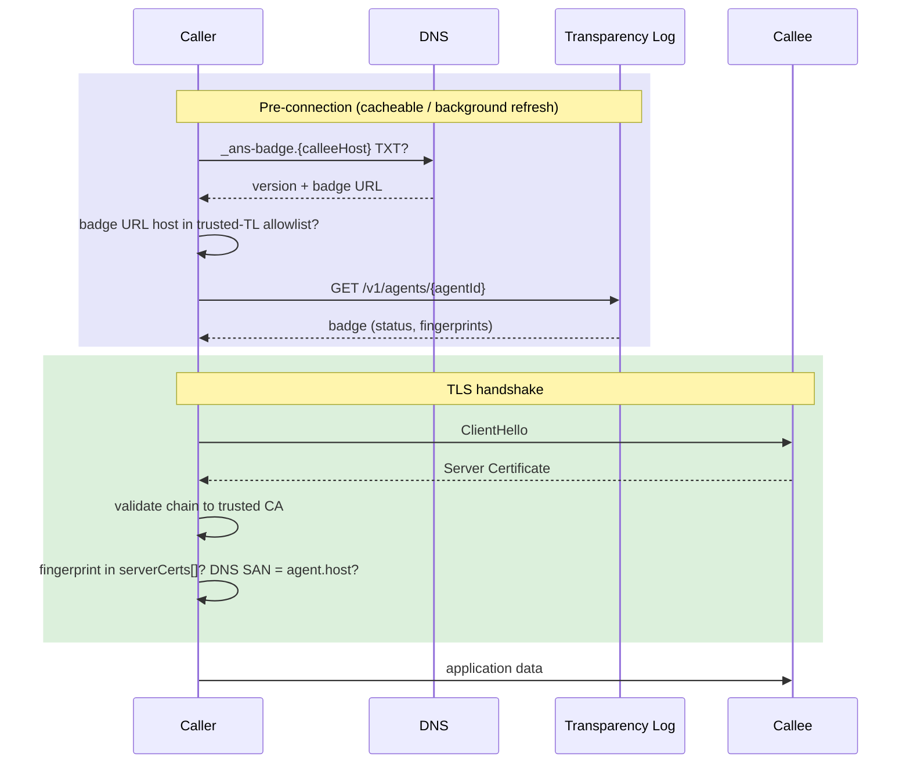
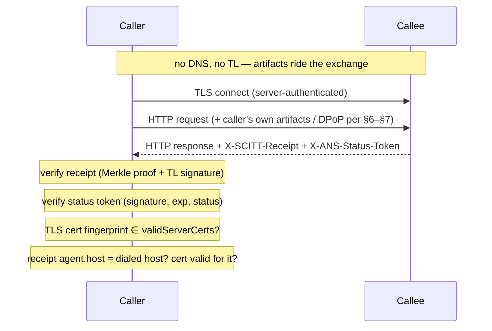

# ANS-6: Agent-to-Agent Authentication

Status: DRAFT v1.0
Spec: ANS-6 (Agent-to-Agent Authentication)
Version: 0.1.0
Date: 2026-08-24
Audience: implementers building ANS-aware agent runtimes and SDKs (caller and callee sides), and operators deploying agent-to-agent authentication

## 1. Scope

ANS-6 is the verifier-facing layer: it specifies how one agent authenticates another at request
time, consuming the artifacts the other layers produce — the Identity and Server Certificates
([ANS-1](ans-1-registration.md), [ANS-2](ans-2-versioned-naming.md)), the published DNS records
([ANS-3](ans-3-dns-publication.md)), and the Transparency Log's badge, receipt, and status token
([ANS-4](ans-4-transparency.md)). Where [ANS-5](ans-5-integrity-monitoring.md) specifies periodic
out-of-band monitoring, ANS-6 specifies the per-request path between two agents.

Authentication decomposes along two independent axes:

- **Verification tier** — where the trust evidence comes from. The **badge tier** queries the TL
  at connection time and trusts its response. The **SCITT tier** verifies receipt and status-token
  artifacts locally, with no per-request network calls.
- **Possession-proof flavor** — how the caller proves it holds its identity key. **Flavor A
  (mTLS)** presents the Identity Certificate in the TLS handshake ([ANS-2
  §4](ans-2-versioned-naming.md#4-mtls-with-identity-certificates)). **Flavor B (application-layer
  proof of possession)** carries an RFC 9449 DPoP proof in an HTTP header, surviving L7 proxies
  and gateways that terminate TLS.

The two flavors have equal standing. A deployment picks per its topology: Flavor A where the TLS
path between the agents is end-to-end; Flavor B where intermediaries terminate TLS, or where
client certificates are operationally unavailable. A conformant callee implements at least one
flavor and documents which (§10).

ANS-6 does **not** specify:

- Authorization. Every procedure in this document AUTHENTICATES a peer — it establishes *who* is
  calling, never *what* they may do. The callee MUST apply its own authorization to the
  authenticated identity.
- Delegation — an agent acting on behalf of a user or another agent across a call chain. That is
  a separate, higher-risk concern outside this revision.
- Trust scoring. Out of scope for ANS; lives in the separate `ti-*` layer set.
- The periodic integrity checks of the AIM ([ANS-5 §4](ans-5-integrity-monitoring.md#4-verification-checks)).

## 2. Terminology

- **Caller / callee**: the agent initiating an HTTP request / the agent serving it. Matches the
  usage of [ANS-2 §4](ans-2-versioned-naming.md#4-mtls-with-identity-certificates).
- **Badge**: the TL's JSON response for an agent's most recent sealed event
  (`GET /v1/agents/{agentId}`, [ANS-4 §5](ans-4-transparency.md#5-public-verification-api)),
  carrying the event, a Merkle inclusion proof, a computed `status`, and the TL's signature.
- **Receipt**: a COSE_Sign1 structure carrying an agent's sealed leaf, its RFC 9162 inclusion
  path, and the TL's signature over the leaf (§4.3). Proves *identity*: the agent's registration
  is in the log.
- **Status token**: a short-lived COSE_Sign1 structure asserting an agent's current lifecycle
  state with bounded staleness. Proves *liveness*: the registration is currently valid.
- **Possession proof**: evidence that the caller holds the Identity Certificate's private key for
  this request — the mTLS `CertificateVerify` in Flavor A, the DPoP proof in Flavor B.
- **Verification tier**: badge tier (online) or SCITT tier (offline), per §3.2.
- **Replay cache**: the callee-side store enforcing single-use DPoP proof identifiers (§7.6).
- **Verification**: establishing a peer's identity and liveness from ANS artifacts (§3.1 rows
  1–2). ANS-5 runs verification out-of-band and periodically; the §5–§7 procedures embed it per
  connection.
- **Authentication**: verification plus a possession proof (§3.1 row 3) — the result is an
  authenticated peer identity the callee can authorize against (§6.5).

## 3. Verification model

### 3.1 The three proofs

Authenticating a peer establishes three independent facts, all bound to one certificate:

| Proof | Question answered | Provided by |
| --- | --- | --- |
| **Identity** | Is this certificate sealed in the Transparency Log for this agent? | Badge (badge tier) or receipt (SCITT tier) |
| **Liveness** | Is that registration valid *right now* (ACTIVE, not revoked)? | Badge `status` (badge tier) or status token (SCITT tier) |
| **Possession** | Does the peer hold the certificate's private key, for *this* connection or request? | TLS handshake (Server Certificate for callees; Identity Certificate under Flavor A) or DPoP proof (Flavor B) |

A verifier that checks identity and liveness but not possession accepts anyone replaying public
artifacts — badges, receipts, and status tokens are all public documents. A verifier that checks
possession but not liveness accepts a revoked agent. All three are required.

### 3.2 Verification tiers

| Tier | Artifacts | Trust model | Per-request network calls |
| --- | --- | --- | --- |
| **Badge** | Badge JSON fetched from the TL | Trust the TL's response at query time | DNS lookup + TL query (cacheable) |
| **SCITT** | Receipt + status token, presented in HTTP headers | Verify signatures and Merkle proof locally | None — verification is local computation (under Flavor B the replay cache adds callee-side state, shared across replicas, §7.6) |

The SCITT tier is RECOMMENDED for new implementations: a verifier holding the TL's root keys
(§4.5, fetched once and cached) verifies peers with no DNS lookup and no TL query in the request
path. The only recurring network dependency is each agent refreshing its **own** status token in
the background (§4.6). The badge tier remains fully supported and is sufficient where online TL
queries are acceptable. The tiers compose: a SCITT-tier verifier falls back to the badge tier
when a peer presents no artifacts (§9).

### 3.3 Possession-proof flavors

| Property | Flavor A: mTLS | Flavor B: application-layer PoP (DPoP) |
| --- | --- | --- |
| Proof mechanism | Identity Certificate + `CertificateVerify` in the TLS handshake | RFC 9449 DPoP proof in the `DPoP` request header |
| Survives TLS-terminating proxies | No — the L7 hop drops the client identity | Yes — the proof rides the HTTP request end to end |
| Channel binding | Yes — the proof is the channel | No — the channel is server-authenticated HTTPS only |
| Request binding | No — the handshake authenticates the connection, not individual requests | Yes — each proof binds one method + URL, single-use |
| Trust anchor for the caller's certificate | Chain to the RA's Private CA ([ANS-2 §3](ans-2-versioned-naming.md#3-the-identity-certificate)) | Status token's `validIdentityCerts` fingerprint set (§7.5) |
| Callee-side state | None beyond TLS | Replay cache (§7.6) |

In both flavors the **callee** is authenticated the same way: TLS server authentication provides
its possession proof, and §5 provides its identity and liveness checks. The flavors differ only
in how the **caller** proves itself.

For consumers scoring interaction strength: the Trust Index's interaction-context model
([TRUST_INDEX_SPEC.md Appendix C](../TRUST_INDEX_SPEC.md#appendix-c-interaction-context-model-informational-implementation-recommended))
classifies authentication methods for profile adjustment. In its terms Flavor A is the `MTLS_*`
family and Flavor B corresponds to `JWT_CERT` — a proof signed by the agent's Identity
Certificate. The mapping is informative: ANS-6 defines the wire procedures, the Trust Index
consumes their outcome.

### 3.4 Composing tiers and flavors

Flavor A composes with either tier: the mTLS handshake authenticates the caller's certificate,
and the badge (§6.2) or the caller's SCITT artifacts (§6.3) establish identity and liveness.
Flavor B requires the SCITT tier: its binding checks run against the status token's certificate
fingerprint arrays (§7.5), and its whole point is a request path free of per-request TL queries.

## 4. Verification artifacts

### 4.1 Badge

`GET /v1/agents/{agentId}` on the TL returns the badge: the agent's most recent sealed event
wrapped in the TL envelope, with a Merkle inclusion proof (`merkleProof`), a `status` computed at
query time, and the TL's signature over the payload. The envelope is `schemaVersion: "V2"`; the
inner event carries `ansId`, `ansName`, `agent {host, name, version, providerId}`, and
`attestations` with certificate **arrays**. A worked response lives at [ANS-4 example
A.2](examples/ans-4-examples.md#a2-tl-badge-response); the machine-readable schema is
[`api/tl-response-schema-v2.json`](../api/tl-response-schema-v2.json).

Key paths a verifier reads:

| Value | Path |
| --- | --- |
| Status | `.status` |
| ANSName | `.payload.producer.event.ansName` |
| Agent host | `.payload.producer.event.agent.host` |
| Agent version | `.payload.producer.event.agent.version` |
| Server Certificate fingerprints | `.payload.producer.event.attestations.serverCerts[].fingerprint` |
| Identity Certificate fingerprints | `.payload.producer.event.attestations.identityCerts[].fingerprint` |
| Event type | `.payload.producer.event.eventType` |

Certificate fingerprints are `SHA256:` followed by the lowercase-hex SHA-256 of the full
DER-encoded certificate — the same value carried in the Server DANE TLSA record ([ANS-3
§6.3](ans-3-dns-publication.md#63-family-trust-records)), so one hash computation serves both
checks. Both certificate fields are arrays; a presented certificate matches when its fingerprint
equals **any** entry, which absorbs the overlap window during certificate rotation (§8.2).

Status values and their connection semantics:

| Status | Meaning | Valid for connections? |
| --- | --- | --- |
| `ACTIVE` | Registered and in good standing | Yes |
| `WARNING` | Certificate expires soon (RA-configured window) | Yes |
| `DEPRECATED` | The AHP has marked this version for retirement | Yes, with a migration signal |
| `EXPIRED` | Certificate has expired (terminal) | No |
| `REVOKED` | Registration explicitly revoked (terminal) | No |

The badge's computed `status` MAY additionally report `UNKNOWN` when the TL cannot compute a
status for the entry; verifiers treat `UNKNOWN` as an inability to verify (apply the §9 failure
policy), never as a pass. Status tokens carry only the five values above (§4.4).

### 4.2 The `_ans-badge` record and trusted TL domains

The badge tier bootstraps from the `_ans-badge.{agentHost}` TXT record, emitted as a family trust
record by every discovery profile ([ANS-3 §6.3](ans-3-dns-publication.md#63-family-trust-records)):

```text
_ans-badge.agent.example.com. IN TXT "v=ans-badge1; version=v1.0.0; url=https://transparency-log.example.com/v1/agents/7a4b2e91-83f6-4c12-9d58-bf1e6a3c9d07"
```

To parse: split on `;`, trim whitespace, read `v` (format tag, `ans-badge1`), `version` (the
registration's semver, `v`-prefixed, matching the ANSName's version segment), and `url` (the TL
badge endpoint). Multiple records coexist during version changes; the `version` field selects the
right one without fetching every badge (§8.1). Absence of the record under `_ans-badge` means the
host is not a registered ANS agent.

This bootstrap is **discovery-profile-agnostic**. `_ans-badge` is a family trust record: the
default [`ANS_DNSAID`](discovery-profiles/ans-dnsaid.md) profile (one SVCB row per endpoint at the
bare FQDN, RFC 9460) and the [`ANS_TXT`](discovery-profiles/ans-txt.md) profile (`_ans` TXT rows)
both emit it unchanged. How the caller discovered the endpoint in the first place — the SVCB
SvcParams or the `_ans` TXT rows — is [ANS-3 §6](ans-3-dns-publication.md#6-discovery-profiles)'s
concern and carries no authentication weight of its own: the discovery hints corroborate
verification where noted below (§4.4 card digests, §5.3 port selection, §8.1 version selection)
but never substitute for the badge, receipt, or status token.

**Before fetching any badge URL, the verifier MUST confirm the URL's host is a TL the verifier
trusts.** Verifiers maintain an explicit allowlist of trusted TL domains. Without this check, a
spoofed or attacker-published TXT record redirects the lookup to a server returning forged badge
data; the DNS record locates the badge, it does not confer trust on the endpoint it names.

How a deployment obtains that allowlist is deployment policy, but it is the trust root of the
badge tier, so it MUST come from configuration or an out-of-band channel the operator already
trusts: operator-pinned configuration, a federation- or consortium-published bundle, or the list
published by the RA the verifier itself registered with. It MUST NOT be derived from the DNS
records under verification — that is circular — and trust-on-first-use from a first badge fetch
is NOT RECOMMENDED.

### 4.3 Receipt

`GET /v1/agents/{agentId}/receipt` returns the SCITT receipt for the agent's latest sealed event
(`Content-Type: application/scitt-receipt+cose`). The receipt is a COSE_Sign1 structure (CBOR
tag 18):

| Component | Contents |
| --- | --- |
| Protected header | `1` (alg) = `-7` (ES256); `4` (kid) = 4-byte key id, `SHA-256(SPKI-DER)[0:4]` of the signing key, cross-referenced against `/root-keys` (§4.5); `395` (vds) = `1` (RFC9162_SHA256); `15` (cwt-claims) = `{1 (iss), 6 (iat)}` |
| Unprotected header | `396` (vdp): the inclusion proof — `-1` tree_size (uint64), `-2` leaf_index (uint64), `-3` hash_path (array of 32-byte hashes), and optionally `-4` root_hash (32 bytes; **advisory** — see below) |
| Payload | The JCS-canonicalized ([RFC 8785](https://www.rfc-editor.org/rfc/rfc8785)) sealed leaf bytes ([ANS-4 §3](ans-4-transparency.md#3-cryptographic-standards)), **attached** |
| Signature | 64-byte ECDSA P-256, IEEE P1363 `R \|\| S` |

The payload is attached — the full canonical leaf rides in the receipt — so a verifier
reconstructs the leaf hash from the receipt alone, with no side channel to the sealed record.
The Merkle leaf is `SHA-256(0x00 || leaf_bytes)` and interior nodes are
`SHA-256(0x01 || left || right)`, per [RFC 9162 §2.1](https://www.rfc-editor.org/rfc/rfc9162)
and the ANS-4 §3 leaf-hash rule; the domain-separation prefixes prevent leaf/node
second-preimage confusion. Implementations MUST canonicalize with JCS before hashing — raw JSON
byte order is not deterministic.

**What the signature covers — and what it does not.** A COSE_Sign1 `Sig_structure` covers only
the protected header and the payload. The inclusion proof rides the **unprotected** header and is
therefore not authenticated by the receipt: the receipt's cryptographic guarantee is "the TL
signed this leaf", and the walked path yields a *computed* root, not a verified one. A
`root_hash` carried at vdp `-4` is advisory and MUST NOT be treated as verification. Tree-head
trust comes from comparing the computed root against a root obtained out-of-band — the TL's
signed checkpoint ([ANS-4 §5.2](ans-4-transparency.md#52-receipts-status-tokens-checkpoints))
and, where deployed, its HCS anchoring
([ANS-4 §7](ans-4-transparency.md#7-checkpoint-anchoring-to-hedera-hcs)). See §11.3.

A `503` with `Retry-After` means the leaf is appended but not yet covered by a signed checkpoint;
retry after the indicated delay.

**Receipt verification algorithm:**

```text
Input: receiptBytes, trusted key set (from /root-keys)

1. Decode CBOR tag 18 → [protected, unprotected, payload, signature]
2. Look up the key by protected[4] (kid)
3. Reconstruct Sig_structure = CBOR(["Signature1", protected, h'', payload]);
   verify ECDSA-P256(key, SHA-256(Sig_structure), signature)
   — signature FIRST, before the issuer check and any Merkle work, so an
   unauthenticated input can neither probe the key store nor buy computation
4. When the protected header carries a cwt-claims iss, assert it equals the
   trusted key's name
5. Read the inclusion proof from unprotected[396]:
   tree_size, leaf_index, hash_path
6. leaf_hash = SHA-256(0x00 || payload)
7. Walk the inclusion path (RFC 9162 §2.1.3.2):
   fn = leaf_index; sn = tree_size - 1; r = leaf_hash
   for each p in hash_path:
     reject if sn == 0                 // excess path elements
     if fn is odd OR fn == sn:
       r = SHA-256(0x01 || p || r)
       if fn is even:                  // right-border node
         right-shift fn and sn until fn is odd or fn == 0
     else:
       r = SHA-256(0x01 || r || p)
     fn >>= 1; sn >>= 1
   reject if sn != 0                   // insufficient path elements
   computed_root = r
8. computed_root is an OUTPUT, not a check: nothing in the receipt
   authenticates it (the VDP is unprotected). Compare it against the TL's
   signed checkpoint when tree-head trust is required; ignore any advisory
   vdp[-4] value for verification purposes.
```

A receipt never goes stale — the tree is append-only, so a valid inclusion proof is valid
forever. It also never proves liveness: a receipt for a since-revoked agent still verifies.
Always pair it with a status token or badge status check (§11.2).

### 4.4 Status token

`GET /v1/agents/{agentId}/status-token` returns the status token
(`Content-Type: application/ans-status-token+cbor`), a COSE_Sign1 (CBOR tag 18) whose protected
header carries `1` (alg) = `-7`, `4` (kid) as in §4.3, and `3` (content type) =
`"application/ans-status-token+cbor"`. The payload is a CBOR map with integer keys:

| Key | Field | Type |
| --- | --- | --- |
| 1 | `agentId` | UUID string |
| 2 | `status` | `ACTIVE`, `WARNING`, `DEPRECATED`, `EXPIRED`, `REVOKED` |
| 3 | `iat` | int64, Unix seconds |
| 4 | `exp` | int64, Unix seconds (default TTL one hour) |
| 5 | `ansName` | e.g. `ans://v1.0.0.agent.example.com` |
| 6 | `validIdentityCerts` | array of cert entries |
| 7 | `validServerCerts` | array of cert entries |
| 8 | `metadataHashes` | map: protocol → `SHA256:...` |

Each cert entry is itself an integer-keyed map: `1` = fingerprint — the 32-byte raw SHA-256 as a
CBOR byte string (decoders SHOULD also accept the `SHA256:<hex>` text form) — and `2` =
certificate type, drawn from the `CertificateExtended.type` enum of the V2 schema (e.g.
`X509-OV-CLIENT`, `X509-DV-SERVER`). The type is informational: verification decisions compare
fingerprints, never types, and consumers SHOULD compare the type case-insensitively (the badge
JSON enum is uppercase; implementations have emitted lowercase in the CBOR form). The arrays list **every currently-valid certificate**, so both old and new
fingerprints appear during a rotation overlap — a verifier matches against any entry and never
needs the refresh-on-mismatch pattern the badge tier uses (§8.2). `metadataHashes` lets a
verifier hash a fetched Agent Card and detect post-registration tampering
([ANS-5 §4](ans-5-integrity-monitoring.md#4-verification-checks), schema-integrity row).

Under the default `ANS_DNSAID` discovery profile the same card digest also appears in DNS: the
endpoint's SVCB row carries it as `key65401` (DNS-AID `cap-sha256`, `base64url` of the raw 32
bytes), while `metadataHashes` carries `SHA256:<hex>` — one hash, two encodings
([ans-dnsaid §2](discovery-profiles/ans-dnsaid.md#2-record-assembly)). A verifier that checks card
integrity SHOULD compare both channels where available: the status-token entry is TL-signed, the
SVCB digest is DNS-anchored where the zone DNSSEC-validates, and disagreement between the two is
itself a finding even when the fetched card matches one of them.

**Status-token verification algorithm:**

```text
Input: tokenBytes, trusted key set, clock-skew tolerance (≤ 10 minutes)

1. Decode CBOR tag 18 → [protected, unprotected, payload, signature]
2. Look up the key by protected[4] (kid)
3. Reconstruct Sig_structure = CBOR(["Signature1", protected, h'', payload])
4. Verify ECDSA-P256(key, SHA-256(Sig_structure), signature)
5. When cwt-claims iss is present, assert it equals the trusted key's name
   (after the signature, as in §4.3 step 3)
6. Decode the integer-keyed payload
7. Assert now ≤ exp + skew
8. Assert status is not terminal (EXPIRED, REVOKED)
```

**Terminal states return `410 Gone`, not a token.** The TL refuses to issue status tokens for
EXPIRED or REVOKED agents; the absence of a fresh token *is* the revocation signal. Verifiers
MUST treat the inability to obtain a fresh status token as equivalent to revocation, subject to
the failure policy in §9. A `501` means the deployment has not enabled status tokens; clients
fall back to the badge tier.

### 4.5 Root keys

Verifiers obtain the TL's verification key once from `GET /root-keys`
([ANS-4 §5.1](ans-4-transparency.md#51-key-distribution)), served as newline-delimited
[C2SP signed-note](https://c2sp.org/signed-note) verifier lines:

```text
<name>+<key_hash>+<base64 key material>
```

`name` is the TL's domain identifier; `key_hash` is the hex-encoded first 4 bytes of
SHA-256(SPKI-DER) and equals the `kid` (label 4) in receipt and status-token protected headers;
the key material is the base64 ECDSA P-256 public key (SubjectPublicKeyInfo DER, optionally
preceded by the C2SP key-type octet `0x02`). Parsers MUST recompute the hash from the decoded
SPKI and reject a line whose declared `key_hash` disagrees.

One TL key signs every outbound artifact — checkpoints, envelope attestations, receipts, and
status tokens — and `/root-keys` advertises exactly one line in the reference deployment
([ANS-4 §3](ans-4-transparency.md#3-cryptographic-standards)); parsers MUST nonetheless accept
multiple lines. Verifiers maintain a list of trusted TL domains, fetch each TL's lines once at
bootstrap, and cache them. This one-time fetch is the only trust bootstrapping the SCITT tier
requires.

**Keys never expire, and the list only grows.** The `/root-keys` contract is append-only
([ANS-4 §5.1](ans-4-transparency.md#51-key-distribution)): a TL MAY add a key, and every
published line is retained so previously issued artifacts stay verifiable. The verifier-side
cache rules follow:

- **Merge additively.** A refresh adds unknown lines to the cache and MUST NOT drop a cached key
  that is absent from the response — a cached key remains valid for verifying the artifacts it
  signed, indefinitely.
- **Refresh on unknown `kid`.** On a receipt or status token whose `kid` matches no cached key,
  the verifier SHOULD re-fetch `/root-keys` once and retry the lookup before rejecting (§9.5).
  Refreshes MUST be rate-limited with a cooldown on the order of minutes: unknown kids arrive on
  attacker-supplied input, and an ungated trigger is a fetch amplifier. A verifier that skips the
  refresh — a pinned, static deployment — simply rejects unknown kids until its configuration is
  updated, which is a valid posture.
- **Collisions fail toward the cache.** A fetched line whose `kid` matches a cached key but whose
  name or key material differs is discarded and logged as a finding; the first-seen key wins.
- **Fetch failure keeps the cache.** A failed refresh leaves the existing snapshot in place, and
  verification continues against cached keys.

### 4.6 HTTP header transport and refresh

SCITT-tier artifacts travel as HTTP headers on the requests and responses agents already
exchange:

| Header | Direction | Contents |
| --- | --- | --- |
| `X-SCITT-Receipt` | Both — callers send it on requests, callees on responses | Standard-base64 COSE_Sign1 receipt |
| `X-ANS-Status-Token` | Both | Standard-base64 COSE_Sign1 status token |
| `DPoP` | Requests only (Flavor B) | Compact-JWS DPoP proof (§7.2) |

Agents SHOULD include their artifacts on **every** request and response, not only the first —
this lets peers observe a refreshed status token the moment it rotates. Re-presentation does not
imply re-verification: a receiver SHOULD cache the verified result keyed by the artifact bytes
(or their hash) and re-run cryptographic verification only when the presented bytes change or
the cached token's `exp` passes. The Flavor-B possession proof is the exception — it is
single-use by design and is verified on every request (§7.4). Each of these headers,
plus `Authorization` (which drives the token binding in §7.8), MUST appear at most once; a
verifier MUST reject a request carrying duplicates, since two hops reading different values of
the same header reach different conclusions about the same request. Receivers MUST bound decoded
header sizes before parsing. Deployments MAY additionally staple the receipt and status token
into the Agent Card as a secondary distribution channel; the headers remain the per-request
mechanism this spec verifies.

Artifacts are refreshed by each agent's own runtime in the background, never in the request path:

- **Status token**: re-fetched on an interval comfortably inside the TTL (the reference
  implementation polls every ~30 minutes against a one-hour TTL; proactive refresh at 50% TTL is
  a reasonable default).
- **Receipt**: re-fetched only when the agent's latest sealed event changes — certificate
  rotation or a version's registration ([ANS-1 §7](ans-1-registration.md#7-lifecycle-operations)).

Peers never call the TL to verify each other in this tier; only each agent's own background
refresh touches the TL.

## 5. Authenticating a callee

The caller authenticates the agent it is connecting to. Both tiers end the same way: the
callee's live Server Certificate must match a sealed fingerprint, and the sealed `agent.host`
must equal the host the caller actually dialed. That second comparison anchors the procedure to
the caller's intent — every other value here comes from artifacts the callee (or a DNS spoofer)
selected, and checking them only against each other verifies a consistent story, not the right
peer.

### 5.1 Badge tier



1. **DNS lookup.** Query `_ans-badge.{calleeHost}` TXT (§4.2). No record → not a registered ANS
   agent. Multiple records → select the version the caller intends to call when it knows one;
   otherwise prefer `ACTIVE` and disambiguate by certificate fingerprint after the handshake
   (§8.1 — callees announce no version at the TLS layer).
2. **Trusted-TL check, then fetch.** Confirm the badge URL's host is a trusted TL, then fetch the
   badge.
3. **Status.** `ACTIVE` / `WARNING`: proceed. `DEPRECATED`: proceed, prefer an ACTIVE sibling
   version when one exists (§8.1). `EXPIRED` / `REVOKED`: reject.
4. **TLS handshake and comparison.** Connect over TLS; validate the chain to a trusted public CA
   as usual; compute `SHA-256(cert.Raw)` over the presented Server Certificate; require the
   fingerprint to equal some entry of `attestations.serverCerts[]`; require `agent.host` to equal
   the host the caller resolved and dialed, and require the certificate to pass standard
   [RFC 6125](https://www.rfc-editor.org/rfc/rfc6125) hostname verification against that same
   requested name. The `agent.host` comparison is in addition to, never in place of, the standard
   hostname check: every field the badge carries was chosen by whoever published it, so only the
   dialed name ties verification to the peer the caller meant to reach.
5. **Optional.** DANE/TLSA pinning (§5.3).

Badge fetch MAY precede or follow the handshake — pre-fetching (or background refresh) keeps the
lookup off the connection's critical path; the constraint is that no application data is trusted
until the comparison completes.

| Condition | Result |
| --- | --- |
| No `_ans-badge` record | Not an ANS-registered agent |
| Badge URL host not a trusted TL | Reject — untrusted badge source |
| TL unreachable | Apply failure policy (§9) |
| Status `EXPIRED` / `REVOKED` | Reject |
| Fingerprint matches no `serverCerts[]` entry | Refresh badge once, then reject (§8.2) |
| `agent.host` ≠ dialed host, or hostname verification fails | Reject |

### 5.2 SCITT tier

The callee sends its receipt and status token in response headers; the caller verifies locally.



1. **TLS handshake** as in §5.1 step 4; capture the Server Certificate.
2. **Extract artifacts** from the response headers (§4.6). Either header absent → fall back to
   the badge tier.
3. **Verify the receipt** (§4.3 algorithm). Malformed → fall back to badge tier; a *failed*
   Merkle proof or signature → reject (§9).
4. **Verify the status token** (§4.4 algorithm). Expired → fall back per §9; terminal status →
   reject.
5. **Bind to the connection.** The Server Certificate's fingerprint must equal some
   `validServerCerts` entry; the receipt event's `agent.host` must equal the host the caller
   resolved and dialed, and the certificate must pass standard hostname verification against that
   same requested name (§5.1 step 4 — the artifacts alone cannot supply this anchor); the receipt
   event and status token must name the same agent (full `ansName`, and the agent identifier when
   both carry one). Optionally compare `metadataHashes` against a fetched Agent Card.

### 5.3 DANE/TLSA (optional, both tiers)

Where the callee's zone is DNSSEC-signed, the caller MAY additionally validate the Server
Certificate against the `_{port}._tcp.{agentHost}` TLSA record set (`3 0 1` — DANE-EE, full
certificate, SHA-256; [ANS-3 §6.3](ans-3-dns-publication.md#63-family-trust-records)). Selector 0
makes the TLSA content the same SHA-256 the badge and status token carry, so no extra hash is
computed. The `{port}` label is the port the connection actually uses — under `ANS_DNSAID` the
SVCB row's `port=` SvcParam, under `ANS_TXT` the endpoint URL's port. Check against **all** TLSA
records — multiple records coexist during rotations. Per RFC
6698 §4, a TLSA RRset that does not DNSSEC-validate as "secure" is unusable and MUST be ignored
rather than trusted. See [ANS-5 §5](ans-5-integrity-monitoring.md#5-verification-procedure-verifier-facing)
for where DANE sits among the verification channels.

## 6. Authenticating a caller — Flavor A: mTLS

The caller presents its Identity Certificate in the TLS handshake per
[ANS-2 §4](ans-2-versioned-naming.md#4-mtls-with-identity-certificates). The handshake proves
possession; this section specifies the identity and liveness verification the callee runs before
processing application data.

### 6.1 Handshake and identity extraction

1. The TLS layer validates the client certificate chain against the RA Private CA trust anchor.
   No chain → reject at the TLS layer.
2. Extract from the validated certificate:
   - **DNS SAN** (also the CN): the caller's FQDN, e.g. `caller.example.com`.
   - **URI SAN**: the full ANSName, e.g. `ans://v1.0.0.caller.example.com` ([ANS-2
     §3](ans-2-versioned-naming.md#3-the-identity-certificate)). No URI SAN → not an ANS Identity
     Certificate.
3. Parse the version from the URI SAN: strip the leading `ans://` and the trailing `.{FQDN}`
   (using the DNS SAN's FQDN); the remainder is the `v`-prefixed version.

The handshake completes before verification, but the callee MUST NOT process application requests
until verification finishes. Cache verified results per §6.4.

Chain validation carries no revocation signal today: ANS-1 revocation revokes Identity
Certificates at the issuing private CA ([ANS-1 §7](ans-1-registration.md#7-lifecycle-operations)),
but the CA publishes no CRL or OCSP endpoint, so a revoked certificate still chains cleanly. The
TL is the revocation channel — the badge computes `REVOKED` and the status-token endpoint returns
`410` (§4.4) — which is why the §6.2/§6.3 verification is REQUIRED even after a successful
handshake. Where a deployment's CA does publish revocation, the TLS layer MAY check it as defense
in depth.

### 6.2 Badge tier

1. Query `_ans-badge.{callerFQDN}` TXT. When multiple records exist, select the record whose
   `version` field equals the version from the URI SAN (§8.1). Apply the trusted-TL check (§4.2)
   before fetching.
2. Fetch the badge and validate:

| Client certificate | Badge field | Requirement |
| --- | --- | --- |
| DNS SAN | `.payload.producer.event.agent.host` | Equal |
| URI SAN | `.payload.producer.event.ansName` | Equal |
| Fingerprint (`SHA-256(cert.Raw)`) | `.payload.producer.event.attestations.identityCerts[]` | Matches any entry |
| — | `.status` | `ACTIVE`, `WARNING`, or `DEPRECATED` |

### 6.3 SCITT tier

The caller sends its receipt and status token in the request headers (§4.6). The callee verifies
both artifacts locally (§4.3, §4.4) and binds them to the presented certificate:

| Client certificate | Artifact field | Requirement |
| --- | --- | --- |
| Fingerprint | Status token `validIdentityCerts` | Matches any entry |
| DNS SAN | Receipt event `agent.host` | Equal |
| URI SAN | Receipt event `ansName` / status token `ansName` | Equal |
| — | Status token `status` | Not terminal |
| — | Status token `exp` | Not expired |

Either header absent → fall back to the badge tier (§6.2).

### 6.4 Timing and caching

- **First request (slow path)**: handshake completes, then verification runs before any
  application data is processed.
- **Subsequent requests (fast path)**: reuse the cached verification for the same certificate.
- **Background refresh**: refresh cached badges before staleness; under the SCITT tier the
  caller's own headers deliver fresh artifacts on every request, so the callee simply re-verifies
  when the presented token changes.

### 6.5 Authorization placement

ANS verification answers "is this a validly registered agent?", never "may it do this?". The
recommended order fails fast: mTLS handshake → callee's own authorization check on the extracted
identity (allowlist, RBAC — application-specific, out of ANS scope) → ANS verification →
application processing. Where authorization decisions depend on registered properties (status,
attestations), run them after ANS verification instead.

### 6.6 Outcomes

| Condition | Result |
| --- | --- |
| Certificate does not chain to the Private CA | Reject at TLS layer |
| No URI SAN | Not an ANS Identity Certificate |
| No `_ans-badge` record for the caller's FQDN (badge tier) | NXDOMAIN → reject (§9.1 — revocation removes the record, so determinate absence is adverse); SERVFAIL/timeout → apply failure policy |
| Badge URL host not a trusted TL | Reject |
| Status terminal (`EXPIRED` / `REVOKED`) | Reject |
| Fingerprint matches no identity-cert entry | Reject (badge tier: refresh once first, §8.2) |
| DNS SAN ≠ `agent.host` or URI SAN ≠ `ansName` | Reject |

## 7. Authenticating a caller — Flavor B: application-layer proof of possession

Flavor B moves the caller's possession proof from the TLS handshake to the application layer as a
[DPoP](https://www.rfc-editor.org/rfc/rfc9449) proof — the RFC-stable form of the IETF WIMSE
workload-proof-token pattern — carried in the standard `DPoP` header over ordinary
server-authenticated HTTPS. No client certificate appears in the handshake, so the proof survives
L7 proxies, gateways, and any hop that terminates TLS.

Where textbook DPoP gets its identity binding from an authorization server stamping a key
thumbprint into an access token, this profile gets it from the Identity Certificate and the
Transparency Log — it works with no authorization server at all. OAuth 2.0 composes on top,
unchanged, when a deployment adds one (§7.8).

### 7.1 The three proofs under Flavor B

| Proof | Provided by |
| --- | --- |
| Identity | SCITT receipt in `X-SCITT-Receipt` (§4.3) |
| Liveness | Status token in `X-ANS-Status-Token` (§4.4) |
| Possession | DPoP proof in `DPoP` — what the mTLS handshake used to provide |

All three MUST bind to one Identity Certificate (§7.5). The receipt is REQUIRED by default; a
deployment MAY operate in a reduced mode that accepts status token + proof alone, trading away
the request-time inclusion proof (the status token still names an agent the TL vouches for), and
MUST document the choice.

### 7.2 Proof format

The proof is a compact JWS in the `DPoP` request header, wire-conformant to RFC 9449 §4.2 — a
textbook DPoP verifier validates it via the `jwk` header and ignores the rest. The profile then
pins what the RFC leaves to deployment policy. The JOSE protected header is **exactly**:

| Parameter | Value |
| --- | --- |
| `typ` | `dpop+jwt` |
| `alg` | `ES256` (the only accepted algorithm) |
| `jwk` | The bare public key: exactly `{kty: "EC", crv: "P-256", x, y}` with full-width (32-byte) base64url coordinates. Required by RFC 9449 §4.2; MUST NOT carry any other member — a private-key `d` fails closed |
| `x5c` | Exactly one entry: the caller's Identity Certificate, standard-base64 DER (RFC 7515 §4.1.6) |

Verifiers MUST decode the header strictly: any JOSE header parameter beyond these four — a
smuggled `kid`, `crit`, anything — rejects the proof. The `jwk` and the `x5c[0]` certificate MUST
present the same public key, compared byte-for-byte on the curve coordinates **before any
signature work**, so the signature is only ever checked under one key and a swapped `jwk` fails
closed. `x5c` is limited to one entry because trust comes from the status token, not a chain
(§7.5): a second entry is never consulted here, and tolerating it would let a chain-walking
verifier reach a different conclusion over the same bytes.

The payload claims:

| Claim | Value |
| --- | --- |
| `htm` | The HTTP method of the request |
| `htu` | The normalized target URI (§7.3) |
| `iat` | Issue time, Unix seconds |
| `jti` | Unique proof id, ≤ 128 bytes. Signers SHOULD generate ≥ 96 bits of randomness (the reference signer uses 128); verifiers can only enforce presence and the size cap |
| `ath` | Only when the request presents an access token: `base64url(SHA-256(token))` (§7.8) |

Additional payload claims are tolerated per RFC 9449; only the header is closed. Verifiers MUST
bound the proof's size before parsing (the reference profile caps it at 8 KiB).

### 7.3 `htu` normalization

Both signer and verifier normalize the target URI to the RFC 9449 §4.3 form before comparison:
lowercase the scheme and host, drop the scheme's default port (`:443` / `:80`), strip the query
and fragment, and normalize an empty path to `/`. The path is otherwise preserved byte-for-byte —
it is case-sensitive and receives no dot-segment or percent-encoding canonicalization, so a
path-rewriting hop between caller and callee breaks the binding **by design**: the proof binds
the URL the caller signed, not whatever a middlebox turned it into. Because `htu` excludes the
query string, request parameters are not bound — deployments MUST NOT put authority-bearing
parameters in the query string of a Flavor-B endpoint.

### 7.4 Verification procedure

Request-level preflight: reject the request when any of `DPoP`, `Authorization`,
`X-SCITT-Receipt`, or `X-ANS-Status-Token` appears more than once (RFC 9449 §4.3 requires this
for `DPoP`; the same reasoning covers the other three, which the decision also reads), and when
the request's authority is outside the configured trusted set (§7.7).

Then, in order, cheapest and least stateful first:

1. Proof size within bound; compact JWS structure splits into three segments.
2. Strict header decode (§7.2); `typ` and `alg` match; `jwk` present; `x5c` has exactly one
   entry.
3. Parse `x5c[0]`; the leaf key MUST be ECDSA P-256; the certificate's validity period MUST
   contain the current time (§7.5).
4. `jwk` equals the certificate key, byte-for-byte.
5. JWS signature verifies under that single key.
6. `htm` equals the request method.
7. `htu` equals the normalized expected URL (§7.3, authority per §7.7).
8. Token binding: `ath` ⟺ presented access token, both directions (§7.8).
9. `iat` within the freshness window: `|now − iat| ≤ skew` (default 120 seconds).
10. `jti` present and within the size bound.
11. Verify the status token and (unless the deployment waives it) the receipt; run the binding
    checks of §7.5.
12. **Record the `jti` in the replay cache last** — only after every other check, including the
    status-token binding, has passed (§7.6).

A proof passing steps 1–10 is cryptographically well-formed but **not yet trusted**: nothing has
tied its certificate to a live ANS agent. Step 11 is what turns "someone holds this key" into
"this registered, currently-valid agent holds this key".

### 7.5 Binding to the ANS identity

The certificate that signed the proof must be the certificate the TL vouches for:

1. **Fingerprint.** `SHA-256(x5c[0] DER)` MUST equal some entry of the status token's
   `validIdentityCerts`.
2. **Name.** The certificate MUST carry an `ans://` URI SAN ([ANS-2
   §3](ans-2-versioned-naming.md#3-the-identity-certificate)) whose host equals the status
   token's `ansName` host (case-insensitive). No URI SAN fails closed. Verifiers MAY require full
   ANSName equality; the two are equal by construction for conformant issuance, since the RA
   validates the URI SAN against the registration's ANSName before signing.
3. **Receipt agreement.** When a receipt is presented, the sealed event in its leaf payload MUST
   name the same agent as the status token: equal `ansName` — compared case-insensitively over
   the **full** name, version segment included — and equal agent identifier when both artifacts
   carry one. A leaf naming no agent at all is invalid.
4. **Peer pinning (optional).** A callee that only accepts known peers compares the authenticated
   ANSName host against its configured set.

**Certificate validity is checked.** Verifiers MUST reject a proof whose `x5c[0]` validity period
does not contain the current time (`notBefore ≤ now ≤ notAfter`, allowing the §7.4 step 9 skew
tolerance). The status token cannot provide this bound: identity-certificate rotation is additive
([ANS-1 §7](ans-1-registration.md#7-lifecycle-operations)) and a sealed event's fingerprint
arrays are immutable once the event lands, so nothing ever prunes a rotated-away or expired
certificate from `validIdentityCerts`. Without this check, a certificate the operator rotated
away from would stay acceptable past its own `notAfter` — the certificate's dates are the only
expiry the system carries for it.

**Deliberately absent:** CA-chain validation, key usage, and certificate-type checks. The status
token — signed by the TL, bounded by `exp` — is the trust statement about the certificate's
*registration*. Chain validation would introduce a second trust root whose revocation semantics
(CRL/OCSP) run on a different clock than the TL's; this profile keeps one authority for "is this
certificate currently the agent's identity". Deployments MAY layer additional X.509 policy on
top, but conformance does not require it. This is a profile decision, not an oversight — though
note it deviates from [RFC 7515 §4.1.6](https://www.rfc-editor.org/rfc/rfc7515#section-4.1.6),
which expects full RFC 5280 path validation for `x5c`; §7.9 records the deviation.

The authenticated result is the status token's `ansName` and `agentId`, the proof certificate's
fingerprint, and the key's RFC 7638 thumbprint (for §7.8). As everywhere in ANS-6, this is
authentication only — the callee authorizes separately (§6.5 applies unchanged).

### 7.6 Replay protection

Each proof is single-use. The callee MUST maintain a replay cache with an atomic check-and-store
operation and:

- **Retention** of at least `iat + skew + grace` per entry (a small grace, e.g. 5 seconds, keeps
  a jti stored slightly past the freshness window so no boundary gap opens between the two
  checks). Over-retention is the safe direction; under-retention reopens a replay.
- **Bounded storage.** Store a fixed-width digest of the `jti` (RFC 9449 §11.1 sanctions storing
  "only a hash thereof"), and enforce the `jti` size cap (§7.2), so a cache bounded in entry
  count is also bounded in bytes.
- **Fail closed.** A cache at capacity or erroring rejects the request; it never silently admits
  a possibly-replayed proof.
- **Record after trust.** The `jti` is committed only after the full §7.4 pipeline, including the
  status-token binding, succeeds. Recording earlier lets anyone with a self-signed certificate
  flood the bounded cache and fail-close authentication for every legitimate caller.
- **Shared scope behind load balancers.** An in-process cache blocks reuse within one replica
  only; a proof replays cleanly against any other replica. Multi-replica deployments MUST share
  the replay cache across replicas serving the same `htu` authority. Size it for the in-flight
  window: `maxEntries ≥ peak RPS × (skew + grace)` — and alarm on occupancy before saturation
  starts rejecting callers.

The freshness window is deliberately tight (±120 seconds default): RFC 9449 §11.1 recommends a
narrow `iat` acceptance window, and each halving of the window halves both the replay exposure
and the cache pressure.

### 7.7 The `htu` authority requirement

The `htu` check is only as trustworthy as the URL the callee compares against. Deriving that URL
from the request's own `Host` header is the vulnerability, not the defense — the client controls
it, so a proof captured from a call to a *different* origin can be presented with a spoofed
`Host` and pass. Every production deployment MUST configure one (or both, as defense in depth)
of:

- **A trusted-authority allowlist** — the externally-visible authorities this callee answers as,
  compared case-insensitively with default ports dropped; requests for any other authority are
  rejected before proof verification.
- **An externally-configured URL** — a trusted authority joined with **this request's** path. The
  authority MUST come from a trusted source: static configuration, or a header the fronting proxy
  sets and strips from clients — never a raw client-supplied `X-Forwarded-*`. The reconstruction
  MUST incorporate the request's path: a constant URL collapses `htu` to one value, so a proof
  minted for any path is accepted on every path and only `htm` still binds the target.
  Implementations SHOULD verify at wiring time that the configured reconstruction varies with the
  path, and fail startup when it does not.

Implementations MUST fail startup when neither is configured, and MUST NOT fall back to deriving
the comparison authority from the request's own `Host` header — a default-constructed verifier
that "works" by trusting `Host` is exactly the misconfigured callee of example A.6.

### 7.8 OAuth 2.0 composition

ANS proves **who**; OAuth 2.0 grants **what**. A deployment adding OAuth presents the
DPoP-bound access token as `Authorization: DPoP <token>` (RFC 9449 §7.1), and RFC 9449 §4.3
requires two checks that deliberately land in different components:

| Check | Who runs it |
| --- | --- |
| `ath` equals `base64url(SHA-256(access token))` | The proof verifier (§7.4 step 8), automatically |
| The token's `cnf.jkt` confirmation claim equals the proof key's RFC 7638 thumbprint | **Whoever validates the token** — the token is opaque to the proof layer, and only its validator can read `cnf` |

The `ath` rule is strict in both directions: a proof carrying `ath` without a presented token is
rejected, and a presented token without a matching `ath` is rejected. A proof minted without a
token (the pure-ANS mode) carries no `ath`, which is itself RFC-conformant — `ath` is required
only when a token is presented.

The `cnf.jkt` comparison cannot be skipped: `ath` hashes a value the presenter already holds, so
a thief with the token bytes mints a fresh proof with a matching `ath` under **its own** key. Only
the thumbprint comparison proves the token was issued to the key that signed this proof. Callers
obtain their thumbprint from their signing key to request bound tokens; callees obtain it from
the verified proof. When both the `Authorization` scheme parse and the `ath` verification read
the header, they MUST read identical bytes — one parser, not two.

### 7.9 RFC 9449 conformance notes

- Proofs are wire-conformant RFC 9449 DPoP: a textbook DPoP verifier accepts them. ES256-only is
  a restriction [RFC 9449 §4.3](https://www.rfc-editor.org/rfc/rfc9449#section-4.3) item 5
  permits a deployment to impose. The closed header set of §7.2 is a deliberate **deviation**,
  not a permitted restriction: RFC 9449 §4.2 allows additional header parameters and
  [RFC 7515 §4](https://www.rfc-editor.org/rfc/rfc7515#section-4) requires ignoring unrecognized
  ones, so an ANS-6 verifier rejects some RFC-conformant proofs (one carrying a library-added
  `kid`, for example). Interoperability is asymmetric by choice — ANS-6 proofs validate anywhere,
  but an ANS-6 verifier is stricter than the RFC; §11.9 is the rationale. Skipping `x5c` chain
  validation in favor of the §7.5 status-token binding and validity check is likewise a deviation
  from [RFC 7515 §4.1.6](https://www.rfc-editor.org/rfc/rfc7515#section-4.1.6).
- Server-provided nonces (RFC 9449 §8–§9) are not used: for direct agent-to-agent requests the
  tight `iat` window plus single-use `jti` bounds replay equivalently, without the extra round
  trip. A callee MAY additionally demand nonces per the RFC; that is a private agreement between
  peers, outside this profile.
- COSE artifacts (receipt, status token) use IEEE P1363 signatures; the DPoP proof, being JWS,
  also uses the fixed-width `R || S` form per RFC 7518 §3.4. Implementations bridging to DER-based
  APIs convert accordingly.

### 7.10 What Flavor B gives up relative to Flavor A

DPoP provides sender-constraint, not channel binding: the TLS channel is server-authenticated
only, and the proof binds the request, not the connection. A caller induced to connect to a
hostile callee discloses its receipt and status token (both public documents) and one single-use,
`htu`-bound, `iat`-bounded proof — the callee learns nothing it can replay elsewhere as that
caller, but the caller has still spoken to the wrong party; §5's callee authentication is what
prevents that. There is also no mutual endpoint authentication at the TLS layer and no
credential confidentiality for the proof itself.

**No request-content integrity.** The proof binds only the method and URI: neither the query
string (§7.3) nor the message body is covered
([RFC 9449 §11.7](https://www.rfc-editor.org/rfc/rfc9449#section-11.7)). A hop that terminates
TLS — the topology Flavor B exists for — can therefore alter either on a first, in-flight request
without invalidating the proof, and that is not replay: the `jti` is unseen and the `iat` fresh.
Deployments needing content integrity SHOULD bind a request digest
([RFC 9530](https://www.rfc-editor.org/rfc/rfc9530)) into an additional proof claim, which RFC
9449 §11.7 contemplates. Flavor A prevents the tampering structurally — an intermediary cannot
terminate mTLS to the callee without being the callee.

Deployments needing these properties run Flavor A (or both — the flavors are not mutually
exclusive on one callee).

### 7.11 Outcomes

| Condition | Result |
| --- | --- |
| Duplicate `DPoP` / `Authorization` / SCITT header | Reject |
| Request authority outside the trusted set | Reject |
| Proof oversize, malformed, wrong `typ`/`alg`, extra header params, `d` in `jwk` | Reject |
| `x5c` count ≠ 1, non-P-256 leaf, certificate expired or not yet valid, `jwk` ≠ certificate key | Reject |
| Signature invalid | Reject |
| `htm`/`htu` mismatch | Reject |
| `ath` without token, token without `ath`, or hash mismatch | Reject |
| `iat` outside window; `jti` missing or oversize | Reject |
| Missing status token (or missing receipt where required) | Reject — §10.1 makes accepting this non-conformant, and the absence may be an intermediary stripping headers (§9.7) |
| Status token invalid, expired, or terminal status | Reject (expired: §9.4) |
| Fingerprint not in `validIdentityCerts`; no/mismatched `ans://` URI SAN; receipt names a different agent | Reject |
| `jti` already seen; replay cache full or erroring | Reject (fail closed) |

## 8. Version changes and certificate rotation

### 8.1 Version changes

A version bump is a new registration under the same `agentHost`
([ANS-2 §2.3](ans-2-versioned-naming.md#23-supersession)): both versions are ACTIVE with
independent Identity Certificates, independent TL entries, and coexisting `_ans-badge` records.
ANS imposes no retirement timeline; the AHP MAY mark the old version `DEPRECATED` to signal
migration.

- **Selecting the right badge**: the caller's certificate URI SAN (Flavor A) carries the version;
  match it against the `version` field across the `_ans-badge` TXT records rather than fetching
  every badge. Callers verifying a callee (whose Server Certificate carries no version) prefer an
  ACTIVE record, or the record for the version they intend to call. Discovery records do not help
  here: `ANS_DNSAID` SVCB rows carry no version discriminator — coexisting versions' rows share
  one RRset at the bare FQDN — so version selection rides the badge record's `version` field (or
  the URI SAN) regardless of discovery profile. Server Certificates cannot carry the version the
  way Identity Certificates do — public CAs cannot issue the `ans://` URI SAN
  ([ANS-2 §3](ans-2-versioned-naming.md#3-the-identity-certificate)) — so the callee-side version
  signal is the SCITT tier: the callee's status token `ansName` names the exact version it is
  serving (§5.2), the callee-side analogue of the caller's URI SAN.
- **SCITT artifacts are per-version**: each version has its own receipt (its own leaf) and its
  own status token (its own `ansName`). Certificate-fingerprint arrays absorb rotations *within*
  a version; version changes produce separate artifacts, never merged arrays.

| Scenario | Recommendation |
| --- | --- |
| Single ACTIVE badge matches | Accept |
| Multiple records, version-selected badge ACTIVE | Accept |
| Version-selected badge DEPRECATED | Accept with a migration warning |
| No badge matches the presented certificate | Reject |

### 8.2 Certificate rotation

Rotation ([ANS-1 §7](ans-1-registration.md#7-lifecycle-operations)) changes fingerprints without
changing `agentId`, ANSName, or DNS structure, so a verifier's cached view can go stale the
moment new certificates deploy:

- **SCITT tier**: no gap. The status token's `validIdentityCerts` / `validServerCerts` arrays
  carry old and new fingerprints through the overlap window; matching any entry suffices.
- **Badge tier**: on a fingerprint mismatch against a cached badge, force one refresh and
  re-compare before rejecting — the sealed event after rotation carries the updated arrays. One
  extra round trip on the first post-rotation connection, no false rejections. Proactive cache
  refresh shrinks the window further.
- **DANE**: during Server Certificate rotation both old and new TLSA records exist; §5.3's
  check-all-records rule covers it.

The audit endpoint (`GET /v1/agents/{agentId}/audit`) provides the full lifecycle history when
forensics are needed.

## 9. Failure handling

### 9.1 DNS lookup failure (badge tier)

Distinguish NXDOMAIN (record does not exist → not an ANS agent) from SERVFAIL/timeout (lookup
failed → apply failure policy). When some of several `_ans-badge` URLs fail to fetch, one
retrieved-and-matching badge suffices; none retrievable → failure policy.

NXDOMAIN can be the *post-revocation* state, not only the never-registered one: revocation
deletes the version's records, `_ans-badge` included
([ANS-1 §7](ans-1-registration.md#7-lifecycle-operations)'s `dnsRecordsToRemove`). So when a peer
presents an ANS Identity Certificate and its host publishes no matching badge record, the
determinate answer is rejection (§6.6) — a cached pre-revocation badge is not a fallback. §9.2's
fail-open-with-cache applies to an unreachable TL, never to a record that is affirmatively gone.

### 9.2 TL unreachable (badge tier)

| Policy | Behavior | Trade-off |
| --- | --- | --- |
| Fail closed | Reject | Secure; reduces availability |
| Fail open with cache | Accept on a sufficiently fresh cached badge | Requires an explicit staleness threshold |
| Fail open | Accept unverified | NOT RECOMMENDED |

### 9.3 Receipt unavailable (SCITT tier)

Receipts never expire (§4.3), so a cached receipt remains valid; a `503` from the receipt
endpoint (checkpoint pending) is retried per `Retry-After`. When no receipt is available at all:
fall back to the badge tier, or fail closed, per deployment policy.

### 9.4 Status token unavailable or expired (SCITT tier)

| Policy | Behavior | Trade-off |
| --- | --- | --- |
| Fall back to badge | Live TL status check | Reintroduces the online query |
| Grace window | Accept a recently-expired token within a bounded grace (e.g. ≤ 1× TTL) | Extends the revocation-latency bound by the grace |
| Fail closed | Reject | Secure; reduces availability |

A `410 Gone` from the status-token endpoint is not a failure — it is the terminal-state signal
and MUST reject (§4.4). A `501` means the TL has no status tokens; use the badge tier.

### 9.5 Unknown signing key (SCITT tier)

A receipt or status token carrying a `kid` that matches no cached root key is not immediately a
forgery — the TL may have added a key (§4.5). Refresh `/root-keys` once, cooldown-gated, and
retry the lookup; if the `kid` is still unknown, reject. Do not fall back to a weaker tier on an
unknown `kid` alone: the badge tier consults the same TL, and a verifier that cannot recognize
the TL's signing key has a configuration problem, not an evidence problem.

### 9.6 Replay cache unavailable or saturated (Flavor B)

The replay cache is the one stateful dependency in the §7.4 pipeline, and §7.6 requires it to
fail closed: a cache that is down, erroring, or at capacity rejects requests rather than admitting
a possibly-replayed proof. There is no weaker tier to fall back to — skipping the `jti` check
reopens the replay exposure that single-use proofs exist to close. Operationally:

- **Bound the wait.** A shared cache MUST be consulted with a deadline; a timeout is a rejection,
  never a skip.
- **Alarm before saturation.** A saturated cache is an authentication outage for every caller
  (§11.6), not a degradation — monitor occupancy against the §7.6 sizing
  (`maxEntries ≥ peak RPS × (skew + grace)`).
- **Shrink the window before growing the cache.** Halving the `iat` freshness window halves the
  cache pressure at the same traffic (§7.6).

### 9.7 Recommended fallback order

1. **Status token** — signature, `exp`, fingerprint arrays (offline).
2. **Cached receipt** — inclusion proof (offline; proves registration, not liveness — pair with
   whichever status source is available).
3. **Badge** — live TL query.
4. **Fail closed.**

Fallbacks apply to *missing or stale* evidence. Evidence that is present and **fails** — a bad
Merkle proof, a forged signature, a fingerprint mismatch, a terminal status — is a rejection, not
a trigger to try a weaker tier. Absence is not always innocent either: where the topology lets an
intermediary remove headers — Flavor B's operating premise — a missing SCITT artifact on a `DPoP`
request is a rejection (§7.11, §10.1), not a fallback trigger. §9.5's reasoning applies: that is
a configuration or tampering problem, not an evidence problem.

## 10. Conformance

A conformant ANS-6 verifier (callee side):

1. Implements at least one caller-authentication flavor (§6 or §7) and documents which; when
   implementing Flavor B, implements the full §7.4 order, the §7.5 binding, the §7.6 replay
   rules, and the §7.7 authority requirement, failing closed throughout. Flavor B is conformant
   only with its SCITT binding: a callee that accepts DPoP proofs without verifying a status
   token against the proof certificate (§7.5) is non-conformant — that is not a degraded mode.
2. Implements callee-side artifact verification per §4: receipt (JCS + RFC 9162 walk + TL
   signature), status token (signature, `exp`, terminal-status handling), root-key handling with
   `kid` cross-reference.
3. Under the badge tier, enforces the trusted-TL allowlist (§4.2) before every badge fetch and
   the §6.2 match set, including version selection.
4. Treats every procedure's result as authentication only, applying authorization separately.

A conformant ANS-6 caller:

5. Authenticates callees per §5 before trusting application data, including the fingerprint and
   hostname binding.
6. Serves its own artifacts per §4.6 — on every request, refreshed in the background, never
   minted or fetched in the request path — and, under Flavor B, mints proofs conformant to §7.2
   with fresh `jti` and current `iat` per request.
7. Enforces single-valued security headers in both directions (§4.6).

## 11. Security considerations

### 11.1 Revocation latency

Revocation is bounded, not instantaneous, and the bounds compose. On the SCITT tier the worst
case is status-token TTL + clock skew + grace: one hour by default
([ANS-4 §5.2](ans-4-transparency.md#52-receipts-status-tokens-checkpoints)), plus the §4.4 step 7
skew allowance (up to 10 minutes), plus §9.4's grace window (up to 1× TTL) — 2 hours 10 minutes
at the defaults. On the badge tier the bound is the badge cache TTL plus the §9.2 staleness
threshold, both deployment configuration rather than spec-bounded: a deployment MUST document the
values it runs, and SHOULD bound §6.4's verified-result reuse by the status-token TTL so "cached
for the life of the process" is unreachable. High-assurance deployments shorten the token TTL,
decline the §9.4 grace, or supplement critical transitions with live badge checks.

### 11.2 Receipts prove history, not liveness

A receipt for a revoked agent verifies forever — the tree is append-only. Receipt verification
without a paired liveness check (status token or badge) authenticates a corpse. §3.1's
three-proof framing exists to make this failure impossible to reach in a conformant
implementation.

### 11.3 Leaf trust versus tree-head trust

Verifying a receipt establishes that *the TL* signed the leaf — trust in the TL's key, not in an
externally-anchored tree. The inclusion path itself rides the unprotected header and is
unauthenticated (§4.3): the walk yields a computed root, and a TL willing to lie can mint a
receipt for a leaf it never published. Verifiers needing stronger assurance compare the computed
root against the TL's signed checkpoint and consistency history
([ANS-4 §5.2](ans-4-transparency.md#52-receipts-status-tokens-checkpoints)) and, where deployed,
the checkpoint's HCS anchoring
([ANS-4 §7](ans-4-transparency.md#7-checkpoint-anchoring-to-hedera-hcs)) — turning
leaf-signature trust into anchored-tree trust. Deployment postures that require anchoring are
defined there, not here.

### 11.4 DNS spoofing (badge tier)

Without DNSSEC the `_ans-badge` lookup is spoofable. The trusted-TL allowlist (§4.2) caps the
damage — an attacker can point the verifier at a *trusted* TL's badge for a different agent, but
the comparisons then fail: on the caller-verification path every field anchors to the validated
client certificate (§6.2), and on the callee path `agent.host` anchors to the name the caller
dialed (§5.1 step 4), which the attacker's badge cannot rename. What the attacker cannot do is
redirect to a forging TL. The SCITT tier removes the DNS dependency from the request path
entirely.

### 11.5 `htu` authority spoofing and path rewriting

§7.7 is a deployment requirement, not advice: with the comparison URL derived from the client's
`Host` header, cross-origin proof replay is trivial. Path-rewriting hops between the caller and
the verifying process break `htu` by design; terminate Flavor-B verification at a hop that sees
the externally-visible path, or configure the reconstruction to reproduce it.

### 11.6 Replay-cache exhaustion

The replay cache is a bounded shared resource that fails closed. Committing the `jti` only after
the status-token binding (§7.6) keeps unauthenticated floods from consuming it — an attacker
without a TL-vouched certificate cannot occupy a single slot. Operators still monitor occupancy:
a legitimate-traffic spike that saturates the cache rejects legitimate callers.

### 11.7 Stolen access tokens

`ath` alone does not sender-constrain a token: the thief holds the token bytes and mints a
matching `ath` under its own key. The `cnf.jkt` thumbprint comparison (§7.8) is the check that
defeats token theft, and it lives with whoever validates the token. Deployments composing OAuth
on Flavor B MUST implement it there.

### 11.8 Hostile callee (Flavor B)

A caller induced to speak to the wrong endpoint leaks public artifacts and one spent,
target-bound proof (§7.10) — the exposure is bounded, but the misdirected request itself may
carry a sensitive body. Callee authentication (§5) runs *before* the request body is sent for
exactly this reason.

### 11.9 Header and JOSE smuggling

Duplicate security headers let two hops act on different bytes of the same request; §4.6 rejects
them. Open-ended JOSE headers let a proof carry instructions that a second verifier interprets
differently (`kid` steering key selection, `crit` demanding extensions, a multi-entry `x5c`
inviting a chain walk); §7.2's closed header set rejects them all before any cryptography runs.

### 11.10 Root-key trust is fetch-channel trust

A new root key is trusted on no more evidence than a TLS fetch from a trusted TL domain (§4.5),
and cached keys are never removed. A compromised `/root-keys` endpoint can therefore introduce a
key that verifiers trust until operators intervene. The append-only contract keeps the damage
auditable — keys cannot be silently swapped, only added — the collision rule blocks `kid` reuse,
and the refresh cooldown bounds the fetch-amplification surface. Deployments needing more SHOULD
pin keys explicitly and treat any addition as an operator-approval event rather than an automatic
merge.

Retirement is the unsolved half: `/root-keys` lines are never removed (§4.5), and ANS-6 defines
no in-band way to stop trusting a compromised TL key. This gap predates this layer — it is the
TL's key-management surface — and the constraint runs deeper than distribution: one key signs
every artifact, so distrusting it invalidates every receipt and status token it ever signed, and
receipts are not re-issued. Any retirement mechanism is therefore a log-wide incident procedure,
not a routine rotation, and belongs in ANS-4 alongside its producer-key compromise section. Until
one exists, the operational controls are HSM-backed TL signing keys — bounding the compromise
class to key misuse rather than key exfiltration — and the explicit pinning above.

## Appendix A: Worked examples

Non-normative worked examples (`_ans-badge` record, receipt and status-token structures, root-key
line, a complete Flavor-B request/response exchange) live at
[`examples/ans-6-examples.md`](examples/ans-6-examples.md).

## 12. References

- ANS-1 [`ans-1-registration.md`](ans-1-registration.md): registration aggregate, lifecycle, rotation.
- ANS-2 [`ans-2-versioned-naming.md`](ans-2-versioned-naming.md): ANSName, Identity Certificate URI SAN, mTLS handshake shapes.
- ANS-3 [`ans-3-dns-publication.md`](ans-3-dns-publication.md): `_ans-badge` and TLSA family trust records.
- ANS-4 [`ans-4-transparency.md`](ans-4-transparency.md): TL public API, receipts, key distribution, checkpoint anchoring.
- ANS-5 [`ans-5-integrity-monitoring.md`](ans-5-integrity-monitoring.md): out-of-band verification checks and channels.
- Trust Index [`TRUST_INDEX_SPEC.md`](../TRUST_INDEX_SPEC.md): interaction-context authentication-strength classes (Appendix C, informative mapping in §3.3).
- [RFC 9449](https://www.rfc-editor.org/rfc/rfc9449): OAuth 2.0 Demonstrating Proof of Possession (DPoP).
- [RFC 7515](https://www.rfc-editor.org/rfc/rfc7515): JWS (`x5c` header, compact serialization).
- [RFC 7517](https://www.rfc-editor.org/rfc/rfc7517) / [RFC 7518](https://www.rfc-editor.org/rfc/rfc7518): JWK and JWA (EC keys, ES256).
- [RFC 7638](https://www.rfc-editor.org/rfc/rfc7638): JWK thumbprint (`cnf.jkt`).
- [RFC 9162](https://www.rfc-editor.org/rfc/rfc9162): Merkle tree hashing and inclusion proofs.
- [RFC 9052](https://www.rfc-editor.org/rfc/rfc9052): COSE (receipt and status-token envelopes).
- [RFC 8785](https://www.rfc-editor.org/rfc/rfc8785): JCS canonicalization (leaf bytes).
- [RFC 6698](https://www.rfc-editor.org/rfc/rfc6698): DANE TLSA.
- [RFC 6125](https://www.rfc-editor.org/rfc/rfc6125): TLS server-identity (hostname) verification (§5).
- [RFC 9530](https://www.rfc-editor.org/rfc/rfc9530): HTTP content digests (§7.10 content-integrity option).
- [RFC 9110](https://www.rfc-editor.org/rfc/rfc9110): HTTP semantics (header fields, auth schemes).
- [C2SP signed-note](https://c2sp.org/signed-note): root-key line format.
- [draft-ietf-wimse-s2s-protocol](https://datatracker.ietf.org/doc/draft-ietf-wimse-s2s-protocol/): WIMSE workload-to-workload authentication (informative; Flavor B is the RFC 9449-stable form of this pattern).
